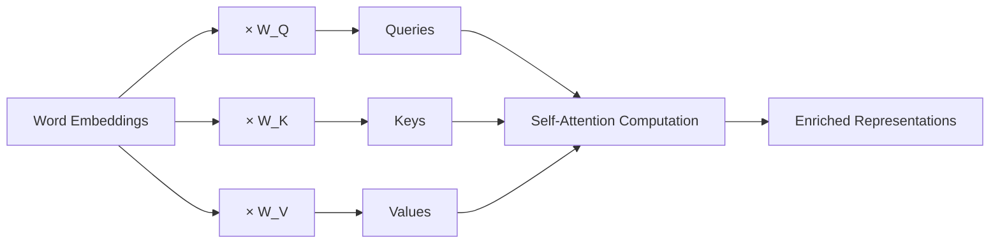

# Self-Attention

You're reading a sentence: "I ate an apple from the orchard near the Apple store." When you reach the second "Apple", you instantly glance back at the context — "store", "near", "orchard" — and realize this means the tech company, not the fruit. You just processed your own sentence to understand a word within it.

That's self-attention. A word reading its own sentence to understand itself.

👉 This is why we need **Self-Attention** — to let each word in a sequence gather context from all other words in the same sequence, building a richer representation of itself.

---

## What makes it "self"?

In regular attention (used in seq2seq), the Query comes from the decoder and the Keys/Values come from the encoder — two different sequences.

In self-attention, the Query, Key, and Value all come from the **same sequence**. Every word attends to every other word in the same sentence (including itself).

---

## How Q, K, V are derived from input

Each word's embedding is projected into three separate vectors using learned weight matrices:

```
Q_i = embedding_i × W_Q    (what word i is looking for)
K_i = embedding_i × W_K    (what word i contains)
V_i = embedding_i × W_V    (what word i contributes when selected)
```

The same input produces three different views of each word. The model learns W_Q, W_K, W_V during training to make attention maximally useful.



---

## The attention matrix

For a sentence of length N, self-attention produces an N×N matrix. Each cell [i][j] contains the attention weight from word i to word j.

For "The cat sat on the mat" (6 words), you get a 6×6 matrix:

|  | The | cat | sat | on | the | mat |
|---|---|---|---|---|---|---|
| The | 0.1 | 0.2 | 0.1 | 0.1 | 0.1 | 0.4 |
| cat | 0.3 | 0.1 | 0.4 | 0.1 | 0.05 | 0.05 |
| sat | 0.1 | 0.3 | 0.1 | 0.2 | 0.1 | 0.2 |
| on | ... | ... | ... | ... | ... | ... |
| the | ... | ... | ... | ... | ... | ... |
| mat | 0.1 | 0.4 | 0.1 | 0.1 | 0.05 | 0.25 |

"cat" attends strongly to "sat" (it's the subject of the action) and to "The" (its article). "mat" attends strongly to "cat" (what sat on it).

---

## What self-attention enables

Every word's final representation captures information from all other words. Contrast this with an RNN where word 6 can only "see" word 1 through 5 sequential steps of degraded memory.

In self-attention:
- Every word directly connects to every other word
- Distance doesn't matter — word 1 and word 100 interact just as easily as adjacent words
- Everything is computed in parallel — no sequential steps

---

## The formula

```
SelfAttention(X) = softmax( X W_Q × (X W_K)^T / √d_k ) × (X W_V)
```

Where X is the input matrix (N words × d dimensions).

---

✅ **What you just learned:** Self-attention is attention where a sequence attends to itself — each word projects into Q, K, V and computes an attention-weighted context over all other words in the same sequence.

🔨 **Build this now:** For the sentence "The animal didn't cross the street because it was tired," think about what "it" should attend to. Map out informally which words "it" would give high attention scores to, and why.

➡️ **Next step:** Multi-Head Attention → `06_Transformers/04_Multi_Head_Attention/Theory.md`

---

## 📂 Navigation

**In this folder:**
| File | |
|---|---|
| 📄 **Theory.md** | ← you are here |
| [📄 Cheatsheet.md](./Cheatsheet.md) | Quick reference |
| [📄 Interview_QA.md](./Interview_QA.md) | Interview prep |
| [📄 Math_Walkthrough.md](./Math_Walkthrough.md) | Step-by-step math walkthrough |

⬅️ **Prev:** [02 Attention Mechanism](../02_Attention_Mechanism/Theory.md) &nbsp;&nbsp;&nbsp; ➡️ **Next:** [04 Multi-Head Attention](../04_Multi_Head_Attention/Theory.md)
