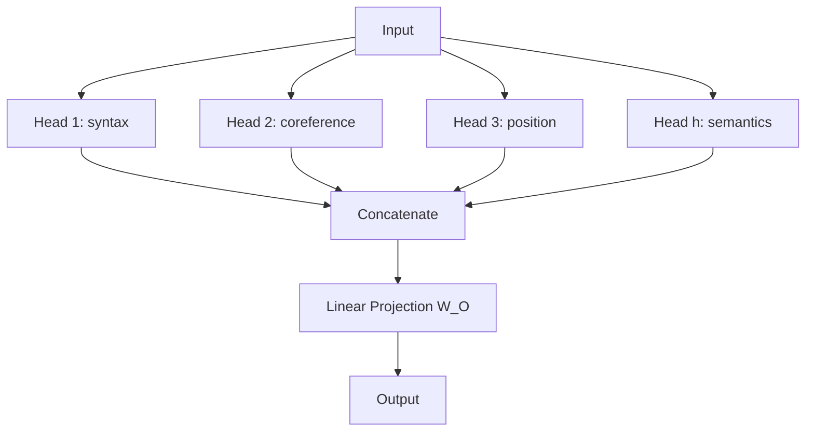

# Multi-Head Attention

A detective arrives at a crime scene. She doesn't investigate alone — she brings eight specialists. One searches for fingerprints. Another analyzes tire tracks. Another maps witness positions. Another looks for the timeline. Each one is an expert looking at the same scene from a different angle. When they're done, they combine their findings into one report.

Multi-head attention works the same way. Instead of one attention mechanism looking at the sentence, you run several in parallel — each one free to learn a different type of relationship.

👉 This is why we need **Multi-Head Attention** — to let the model simultaneously capture different types of relationships (syntactic, semantic, positional, coreference) in the same sentence.

---

## The problem with single-head attention

With one attention head, each word computes one attention distribution over the sequence. But language has many types of relationships at once:

- "She" should attend to the verb (syntactic: subject-verb)
- "she" should also attend to "Mary" earlier in the text (coreference)
- "great" should attend to "not" (negation — "not great")

One attention distribution can't capture all of these simultaneously. It has to compromise.

---

## How multi-head attention works

Run h separate attention operations in parallel, each with its own W_Q, W_K, W_V matrices:

```
Head_1 = Attention(Q × W_Q_1, K × W_K_1, V × W_V_1)
Head_2 = Attention(Q × W_Q_2, K × W_K_2, V × W_V_2)
...
Head_h = Attention(Q × W_Q_h, K × W_K_h, V × W_V_h)
```

Then concatenate all head outputs and project back to the model dimension:

```
MultiHead(Q, K, V) = Concat(Head_1, ..., Head_h) × W_O
```



---

## What each head might learn

Heads are not hand-labeled — they learn their specializations through training. Research analyzing trained BERT models found patterns like:

| Head type | What it learns |
|---|---|
| Syntactic head | Subject-verb agreements, article-noun links |
| Coreference head | Pronoun → antecedent ("it" → "the cat") |
| Positional head | Attends mostly to adjacent words (local context) |
| Semantic head | Semantically related words across the sentence |
| Separator head | Attends heavily to [CLS] or [SEP] tokens |

---

## Dimension math

Model dimension: d_model (e.g., 512)
Number of heads: h (e.g., 8)
Per-head dimension: d_k = d_model / h = 512 / 8 = 64

Each head works with 64-dimensional Q, K, V vectors. After concatenation: 8 × 64 = 512 — back to d_model. The final linear layer W_O projects this back into the right shape.

**Total parameters for multi-head attention:**
- 3h weight matrices (W_Q, W_K, W_V per head): 3 × h × d_model × d_k
- 1 output projection W_O: (h × d_v) × d_model
- Combined: roughly 4 × d_model²

---

## Why the final projection W_O matters

Concatenating heads gives you a vector that mixes 8 different perspectives. The W_O projection lets the model learn the best linear combination of all heads' outputs. It's not just gluing — it's learned mixing.

---

✅ **What you just learned:** Multi-head attention runs h parallel attention operations on the same input, each with independent weight matrices, allowing the model to simultaneously capture different types of relationships in a sequence.

🔨 **Build this now:** Take the sentence "The old man couldn't lift the box because it was too heavy." Think of 3 different relationship types a model would need to capture. Which head would handle each one?

➡️ **Next step:** Positional Encoding → `06_Transformers/05_Positional_Encoding/Theory.md`

---

## 📂 Navigation

**In this folder:**
| File | |
|---|---|
| 📄 **Theory.md** | ← you are here |
| [📄 Cheatsheet.md](./Cheatsheet.md) | Quick reference |
| [📄 Interview_QA.md](./Interview_QA.md) | Interview prep |

⬅️ **Prev:** [03 Self Attention](../03_Self_Attention/Theory.md) &nbsp;&nbsp;&nbsp; ➡️ **Next:** [05 Positional Encoding](../05_Positional_Encoding/Theory.md)
