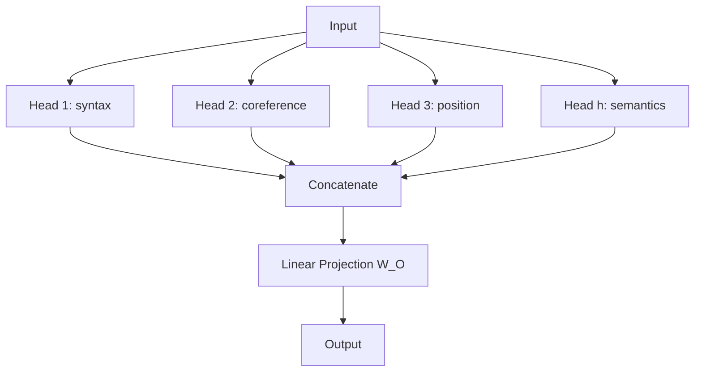

# Multi-Head Attention

A detective brings eight specialists to a crime scene. One searches for fingerprints. Another analyzes tire tracks. Another maps witness positions. Another examines the timeline. Each is an expert looking at the same scene from a different angle. They combine findings into one report.

Multi-head attention works the same way: several attention mechanisms run in parallel, each free to learn a different type of relationship.

👉 This is why we need **Multi-Head Attention** — to simultaneously capture different relationship types (syntactic, semantic, positional, coreference) in the same sentence.

---

## 📌 Learning Priority

**Must Learn** — core concepts, needed to understand the rest of this file:
[Single Head Limitation](#the-problem-with-single-head-attention) · [How Multi-Head Works](#how-multi-head-attention-works) · [Dimension Math](#dimension-math)

**Should Learn** — important for real projects and interviews:
[What Each Head Learns](#what-each-head-might-learn) · [Final Projection W_O](#why-the-final-projection-wo-matters)

**Good to Know** — useful in specific situations, not needed daily:
[Head Specialization Patterns](#what-each-head-might-learn)

**Reference** — skim once, look up when needed:
[Parameter Count Formula](#dimension-math)

---

## The problem with single-head attention

With one attention head, each word computes one distribution over the sequence. But language has many relationship types at once:
- "She" should attend to the verb (syntactic: subject-verb)
- "she" should also attend to "Mary" earlier (coreference)
- "great" should attend to "not" (negation)

One distribution can't capture all of these simultaneously — it must compromise.

---

## How multi-head attention works

Run h separate attention operations in parallel, each with its own W_Q, W_K, W_V:

```
Head_i = Attention(Q × W_Q_i, K × W_K_i, V × W_V_i)
MultiHead(Q, K, V) = Concat(Head_1, ..., Head_h) × W_O
```



---

## What each head might learn

Heads learn their specializations through training. Research analyzing trained BERT models found patterns like:

| Head type | What it learns |
|---|---|
| Syntactic head | Subject-verb agreements, article-noun links |
| Coreference head | Pronoun → antecedent ("it" → "the cat") |
| Positional head | Attends mostly to adjacent words (local context) |
| Semantic head | Semantically related words across the sentence |
| Separator head | Attends heavily to [CLS] or [SEP] tokens |

---

## Dimension math

- Model dimension: d_model = 512
- Number of heads: h = 8
- Per-head dimension: d_k = 512 / 8 = 64

Each head works with 64-dimensional Q, K, V. After concatenation: 8 × 64 = 512 — back to d_model. W_O projects this back into the right shape.

**Total parameters:** roughly 4 × d_model²

---

## Why the final projection W_O matters

Concatenating heads gives a vector mixing 8 perspectives. W_O learns the best linear combination — not just gluing outputs, but learned mixing.

---

✅ **What you just learned:** Multi-head attention runs h parallel attention operations on the same input, each with independent weights, allowing the model to simultaneously capture different relationship types in a sequence.

🔨 **Build this now:** For "The old man couldn't lift the box because it was too heavy," identify 3 relationship types a model needs. Which head would handle each?

➡️ **Next step:** Positional Encoding → `06_Transformers/05_Positional_Encoding/Theory.md`


---

## 📝 Practice Questions

- 📝 [Q33 · multi-head-attention](../../ai_practice_questions_100.md#q33--interview--multi-head-attention)


---

## 📂 Navigation

**In this folder:**
| File | |
|---|---|
| 📄 **Theory.md** | ← you are here |
| [📄 Cheatsheet.md](./Cheatsheet.md) | Quick reference |
| [📄 Interview_QA.md](./Interview_QA.md) | Interview prep |

⬅️ **Prev:** [03 Self Attention](../03_Self_Attention/Theory.md) &nbsp;&nbsp;&nbsp; ➡️ **Next:** [05 Positional Encoding](../05_Positional_Encoding/Theory.md)
