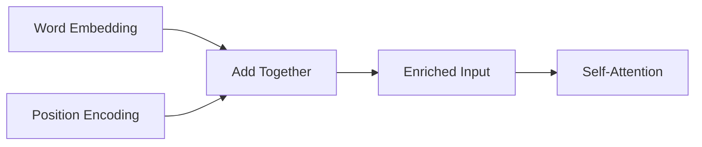
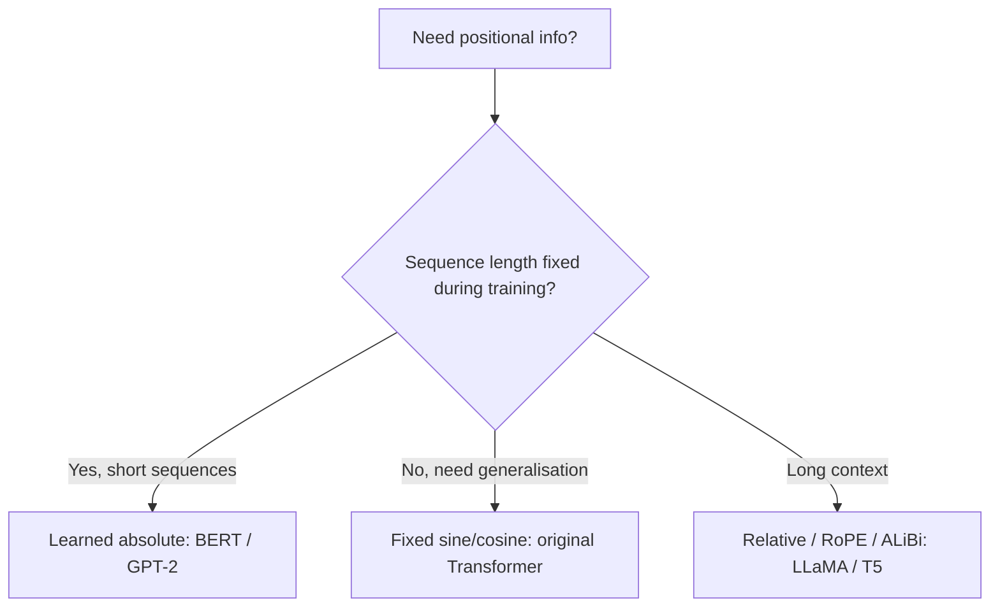

# Positional Encoding

Index cards handed to you in random order — one word per card: "bites", "dog", "man", "the", "the". You can't tell the story without knowing the position of each card. "Dog bites man" and "Man bites dog" are completely different — only order reveals meaning.

This is exactly the problem with attention: it connects words but has no idea where in the sentence each word sits.

👉 This is why we need **Positional Encoding** — to stamp each word with its position before feeding into attention, so the model knows word 1 comes before word 2.

---

## 📌 Learning Priority

**Must Learn** — core concepts, needed to understand the rest of this file:
[Why Attention Is Order-Agnostic](#why-attention-is-order-agnostic) · [Adding Position to Embeddings](#the-solution-add-position-to-the-embedding) · [Sine/Cosine Encoding](#sinecosine-encoding--the-original-approach)

**Should Learn** — important for real projects and interviews:
[Fixed vs Learned Encodings](#fixed-vs-learned-positional-encodings) · [RoPE and Modern Approaches](#fixed-vs-learned-positional-encodings)

**Good to Know** — useful in specific situations, not needed daily:
[Encoding Properties](#sinecosine-encoding--the-original-approach)

**Reference** — skim once, look up when needed:
[Clock Frequency Analogy](#sinecosine-encoding--the-original-approach)

---

## Why attention is order-agnostic

Self-attention computes dot products between Q and K vectors. The score between word 1 and word 5 is computed the same way regardless of their positions. Shuffle the input words — the mechanism has nothing encoding "word 3 is position 3." It sees a set, not a sequence.

---

## The solution: add position to the embedding

Before feeding embeddings into attention, add a positional signal:

```
input_to_attention[i] = word_embedding[i] + positional_encoding[i]
```

Position is now baked into the embeddings. The model learns that "word at position 5" has different properties than "same word at position 50."



---

## Sine/cosine encoding — the original approach

Different dimensions cycle at different frequencies — like clock hands: seconds hand cycles every 60s, minutes every 60min, hours every 12h. Together they uniquely represent any time.

Properties that make this useful:
1. **Uniqueness:** every position gets a different vector
2. **Bounded:** all values stay between −1 and 1 (won't overwhelm word embeddings)
3. **Smooth:** nearby positions have similar-looking vectors
4. **Generalizes beyond training:** the math works for positions the model never saw

---

## Fixed vs learned positional encodings

| Type | How it works | Example models |
|---|---|---|
| Fixed (sine/cosine) | Predefined mathematical formula | Original Transformer |
| Learned (absolute) | Train a separate embedding per position | BERT, GPT-2 |
| Relative | Encode distance between pairs, not absolute position | T5, Transformer-XL |
| Rotary (RoPE) | Rotate Q/K vectors by position angle | Llama, Mistral |
| ALiBi | Add position-based bias to attention scores | Some recent models |



Fixed and learned encodings perform similarly in practice. Modern LLMs mostly use relative or rotary encodings because they handle very long contexts better.

---

✅ **What you just learned:** Positional encoding injects position information into word embeddings before self-attention because attention has no notion of word order. Sine/cosine encoding achieves this with a unique, smooth, bounded signal at every position.

🔨 **Build this now:** Write a function generating positional encoding for positions 0–3 using two dimensions. Use `sin(pos / 10000^(0/d))` and `cos(pos / 10000^(1/d))` with d=2. Print the four vectors and verify they're all different.

➡️ **Next step:** Transformer Architecture → `06_Transformers/06_Transformer_Architecture/Theory.md`


---

## 📝 Practice Questions

- 📝 [Q34 · positional-encoding](../../ai_practice_questions_100.md#q34--thinking--positional-encoding)


---

## 📂 Navigation

**In this folder:**
| File | |
|---|---|
| 📄 **Theory.md** | ← you are here |
| [📄 Cheatsheet.md](./Cheatsheet.md) | Quick reference |
| [📄 Interview_QA.md](./Interview_QA.md) | Interview prep |
| [📄 Math_Intuition.md](./Math_Intuition.md) | Math intuition behind positional encoding |

⬅️ **Prev:** [04 Multi-Head Attention](../04_Multi_Head_Attention/Theory.md) &nbsp;&nbsp;&nbsp; ➡️ **Next:** [06 Transformer Architecture](../06_Transformer_Architecture/Theory.md)
