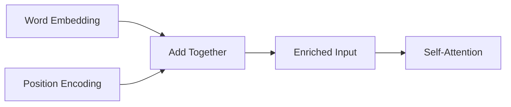

# Positional Encoding

Imagine someone hands you a stack of index cards, one word per card, in random order: "bites", "dog", "man", "the", "the". You read them and get... nothing useful. "Dog bites man" and "Man bites dog" are completely different stories. Without knowing the position of each card, you can't tell them apart. The words are identical — only the order reveals the meaning.

This is exactly the problem with attention. Attention is great at connecting words, but it has no idea where in the sentence each word sits.

👉 This is why we need **Positional Encoding** — to stamp each word with its position before feeding it into attention, so the model knows word 1 comes before word 2.

---

## Why attention is order-agnostic

Recall how self-attention works: it computes dot products between Q and K vectors. The score between word 1 and word 5 is computed the same way regardless of where they appear in the sequence.

Shuffle the input words in any order: the attention scores change (because the Q/K vectors change), but there's nothing in the mechanism that encodes "word 3 is position 3." The model sees a set, not a sequence.

---

## The solution: add position to the embedding

Before feeding embeddings into attention, add a positional signal to each embedding:

```
input_to_attention[i] = word_embedding[i] + positional_encoding[i]
```

Now when the model computes attention, position is baked into the embeddings themselves. The model can learn that "word at position 5" has different properties than "same word at position 50."



---

## Sine/cosine encoding — the original approach

The "Attention is All You Need" paper used a clever mathematical encoding based on sine and cosine functions at different frequencies.

**The intuition (before any formulas):**

Think of a digital clock. The seconds hand cycles every 60 seconds. The minutes hand cycles every 60 minutes. The hours hand cycles every 12 hours. Each "hand" completes a cycle at a different rate. Together, they can uniquely represent any time of day.

Sine/cosine encoding works the same way. Different dimensions of the position vector cycle at different frequencies. Together, they uniquely identify any position.

Properties that make this useful:
1. **Uniqueness:** every position gets a different vector
2. **Bounded:** all values stay between -1 and 1 (won't overwhelm word embeddings)
3. **Smooth:** nearby positions have similar-looking vectors
4. **Generalizes beyond training:** the math works for positions the model never saw in training

---

## Fixed vs learned positional encodings

| Type | How it works | Example models |
|---|---|---|
| Fixed (sine/cosine) | Predefined mathematical formula | Original Transformer |
| Learned (absolute) | Train a separate embedding for each position | BERT, GPT-2 |
| Relative | Encode the distance between pairs, not absolute position | T5, Transformer-XL |
| Rotary (RoPE) | Rotate Q/K vectors by position angle | Llama, Mistral |
| ALiBi | Add position-based bias to attention scores | Some recent models |

---

## Learned vs fixed: which is better?

They perform similarly in practice. Learned encodings are flexible — the model can discover what patterns are useful. Fixed sine/cosine encodings have a nice property: they can generalize to sequence lengths longer than training (since the formula works for any position).

Modern LLMs mostly use relative or rotary encodings because they handle very long contexts better.

---

✅ **What you just learned:** Positional encoding injects position information into word embeddings before self-attention, because attention itself has no notion of word order. Sine/cosine encoding achieves this with a unique, smooth, bounded signal at every position.

🔨 **Build this now:** Write a function that generates a positional encoding vector for position 0, 1, 2, 3 using just two dimensions. Use `sin(pos / 10000^(0/d))` and `cos(pos / 10000^(1/d))` with d=2. Print the four vectors and notice they're all different.

➡️ **Next step:** Transformer Architecture → `06_Transformers/06_Transformer_Architecture/Theory.md`

---

## 📂 Navigation

**In this folder:**
| File | |
|---|---|
| 📄 **Theory.md** | ← you are here |
| [📄 Cheatsheet.md](./Cheatsheet.md) | Quick reference |
| [📄 Interview_QA.md](./Interview_QA.md) | Interview prep |
| [📄 Math_Intuition.md](./Math_Intuition.md) | Math intuition behind positional encoding |

⬅️ **Prev:** [04 Multi-Head Attention](../04_Multi_Head_Attention/Theory.md) &nbsp;&nbsp;&nbsp; ➡️ **Next:** [06 Transformer Architecture](../06_Transformer_Architecture/Theory.md)
