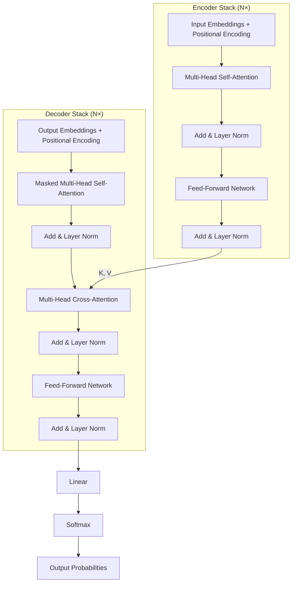

# Transformer Architecture — Deep Dive

## The Original Paper: "Attention is All You Need" (2017)

**Authors:** Vaswani, Shazeer, Parmar, Uszkoreit, Jones, Gomez, Kaiser, Polosukhin (Google Brain/Google Research)

**Core claim:** You don't need recurrence or convolution at all. Attention alone is sufficient to model sequences — and it's faster and better.

**Why it mattered:** Before this paper, all competitive NLP models used RNNs or LSTMs as their backbone. The transformer eliminated recurrence entirely. This enabled massive parallelization, which enabled training on far more data, which enabled the modern LLM era.

---

## Full Architecture Diagram

---

## Data shapes at each step

For the original model: d_model=512, N=6, h=8, d_k=64, d_ff=2048, vocab=37,000, sequence length=100.

| Step | Shape | Notes |
|---|---|---|
| Input token IDs | (batch, 100) | Integer indices |
| Word embeddings | (batch, 100, 512) | Lookup table |
| + Positional encoding | (batch, 100, 512) | Added, not concatenated |
| After self-attention | (batch, 100, 512) | Each token enriched with context |
| After FFN | (batch, 100, 512) | Further transformed |
| After N encoder layers | (batch, 100, 512) | Final encoder output |
| Cross-attention K, V | (batch, 100, 512) | From encoder to decoder |
| Decoder output | (batch, target_len, 512) | Per-token decoder representations |
| Linear projection | (batch, target_len, 37000) | To vocabulary size |
| Softmax | (batch, target_len, 37000) | Probability per token |

---

## Paper summary in plain English

### What they did:

1. Replaced the RNN encoder with a stack of self-attention + FFN layers. Every source token can directly attend to every other source token in one pass.

2. Replaced the RNN decoder with a stack of masked self-attention + cross-attention + FFN layers. At each step, the decoder attends to its own generated tokens (masked) and to all encoder tokens (cross-attention).

3. Added positional encoding — sine/cosine functions at different frequencies — to inject word order into the position-agnostic attention mechanism.

4. Used residual connections and layer normalization around every sub-layer for stable training.

### What changed vs. seq2seq with attention:

- Old model: RNN encoder (sequential) → attention → RNN decoder (sequential)
- New model: Stack of attention layers (fully parallel) → stack of attention layers (partially parallel)

The key change: NO recurrence. Everything can be computed in parallel within each layer. Training is dramatically faster.

### Performance:

On WMT 2014 English-German translation: 28.4 BLEU. State of the art. Trained in 3.5 days on 8 GPUs. Previous SOTA required weeks.

---

## Why residual connections enable deep transformers

Without residuals, going from 6 layers to 12 layers might hurt performance (vanishing gradients). With residuals, adding more layers consistently improves performance up to very large depths.

GPT-3 uses 96 layers. Each layer has residual connections. The signal can flow from the 96th layer back to the 1st layer through 96 direct skip paths. Any gradient can always "skip" all the way back.

---

## The FFN as a "fact storage" mechanism

Research has shown that factual knowledge is largely stored in the transformer's FFN layers. When you ask a model "The capital of France is ___?", the FFN layers activate patterns learned from billions of occurrences of "Paris" in context with "France" and "capital."

Evidence: "knowledge editing" techniques that modify specific facts in a model tend to edit the FFN weight matrices, not the attention weights.

The attention mechanism is more about routing — "which context to gather from where." The FFN is more about computation on that gathered context — "what to do with it."

---

## 📂 Navigation

**In this folder:**
| File | |
|---|---|
| [📄 Theory.md](./Theory.md) | Core concepts |
| [📄 Cheatsheet.md](./Cheatsheet.md) | Quick reference |
| [📄 Interview_QA.md](./Interview_QA.md) | Interview prep |
| 📄 **Architecture_Deep_Dive.md** | ← you are here |
| [📄 Component_Breakdown.md](./Component_Breakdown.md) | Component-by-component breakdown |

⬅️ **Prev:** [05 Positional Encoding](../05_Positional_Encoding/Theory.md) &nbsp;&nbsp;&nbsp; ➡️ **Next:** [07 Encoder-Decoder Models](../07_Encoder_Decoder_Models/Theory.md)
