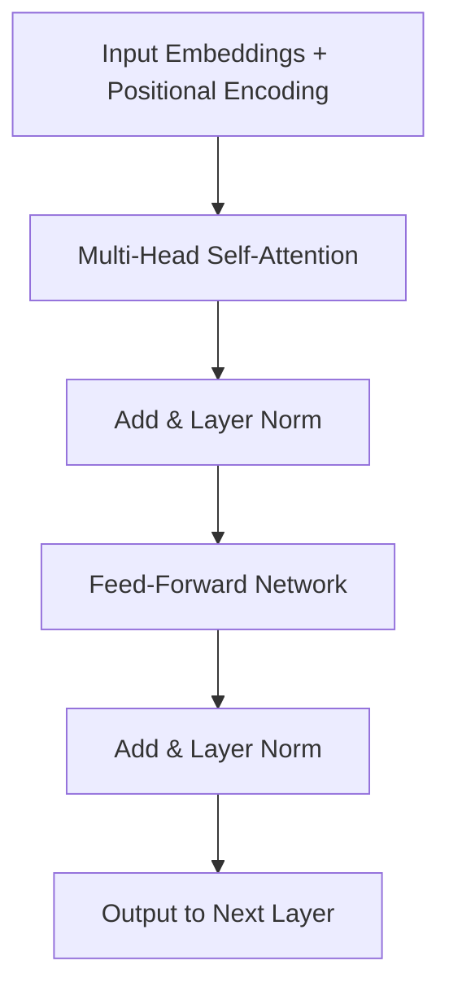
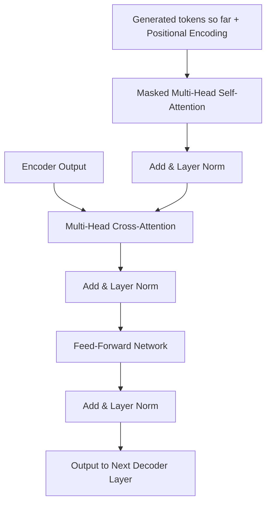
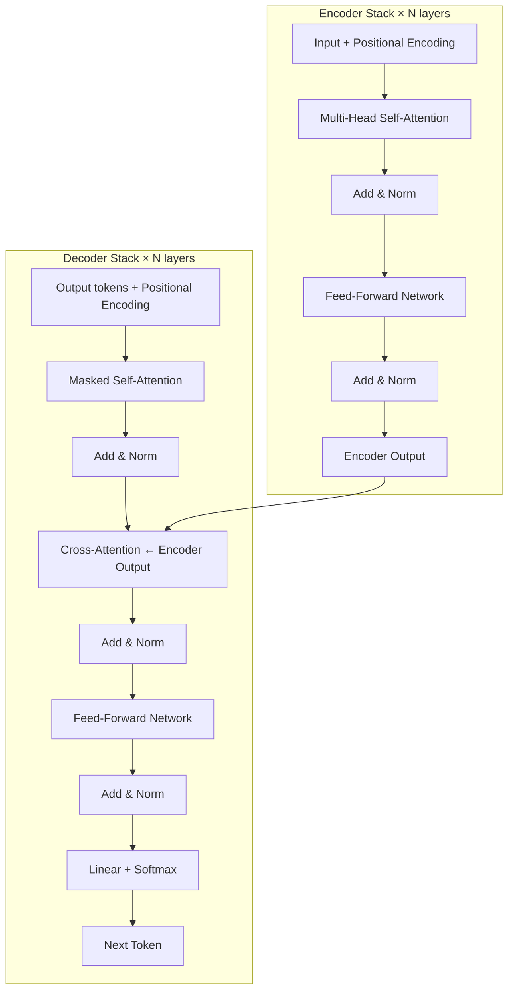

# Transformer Architecture

A UN interpreter listens to the entire speech first to understand the full context — the argument, the tone, the references. Then word by word they speak the translation, constantly glancing back at the original speech and what they've already said to stay coherent.

That's the transformer: the encoder reads everything; the decoder generates one token at a time using both the original and what it has generated so far.

👉 This is why the **Transformer Architecture** works — it separates understanding (encoder) from generation (decoder) and connects them through attention.

---

## 📌 Learning Priority

**Must Learn** — core concepts, needed to understand the rest of this file:
[Encoder and Decoder](#the-two-halves) · [Residual Connections](#residual-connections--why-they-matter) · [Feed-Forward Network](#feed-forward-network-ffn)

**Should Learn** — important for real projects and interviews:
[One Encoder Layer](#one-encoder-layer) · [One Decoder Layer](#one-decoder-layer) · [Layer Normalization](#layer-normalization)

**Good to Know** — useful in specific situations, not needed daily:
[FFN Inner Dimension](#feed-forward-network-ffn)

**Reference** — skim once, look up when needed:
[Full Architecture Diagram](#what-you-just-learned)

---

## The two halves

### Encoder

Reads the full input sequence and produces rich contextual representations for each token. Every token attends to every other token (bidirectional self-attention).

Used for: understanding, classification, encoding meaning.

### Decoder

Generates output one token at a time using:
1. Masked self-attention on what it's generated so far (can't see the future)
2. Cross-attention to attend to the encoder's output (the source material)

Used for: generation, translation, summarization output.

---

## One encoder layer



Two sub-layers: multi-head self-attention, then position-wise feed-forward network. Each wrapped in a residual connection + layer normalization.

---

## One decoder layer

Three sub-layers:
1. Masked multi-head self-attention (on generated tokens so far)
2. Multi-head cross-attention (attends to encoder output)
3. Position-wise feed-forward network

Same residual + layer norm around each.



---

## Residual connections — why they matter

```
output = LayerNorm(x + SubLayer(x))
```

The original signal passes through alongside the transformation. Benefits:
- Gradients flow directly to early layers without vanishing
- The model only learns the "correction" on top of identity — easier to optimize
- Enables very deep networks (original: 6+6 layers; GPT-3: 96 layers)

---

## Layer normalization

Applied after each sub-layer. Normalizes activations within each sample to zero mean and unit variance — prevents exploding/vanishing activations during deep network training.

---

## Feed-forward network (FFN)

```
FFN(x) = max(0, x × W1 + b1) × W2 + b2
```

Two linear transformations with ReLU between. Inner dimension is typically 4× the model dimension (512-dim model → 2048 inner). Attention gathers context; the FFN applies learned transformations to process that information — storing facts and patterns from pretraining.

---

✅ **What you just learned:** The transformer has an encoder (bidirectional self-attention) and decoder (masked self-attention + cross-attention), each layer containing attention → FFN wrapped in residual connections and layer norm.



🔨 **Build this now:** Draw the transformer architecture from memory. Label: encoder stack, decoder stack, self-attention, cross-attention, FFN, residual connections, positional encoding.

➡️ **Next step:** Encoder-Decoder Models → `06_Transformers/07_Encoder_Decoder_Models/Theory.md`


---

## 📝 Practice Questions

- 📝 [Q35 · transformer-architecture](../../ai_practice_questions_100.md#q35--interview--transformer-architecture)


---

## 📂 Navigation

**In this folder:**
| File | |
|---|---|
| 📄 **Theory.md** | ← you are here |
| [📄 Cheatsheet.md](./Cheatsheet.md) | Quick reference |
| [📄 Interview_QA.md](./Interview_QA.md) | Interview prep |
| [📄 Architecture_Deep_Dive.md](./Architecture_Deep_Dive.md) | Full architecture deep dive |
| [📄 Component_Breakdown.md](./Component_Breakdown.md) | Component-by-component breakdown |

⬅️ **Prev:** [05 Positional Encoding](../05_Positional_Encoding/Theory.md) &nbsp;&nbsp;&nbsp; ➡️ **Next:** [07 Encoder-Decoder Models](../07_Encoder_Decoder_Models/Theory.md)
