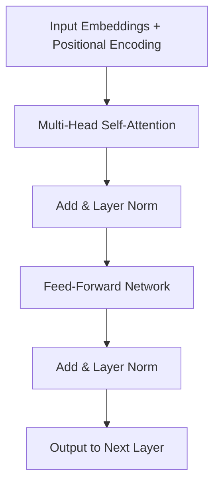

# Transformer Architecture

Picture a professional UN interpreter working in a glass booth. Before translating, they listen to the entire speech first to understand the full context — the argument, the tone, the references. Then, word by word, they speak the translation into the microphone, constantly glancing back at the original speech and what they've already said to make sure it all stays coherent.

That's the transformer. The encoder reads everything. The decoder generates one token at a time, using both what was said and what it has generated so far.

👉 This is why the **Transformer Architecture** works — it separates understanding (encoder) from generation (decoder) and connects them through attention.

---

## The two halves

### Encoder

Reads the full input sequence and produces rich contextual representations for each token. Every token attends to every other token (bidirectional self-attention).

Used for: understanding, classification, encoding meaning.

### Decoder

Generates the output sequence one token at a time. Uses:
1. Masked self-attention on what it's generated so far (can't see the future)
2. Cross-attention to attend to the encoder's output (the source material)

Used for: generation, translation, summarization output.

---

## One encoder layer



Each encoder layer has two sub-layers:
1. Multi-head self-attention
2. Position-wise feed-forward network

Around each sub-layer: a residual connection + layer normalization.

---

## One decoder layer

Each decoder layer has three sub-layers:
1. Masked multi-head self-attention (on generated tokens so far)
2. Multi-head cross-attention (attends to encoder output)
3. Position-wise feed-forward network

Same residual + layer norm around each.

---

## Residual connections — why they matter

Each sub-layer computes its output and adds it to its own input:

```
output = LayerNorm(x + SubLayer(x))
```

This is a residual (skip) connection. The original signal passes through directly alongside the transformation.

**Why it matters:**
- Gradients can flow directly back to early layers without vanishing
- The model only needs to learn the "correction" on top of the identity — easier to optimize
- Enables training very deep networks (the original had 6 encoder + 6 decoder layers; GPT-3 has 96 layers)

---

## Layer normalization

After each sub-layer (attention or FFN), layer norm is applied. It normalizes the activations within each sample to have zero mean and unit variance.

This stabilizes training — prevents activations from exploding or vanishing during deep network training.

---

## Feed-forward network (FFN)

Despite the name, this is simple: two linear transformations with a ReLU in between.

```
FFN(x) = max(0, x × W1 + b1) × W2 + b2
```

The inner dimension is typically 4× the model dimension. For a 512-dim model, the FFN inner layer is 2048.

**Why it's there:** Attention is good at gathering information from context. The FFN is where the model applies learned transformations to process that information — it stores facts, patterns, and knowledge from pretraining.

---

✅ **What you just learned:** The transformer has an encoder (bidirectional self-attention) and a decoder (masked self-attention + cross-attention), with each layer containing attention → FFN wrapped in residual connections and layer norm.

🔨 **Build this now:** Draw the transformer architecture from memory. Label: encoder stack, decoder stack, self-attention, cross-attention, FFN, residual connections, positional encoding.

➡️ **Next step:** Encoder-Decoder Models → `06_Transformers/07_Encoder_Decoder_Models/Theory.md`

---

## 📂 Navigation

**In this folder:**
| File | |
|---|---|
| 📄 **Theory.md** | ← you are here |
| [📄 Cheatsheet.md](./Cheatsheet.md) | Quick reference |
| [📄 Interview_QA.md](./Interview_QA.md) | Interview prep |
| [📄 Architecture_Deep_Dive.md](./Architecture_Deep_Dive.md) | Full architecture deep dive |
| [📄 Component_Breakdown.md](./Component_Breakdown.md) | Component-by-component breakdown |

⬅️ **Prev:** [05 Positional Encoding](../05_Positional_Encoding/Theory.md) &nbsp;&nbsp;&nbsp; ➡️ **Next:** [07 Encoder-Decoder Models](../07_Encoder_Decoder_Models/Theory.md)
