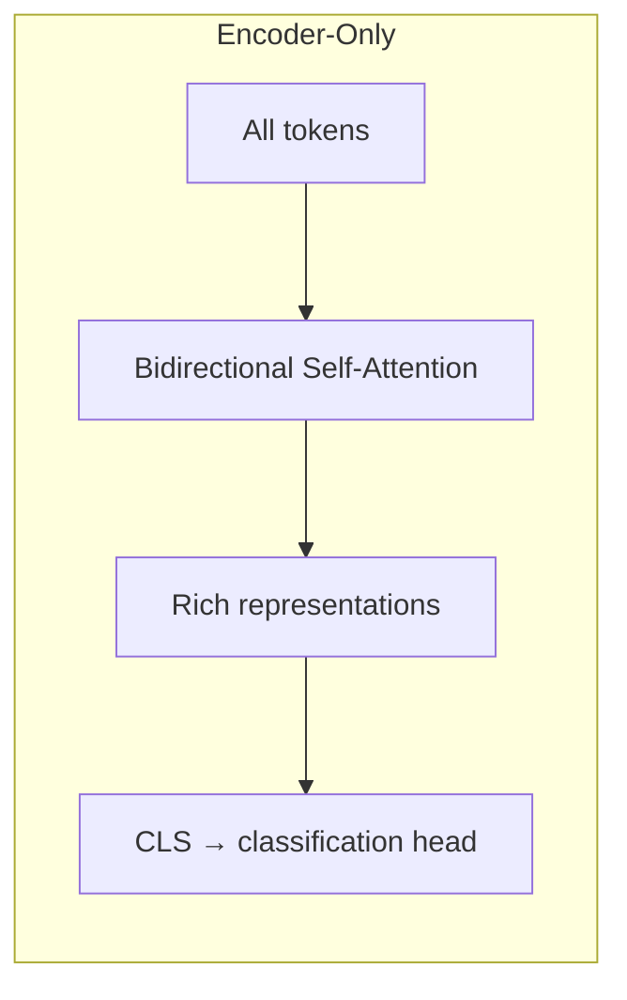
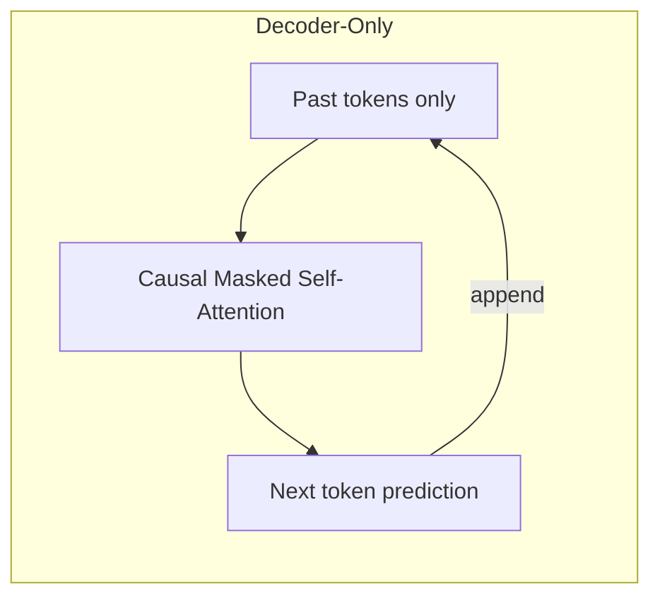
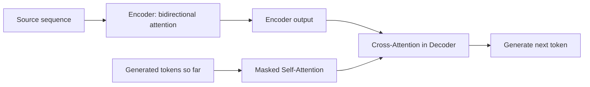
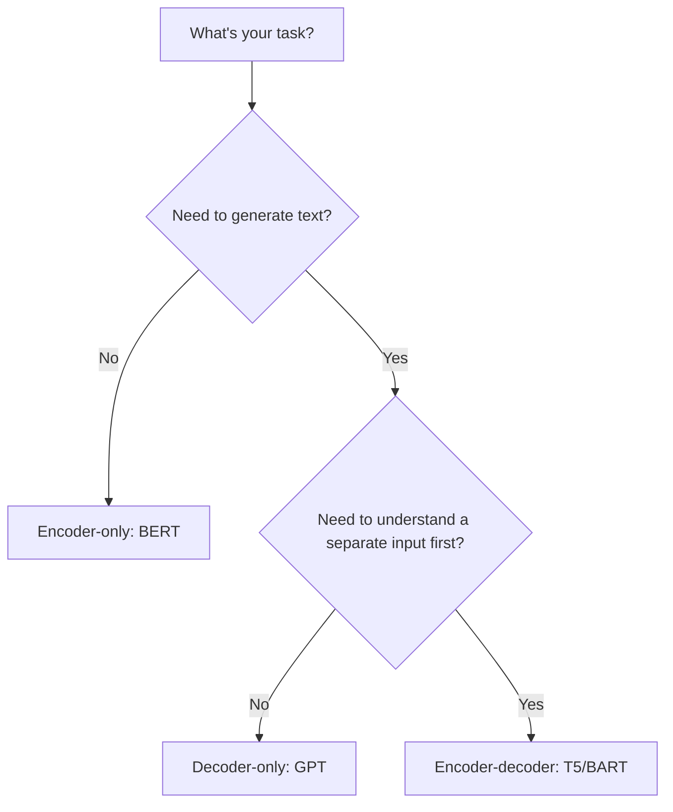

# Encoder-Decoder Models

Reading comprehension: you read the whole passage and answer questions — you need to understand, not generate. Essay writing: you generate sentences one at a time — you need to produce, not just understand. Some tasks need only reading. Some need only writing. Some need both.

👉 This is why there are **different transformer architectures** — encoder-only for understanding, decoder-only for generation, encoder-decoder for tasks that need both.

---

## The three flavors

### Encoder-only (BERT family)

**Structure:** Just the encoder stack. Bidirectional self-attention — every token sees the whole sequence.

**Training objective:** Masked Language Modeling (MLM) — predict masked tokens from context.

**Best for:** Text classification, NER, extractive QA, sentence embeddings.

**Examples:** BERT, RoBERTa, ALBERT, DistilBERT

---

### Decoder-only (GPT family)

**Structure:** Just the decoder stack. Masked (causal) self-attention — each token only sees past tokens.

**Training objective:** Next-token prediction (causal language modeling).

**Best for:** Text generation, chatbots, code generation, summarization from prompt, few/zero-shot learning.

**Examples:** GPT-2, GPT-3, GPT-4, LLaMA, Mistral, Claude

---

### Encoder-Decoder (T5, BART family)

**Structure:** Full transformer — encoder reads input, decoder generates output with cross-attention to encoder.

**Best for:** Tasks requiring understanding input AND generating output: translation, summarization, generative QA, dialogue.

**Examples:** T5, BART, mT5, FLAN-T5

---

## How to choose

---

## A note on modern practice

Decoder-only models (GPT family) have dominated since GPT-3:
1. They can do classification too — just format the input as a prompt
2. Scale better — next-token prediction is a clean, efficient objective
3. Instruction fine-tuning (RLHF) is more natural for decoders
4. The largest models (GPT-4, Claude) are decoder-only

BERT-style models remain widely used for production tasks needing low latency (search, classification at scale).

---

✅ **What you just learned:** Encoder-only models (BERT) understand text bidirectionally; decoder-only models (GPT) generate text autoregressively; encoder-decoder models (T5) handle tasks requiring both input understanding and output generation.

🔨 **Build this now:** Match each task to architecture: (1) Spam detection (2) Machine translation (3) Story generation (4) Named entity recognition (5) Summarization.

➡️ **Next step:** BERT → `06_Transformers/08_BERT/Theory.md`

---

## 📂 Navigation

**In this folder:**
| File | |
|---|---|
| 📄 **Theory.md** | ← you are here |
| [📄 Cheatsheet.md](./Cheatsheet.md) | Quick reference |
| [📄 Interview_QA.md](./Interview_QA.md) | Interview prep |
| [📄 Comparison.md](./Comparison.md) | Encoder vs decoder vs encoder-decoder comparison |

⬅️ **Prev:** [06 Transformer Architecture](../06_Transformer_Architecture/Theory.md) &nbsp;&nbsp;&nbsp; ➡️ **Next:** [08 BERT](../08_BERT/Theory.md)
