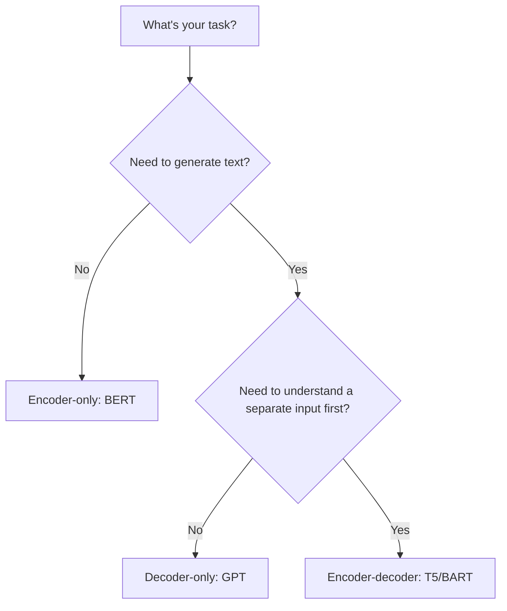

# Encoder-Decoder Models

Think about two very different student tasks. Reading comprehension: you read the whole passage and answer questions — you need to understand, not generate. Essay writing: you generate sentences one at a time, each one following from the last — you need to produce, not just understand. Some tasks need only reading. Some need only writing. Some need both.

👉 This is why there are **different transformer architectures** — encoder-only for understanding, decoder-only for generation, encoder-decoder for tasks that need both.

---

## The three flavors

### Encoder-only (BERT family)

**Structure:** Just the encoder stack. Bidirectional self-attention — every token sees the whole sequence.

**Training objective:** Masked Language Modeling (MLM) — predict masked tokens from context.

**Best for:** Tasks where you need to understand text:
- Text classification (sentiment, spam, topic)
- Named entity recognition
- Question answering (extractive)
- Sentence embeddings

**Why no decoder?** You don't need to generate a sequence. You just need rich representations.

**Examples:** BERT, RoBERTa, ALBERT, DistilBERT

---

### Decoder-only (GPT family)

**Structure:** Just the decoder stack. Masked (causal) self-attention — each token only sees past tokens.

**Training objective:** Next-token prediction (causal language modeling).

**Best for:** Tasks where you need to generate text:
- Open-ended text generation
- Chatbots, assistants
- Code generation
- Summarization (generate from prompt)
- Few-shot and zero-shot learning

**Why no encoder?** The model reads the input as context (just prepended to the generation) and generates the output directly.

**Examples:** GPT-2, GPT-3, GPT-4, LLaMA, Mistral, Claude

---

### Encoder-Decoder (T5, BART family)

**Structure:** Full transformer — encoder reads input, decoder generates output with cross-attention to encoder.

**Training objective:** Varies — T5 uses text-to-text, BART uses denoising.

**Best for:** Tasks that require understanding input AND generating output:
- Translation (understand source → generate target)
- Summarization (understand document → generate summary)
- Question answering (generative)
- Dialogue (understand context → generate response)

**Examples:** T5, BART, mT5, FLAN-T5

---

## How to choose

---

## A note on modern practice

In practice, decoder-only models (GPT family) have dominated since GPT-3. Here's why:

1. They can do classification too — just format the input as a prompt
2. They scale better — one training objective (next-token prediction) is clean and efficient
3. Instruction fine-tuning (RLHF) is more natural for decoders
4. Much bigger models (GPT-4, Claude) are decoder-only

BERT-style models are still widely used for production tasks that need low latency (e.g., search, classification at scale).

---

✅ **What you just learned:** Encoder-only models (BERT) understand text bidirectionally; decoder-only models (GPT) generate text autoregressively; encoder-decoder models (T5) handle tasks that need both input understanding and output generation.

🔨 **Build this now:** Match each task to the right architecture: (1) Spam detection (2) Machine translation (3) Story generation (4) Named entity recognition (5) Summarization. Check your answers against the guide above.

➡️ **Next step:** BERT → `06_Transformers/08_BERT/Theory.md`

---

## 📂 Navigation

**In this folder:**
| File | |
|---|---|
| 📄 **Theory.md** | ← you are here |
| [📄 Cheatsheet.md](./Cheatsheet.md) | Quick reference |
| [📄 Interview_QA.md](./Interview_QA.md) | Interview prep |
| [📄 Comparison.md](./Comparison.md) | Encoder vs decoder vs encoder-decoder comparison |

⬅️ **Prev:** [06 Transformer Architecture](../06_Transformer_Architecture/Theory.md) &nbsp;&nbsp;&nbsp; ➡️ **Next:** [08 BERT](../08_BERT/Theory.md)
