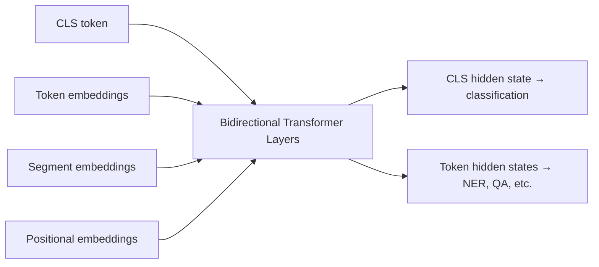

# BERT

You're taking a fill-in-the-blank exam. The question reads: "The ___ barked at the stranger." You don't just look at the word before the blank — you read the whole sentence. Left and right. "Barked" and "stranger" together make it obvious: this is about a dog. You need both directions to fill the blank correctly.

BERT was trained exactly this way — predicting masked words using context from both sides simultaneously. That's the "B" in BERT: Bidirectional.

👉 This is why **BERT** changed NLP — it was the first model to pretrain a deep bidirectional transformer, producing representations so rich that fine-tuning on a new task took minutes and beat years of specialized research.

---

## What BERT actually is

BERT is an encoder-only transformer pretrained on two objectives:

1. **Masked Language Modeling (MLM):** Randomly mask 15% of tokens. Train the model to predict the masked tokens using the full bidirectional context.

2. **Next Sentence Prediction (NSP):** Given two sentences A and B, predict if B actually follows A in the original text. (Note: later research showed NSP adds little value; RoBERTa dropped it.)

---

## Why "bidirectional" matters so much

Before BERT, GPT read left to right. ELMo used two separate LSTMs (one in each direction) but they couldn't see each other. BERT runs one transformer that processes all positions simultaneously, with every position attending to every other position in both directions.

This means "bank" in "The river bank was flooded" sees both "river" (left) and "flooded" (right) — giving it context from both sides to resolve ambiguity. GPT's left-to-right model had to predict "bank" before seeing "flooded."

---

## Special tokens

BERT uses special tokens:

```
[CLS] The cat sat on the mat [SEP]
```

- `[CLS]` — placed at the start. Its final hidden state is used for classification tasks.
- `[SEP]` — separates two segments (used in NSP and QA tasks).
- `[MASK]` — replaces masked tokens during MLM pretraining.
- `[PAD]` — padding for variable-length batches.



---

## Fine-tuning BERT

BERT's power comes from fine-tuning. Pretraining gives BERT general language understanding. Fine-tuning adapts it to a specific task in minutes.

| Task | What changes | Input format |
|---|---|---|
| Classification | Add linear layer on [CLS] | [CLS] text [SEP] |
| NER | Add linear layer per token | [CLS] tokens [SEP] |
| QA (extractive) | Predict start/end token | [CLS] question [SEP] context [SEP] |
| Sentence similarity | Add linear layer on [CLS] | [CLS] A [SEP] B [SEP] |

The transformer layers are also fine-tuned (not frozen), so BERT adapts its representations to the task.

---

## BERT sizes

| Model | Layers | d_model | Heads | Parameters |
|---|---|---|---|---|
| BERT-base | 12 | 768 | 12 | 110M |
| BERT-large | 24 | 1024 | 16 | 340M |

---

✅ **What you just learned:** BERT is a bidirectional encoder-only transformer pretrained on masked language modeling, producing deep contextual representations that can be fine-tuned for nearly any NLP task with minimal additional training.

🔨 **Build this now:** Load `bert-base-uncased` from HuggingFace and run MLM inference on "The [MASK] sat on the mat." Print the top 5 predictions. Then try "The president signed the [MASK]." Do the predictions make sense?

➡️ **Next step:** GPT → `06_Transformers/09_GPT/Theory.md`

---

## 📂 Navigation

**In this folder:**
| File | |
|---|---|
| 📄 **Theory.md** | ← you are here |
| [📄 Cheatsheet.md](./Cheatsheet.md) | Quick reference |
| [📄 Interview_QA.md](./Interview_QA.md) | Interview prep |
| [📄 Code_Example.md](./Code_Example.md) | Python code examples |

⬅️ **Prev:** [07 Encoder-Decoder Models](../07_Encoder_Decoder_Models/Theory.md) &nbsp;&nbsp;&nbsp; ➡️ **Next:** [09 GPT](../09_GPT/Theory.md)
