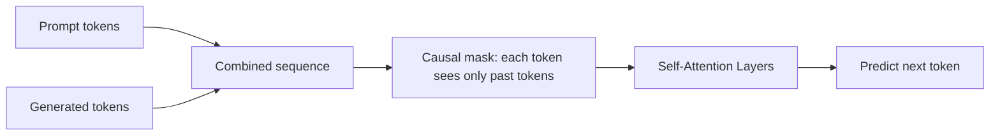
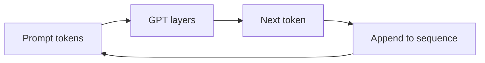

# GPT

An author writing a novel sits at a typewriter and writes one word at a time. They can see everything written so far but don't know what comes next. They predict the best next word, write it, then look at the updated manuscript and predict again.

GPT works exactly like this: generate text by predicting the next token, given all previous tokens. Autoregressive. Left to right. One step at a time.

👉 This is why **GPT** is the dominant architecture for AI assistants — it's a natural text-completing machine that scales spectacularly.

---

## 📌 Learning Priority

**Must Learn** — core concepts, needed to understand the rest of this file:
[What GPT Is](#what-gpt-is) · [Autoregressive Generation](#autoregressive-generation) · [GPT Family Scale](#the-gpt-family-scale-matters)

**Should Learn** — important for real projects and interviews:
[Why Decoder-Only](#why-decoder-only-no-encoder) · [Zero-Shot and Few-Shot](#zero-shot-and-few-shot-learning)

**Good to Know** — useful in specific situations, not needed daily:
[Temperature and Sampling](#temperature-and-sampling)

**Reference** — skim once, look up when needed:
[GPT Parameter Timeline](#the-gpt-family-scale-matters)

---

## What GPT is

GPT (Generative Pretrained Transformer) is a decoder-only transformer using causal (masked) self-attention — each token sees only tokens before it, never after.

**Training objective:** next-token prediction (causal language modeling). Given "The cat sat on the", predict "mat."

Trained on massive text corpora, the model learns grammar, facts, reasoning patterns, and style by predicting any next token from any context.

---

## Why decoder-only (no encoder)?

There's no separate reading phase. Input prompt and output generation are part of the same sequence. The model reads the prompt as context and generates the continuation.

```
"Tell me a joke about computers"
→ [reads as context, predicts continuation]
→ "Why do programmers prefer dark mode? Because light attracts bugs."
```



---

## Autoregressive generation

One token at a time, each step running the whole model:

```
Step 1: "The cat" → predict "sat"
Step 2: "The cat sat" → predict "on"
Step 3: "The cat sat on" → predict "the"
Step 4: "The cat sat on the" → predict "mat"
```



---

## The GPT family: scale matters

| Model | Year | Parameters | Key capability |
|---|---|---|---|
| GPT-1 | 2018 | 117M | First GPT: pretraining + fine-tuning |
| GPT-2 | 2019 | 1.5B | Zero-shot text generation |
| GPT-3 | 2020 | 175B | Few-shot in-context learning |
| InstructGPT | 2022 | 175B | RLHF — follows instructions |
| GPT-4 | 2023 | ~1T (est.) | Multimodal, near-human reasoning |

Consistent finding: bigger models + more data + better training = qualitatively new capabilities. GPT-3 could translate, summarize, code, and reason from a few examples in the prompt — no fine-tuning needed.

---

## Zero-shot and few-shot learning

**Zero-shot:** "Translate to French: Hello"

**Few-shot:** "Translate to French: Hello → Bonjour, Goodbye → Au revoir, Thank you → "

The model generalizes the pattern from the examples. This emerged from scale — small models don't do this reliably, large ones do.

---

## Temperature and sampling

- **Temperature = 0:** Always pick highest-probability token (greedy, deterministic)
- **Temperature = 1.0:** Sample proportional to probabilities (default)
- **Temperature = 1.5:** More random and creative, sometimes incoherent

High temperature → diverse, creative text. Low temperature → focused, predictable text.

---

✅ **What you just learned:** GPT is a decoder-only transformer trained on next-token prediction, generating text autoregressively one token at a time; capabilities scale dramatically with model size, enabling zero/few-shot learning.

🔨 **Build this now:** Load GPT-2 from HuggingFace. Generate text from "The future of artificial intelligence is". Try temperature=0.7 and temperature=1.3. Notice the difference in creativity vs coherence.

➡️ **Next step:** Vision Transformers → `06_Transformers/10_Vision_Transformers/Theory.md`


---

## 📝 Practice Questions

- 📝 [Q37 · gpt-model](../../ai_practice_questions_100.md#q37--thinking--gpt-model)


---

## 📂 Navigation

**In this folder:**
| File | |
|---|---|
| 📄 **Theory.md** | ← you are here |
| [📄 Cheatsheet.md](./Cheatsheet.md) | Quick reference |
| [📄 Interview_QA.md](./Interview_QA.md) | Interview prep |
| [📄 Code_Example.md](./Code_Example.md) | Python code examples |

⬅️ **Prev:** [08 BERT](../08_BERT/Theory.md) &nbsp;&nbsp;&nbsp; ➡️ **Next:** [10 Vision Transformers](../10_Vision_Transformers/Theory.md)
