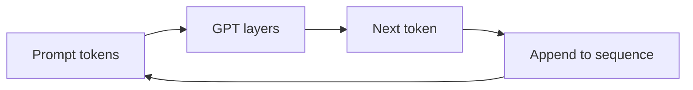

# GPT

Imagine an author writing a novel. They sit down at the typewriter and write one word at a time. They can see everything they've written so far — the whole manuscript — but they have no idea what comes next. They predict the best next word, write it down, then look at the updated manuscript and predict the next word again. Word by word, sentence by sentence, the story emerges.

GPT works exactly like this. It generates text by predicting the next token, given all previous tokens. Autoregressive. Left to right. One step at a time.

👉 This is why **GPT** is the dominant architecture for AI assistants — it's a natural text-completing machine that scales spectacularly.

---

## What GPT is

GPT (Generative Pretrained Transformer) is a decoder-only transformer. It uses causal (masked) self-attention — each token can only see tokens before it, never after.

Training objective: **next-token prediction** (also called causal language modeling).

Given the sequence "The cat sat on the", predict "mat".

This is trained on massive text corpora — the model learns to predict any next token from any context. In doing so, it learns grammar, facts, reasoning patterns, style, and more.

---

## Why decoder-only (no encoder)?

There's no separate "reading phase." The input (your prompt) and the output (the generation) are all part of the same sequence. The model reads the prompt and generates the continuation.

```
"Tell me a joke about computers"
→ [reads this as context, predicts what comes after]
→ "Why do programmers prefer dark mode? Because light attracts bugs."
```

The prompt is just the first part of the sequence. Generation is predicting more of it.

---

## Autoregressive generation

Generation happens one token at a time:

```
Step 1: "The cat" → predict "sat"
Step 2: "The cat sat" → predict "on"
Step 3: "The cat sat on" → predict "the"
Step 4: "The cat sat on the" → predict "mat"
```



Each step runs the whole model. For a 100-token generation, you run the model 100 times.

---

## The GPT family: scale matters

| Model | Year | Parameters | Key capability |
|---|---|---|---|
| GPT-1 | 2018 | 117M | First GPT: pretraining + fine-tuning |
| GPT-2 | 2019 | 1.5B | Zero-shot text generation |
| GPT-3 | 2020 | 175B | Few-shot in-context learning |
| InstructGPT | 2022 | 175B | RLHF — follows instructions |
| GPT-4 | 2023 | ~1T (est.) | Multimodal, near-human reasoning |

The consistent finding: bigger models + more data + better training = qualitatively new capabilities. GPT-3 could translate, summarize, code, and reason from just a few examples in the prompt — no fine-tuning needed.

---

## Zero-shot and few-shot learning

GPT-3 demonstrated that large language models can perform tasks just from a description in the prompt:

**Zero-shot:** "Translate to French: Hello"

**Few-shot:** "Translate to French: Hello → Bonjour, Goodbye → Au revoir, Thank you → "

The model generalizes the pattern from the examples. This emerged from scale — small models don't do this reliably, large ones do.

---

## Temperature and sampling

When GPT generates text, it doesn't always pick the most probable token. You can control randomness:

- **Temperature = 0:** Always pick the highest-probability token (greedy, deterministic)
- **Temperature = 1.0:** Sample proportional to probabilities (default)
- **Temperature = 1.5:** More random, creative, sometimes incoherent

High temperature → diverse, creative text. Low temperature → focused, predictable text.

---

✅ **What you just learned:** GPT is a decoder-only transformer trained on next-token prediction, generating text autoregressively one token at a time; its capabilities scale dramatically with model size, enabling zero/few-shot learning at scale.

🔨 **Build this now:** Load GPT-2 from HuggingFace. Generate text from the prompt "The future of artificial intelligence is". Try temperature=0.7 and temperature=1.3. Notice the difference in creativity vs coherence.

➡️ **Next step:** Vision Transformers → `06_Transformers/10_Vision_Transformers/Theory.md`

---

## 📂 Navigation

**In this folder:**
| File | |
|---|---|
| 📄 **Theory.md** | ← you are here |
| [📄 Cheatsheet.md](./Cheatsheet.md) | Quick reference |
| [📄 Interview_QA.md](./Interview_QA.md) | Interview prep |
| [📄 Code_Example.md](./Code_Example.md) | Python code examples |

⬅️ **Prev:** [08 BERT](../08_BERT/Theory.md) &nbsp;&nbsp;&nbsp; ➡️ **Next:** [10 Vision Transformers](../10_Vision_Transformers/Theory.md)