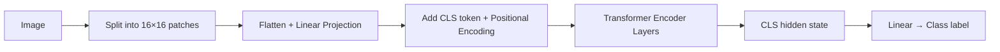

# Vision Transformers (ViT)

Instead of scanning an image pixel by pixel — 1080p is two million pixels — imagine cutting the image into puzzle pieces. Each 16×16 piece becomes one "word." A 224×224 image becomes 196 patches. Process those patches the same way a transformer processes words. That's ViT — taking the architecture that conquered NLP and applying it directly to images.

👉 This is why we need **Vision Transformers** — to apply the proven, scalable transformer architecture to image understanding, replacing the inductive biases of convolutions with flexible attention.

---

## Why not just use CNNs?

Convolutional Neural Networks (CNNs) dominated computer vision for years. They work by applying learned filters locally — detecting edges, textures, shapes.

CNNs have built-in assumptions:
- Local connectivity (nearby pixels relate more than distant ones)
- Translation equivariance (a dog in the corner looks like a dog in the center)

These assumptions were great — and limited. CNNs can't easily model global relationships across the image (e.g., two objects on opposite sides interacting).

Transformers have no such assumptions. Every patch can attend to every other patch directly.

---

## How ViT works

### Step 1: Split image into patches

Take a 224×224 image and divide it into 16×16 patches.

```
224 / 16 = 14 patches per row
14 × 14 = 196 patches total
```

Each patch is 16×16×3 = 768 pixels (RGB). This gets flattened and linearly projected to d_model dimensions.

### Step 2: Add positional encoding

Transformers need position information. ViT adds 1D learned positional embeddings — one per patch position (1 through 196).

### Step 3: Prepend [CLS] token

Just like BERT, ViT prepends a learnable [CLS] token. Its final hidden state is used for image classification.

### Step 4: Pass through transformer encoder

196 patches + 1 [CLS] = 197 tokens → standard encoder layers (multi-head self-attention + FFN).

### Step 5: Classify

Take the [CLS] token's final hidden state → linear layer → class probabilities.



---

## ViT vs CNN

| Feature | CNN | ViT |
|---|---|---|
| Core operation | Local convolution | Global attention |
| Inductive biases | Locality, translation invariance | None (learns them from data) |
| Data efficiency | Good with less data | Needs large datasets (or pretraining) |
| Scalability | Limited at scale | Excellent — scales with compute |
| Long-range dependencies | Hard | Easy |
| Pretrained models | ResNet, EfficientNet | ViT-B, ViT-L, ViT-H |

---

## Multimodal models

ViT's key contribution was showing transformers could handle images as sequences. This opened the door to multimodal models — systems that handle both text and images in one architecture.

| Model | What it does |
|---|---|
| CLIP | Aligns image patches and text tokens in the same embedding space |
| DALL-E | Generates images from text descriptions (using patches as tokens) |
| GPT-4 Vision | Accepts both text and images as input tokens |
| LLaVA | Open-source multimodal LLM using ViT encoder + LLM decoder |

The key insight: once images are represented as sequences of patch embeddings, you can concatenate them with text token embeddings and process the whole thing with one transformer.

---

✅ **What you just learned:** Vision Transformers (ViT) split images into fixed-size patches, treat each patch as a token, add positional encoding, and process them through a standard transformer encoder — enabling attention-based image understanding and multimodal AI.

🔨 **Build this now:** Look at a 224×224 image. Mentally divide it into a 14×14 grid of 16×16 patches. How many patches are there? What information does each patch contain? Which patches would "attend to" each other to recognize a face?

➡️ **Next step:** Section 07 — Large Language Models → `07_Large_Language_Models/Readme.md`

---

## 📂 Navigation

**In this folder:**
| File | |
|---|---|
| 📄 **Theory.md** | ← you are here |
| [📄 Cheatsheet.md](./Cheatsheet.md) | Quick reference |
| [📄 Interview_QA.md](./Interview_QA.md) | Interview prep |

⬅️ **Prev:** [09 GPT](../09_GPT/Theory.md) &nbsp;&nbsp;&nbsp; ➡️ **Next:** [01 LLM Fundamentals](../../07_Large_Language_Models/01_LLM_Fundamentals/Theory.md)