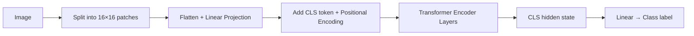

# Vision Transformers (ViT)

Instead of scanning an image pixel by pixel — 1080p is two million pixels — cut the image into puzzle pieces. Each 16×16 piece becomes one "word." A 224×224 image becomes 196 patches. Process those patches the same way a transformer processes words. That's ViT: taking the architecture that conquered NLP and applying it directly to images.

👉 This is why we need **Vision Transformers** — to apply the proven, scalable transformer architecture to image understanding, replacing the inductive biases of convolutions with flexible attention.

---

## 📌 Learning Priority

**Must Learn** — core concepts, needed to understand the rest of this file:
[How ViT Works](#how-vit-works) · [ViT vs CNN](#vit-vs-cnn)

**Should Learn** — important for real projects and interviews:
[Why Not CNNs](#why-not-just-use-cnns) · [Multimodal Models](#multimodal-models)

**Good to Know** — useful in specific situations, not needed daily:
[Patch Count Math](#how-vit-works)

**Reference** — skim once, look up when needed:
[CLIP and DALL-E Examples](#multimodal-models)

---

## Why not just use CNNs?

CNNs dominated computer vision for years with built-in assumptions:
- Local connectivity (nearby pixels relate more than distant ones)
- Translation equivariance (a dog in the corner looks like a dog in the center)

These assumptions were useful but limiting — CNNs can't easily model global relationships across an image (e.g., two objects on opposite sides interacting). Transformers have no such assumptions; every patch can attend to every other patch directly.

---

## How ViT works

**Step 1: Split image into patches**
```
224 / 16 = 14 patches per row
14 × 14 = 196 patches total
```
Each 16×16×3 patch is flattened and linearly projected to d_model dimensions.

**Step 2: Add positional encoding** — ViT adds 1D learned positional embeddings (one per patch position).

**Step 3: Prepend [CLS] token** — just like BERT; its final hidden state is used for classification.

**Step 4: Pass through transformer encoder** — 196 patches + 1 [CLS] = 197 tokens through standard encoder layers.

**Step 5: Classify** — [CLS] final hidden state → linear layer → class probabilities.



---

## ViT vs CNN

| Feature | CNN | ViT |
|---|---|---|
| Core operation | Local convolution | Global attention |
| Inductive biases | Locality, translation invariance | None (learns from data) |
| Data efficiency | Good with less data | Needs large datasets or pretraining |
| Scalability | Limited at scale | Excellent — scales with compute |
| Long-range dependencies | Hard | Easy |
| Pretrained models | ResNet, EfficientNet | ViT-B, ViT-L, ViT-H |

---

## Multimodal models

ViT showed transformers could handle images as sequences, opening the door to multimodal models. Once images are represented as patch embeddings, they can be concatenated with text token embeddings and processed by one transformer.

| Model | What it does |
|---|---|
| CLIP | Aligns image patches and text tokens in the same embedding space |
| DALL-E | Generates images from text descriptions (using patches as tokens) |
| GPT-4 Vision | Accepts both text and images as input tokens |
| LLaVA | Open-source multimodal LLM using ViT encoder + LLM decoder |

---

✅ **What you just learned:** ViT splits images into fixed-size patches, treats each as a token, adds positional encoding, and processes them through a standard transformer encoder — enabling attention-based image understanding and multimodal AI.

🔨 **Build this now:** Mentally divide a 224×224 image into a 14×14 grid of 16×16 patches. How many patches are there? Which patches would attend to each other to recognize a face?

➡️ **Next step:** Section 07 — Large Language Models → `07_Large_Language_Models/Readme.md`

---

## 📂 Navigation

**In this folder:**
| File | |
|---|---|
| 📄 **Theory.md** | ← you are here |
| [📄 Cheatsheet.md](./Cheatsheet.md) | Quick reference |
| [📄 Interview_QA.md](./Interview_QA.md) | Interview prep |

⬅️ **Prev:** [09 GPT](../09_GPT/Theory.md) &nbsp;&nbsp;&nbsp; ➡️ **Next:** [01 LLM Fundamentals](../../07_Large_Language_Models/01_LLM_Fundamentals/Theory.md)
