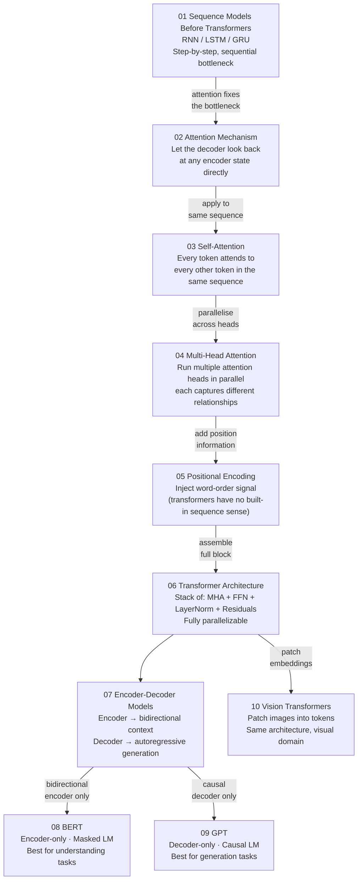

# ⚡ Transformers

⬅️ [05 NLP Foundations](../05_NLP_Foundations/Readme.md) &nbsp;|&nbsp; [🏠 Home](../00_Learning_Guide/Readme.md) &nbsp;|&nbsp; [07 Large Language Models ➡️](../07_Large_Language_Models/Readme.md)

> One 2017 paper — "Attention is All You Need" — replaced a decade of sequence modeling and became the foundation of every major AI system built since.

**[▶ Start here → Sequence Models Before Transformers Theory](./01_Sequence_Models_Before_Transformers/Theory.md)**

---

## At a Glance

| | |
|---|---|
| 📚 Topics | 10 topics |
| ⏱️ Est. Time | 6–8 hours |
| 📋 Prerequisites | [05 NLP Foundations](../05_NLP_Foundations/Readme.md) |
| 🔓 Unlocks | [07 Large Language Models](../07_Large_Language_Models/Readme.md) |

---

## What's in This Section

---

## Topics

| # | Topic | What You'll Learn | Files |
|---|---|---|---|
| 01 | [Sequence Models Before Transformers](./01_Sequence_Models_Before_Transformers/) | Why RNNs and LSTMs struggled with long-range dependencies | [📖 Theory](./01_Sequence_Models_Before_Transformers/Theory.md) · [⚡ Cheatsheet](./01_Sequence_Models_Before_Transformers/Cheatsheet.md) · [🎯 Interview Q&A](./01_Sequence_Models_Before_Transformers/Interview_QA.md) · [📅 Timeline](./01_Sequence_Models_Before_Transformers/Timeline.md) |
| 02 | [Attention Mechanism](./02_Attention_Mechanism/) | Query, key, value — how attention scores focus on relevant context | [📖 Theory](./02_Attention_Mechanism/Theory.md) · [⚡ Cheatsheet](./02_Attention_Mechanism/Cheatsheet.md) · [🎯 Interview Q&A](./02_Attention_Mechanism/Interview_QA.md) · [🔢 Math](./02_Attention_Mechanism/Math_Walkthrough.md) |
| 03 | [Self-Attention](./03_Self_Attention/) | How words attend to each other within the same sequence | [📖 Theory](./03_Self_Attention/Theory.md) · [⚡ Cheatsheet](./03_Self_Attention/Cheatsheet.md) · [🎯 Interview Q&A](./03_Self_Attention/Interview_QA.md) · [🔢 Math](./03_Self_Attention/Math_Walkthrough.md) |
| 04 | [Multi-Head Attention](./04_Multi_Head_Attention/) | Running H attention heads in parallel — each learns different relationships | [📖 Theory](./04_Multi_Head_Attention/Theory.md) · [⚡ Cheatsheet](./04_Multi_Head_Attention/Cheatsheet.md) · [🎯 Interview Q&A](./04_Multi_Head_Attention/Interview_QA.md) |
| 05 | [Positional Encoding](./05_Positional_Encoding/) | Sine/cosine embeddings that give the model a sense of token order | [📖 Theory](./05_Positional_Encoding/Theory.md) · [⚡ Cheatsheet](./05_Positional_Encoding/Cheatsheet.md) · [🎯 Interview Q&A](./05_Positional_Encoding/Interview_QA.md) · [🔢 Math](./05_Positional_Encoding/Math_Intuition.md) |
| 06 | [Transformer Architecture](./06_Transformer_Architecture/) | The complete encoder-decoder block with residuals, layer norm, and FFN | [📖 Theory](./06_Transformer_Architecture/Theory.md) · [⚡ Cheatsheet](./06_Transformer_Architecture/Cheatsheet.md) · [🎯 Interview Q&A](./06_Transformer_Architecture/Interview_QA.md) · [🏗️ Architecture](./06_Transformer_Architecture/Architecture_Deep_Dive.md) · [🔩 Components](./06_Transformer_Architecture/Component_Breakdown.md) |
| 07 | [Encoder-Decoder Models](./07_Encoder_Decoder_Models/) | BERT vs GPT vs T5 — which architecture to pick and when | [📖 Theory](./07_Encoder_Decoder_Models/Theory.md) · [⚡ Cheatsheet](./07_Encoder_Decoder_Models/Cheatsheet.md) · [🎯 Interview Q&A](./07_Encoder_Decoder_Models/Interview_QA.md) · [🔀 Comparison](./07_Encoder_Decoder_Models/Comparison.md) |
| 08 | [BERT](./08_BERT/) | Bidirectional encoder, masked language modeling, fine-tuning for NLU | [📖 Theory](./08_BERT/Theory.md) · [⚡ Cheatsheet](./08_BERT/Cheatsheet.md) · [🎯 Interview Q&A](./08_BERT/Interview_QA.md) · [💻 Code](./08_BERT/Code_Example.md) |
| 09 | [GPT](./09_GPT/) | Causal decoder, autoregressive generation, the GPT-1→4 scaling story | [📖 Theory](./09_GPT/Theory.md) · [⚡ Cheatsheet](./09_GPT/Cheatsheet.md) · [🎯 Interview Q&A](./09_GPT/Interview_QA.md) · [💻 Code](./09_GPT/Code_Example.md) |
| 10 | [Vision Transformers](./10_Vision_Transformers/) | Splitting images into patches, treating them as tokens — ViT and beyond | [📖 Theory](./10_Vision_Transformers/Theory.md) · [⚡ Cheatsheet](./10_Vision_Transformers/Cheatsheet.md) · [🎯 Interview Q&A](./10_Vision_Transformers/Interview_QA.md) |

---

## Key Concepts at a Glance

| Concept | Why It Matters in AI |
|---|---|
| Attention is O(n²) | Every token attends to every other token — expensive but allows direct, single-step connection between any two positions regardless of distance |
| Self-attention replaces recurrence | The entire sequence is processed at once instead of step-by-step, making transformers massively parallelizable on GPUs |
| Multi-head attention | The model attends for different reasons simultaneously — one head may track syntax, another co-reference, another topic — outputs are concatenated |
| BERT is bidirectional, GPT is causal | BERT reads the whole sequence at once (excellent for understanding); GPT predicts the next token (excellent for generation); the task decides which to use |
| Transformers generalize beyond text | Vision Transformers (ViT) apply the exact same mechanism to image patches; the pattern has spread to audio, protein structure, and more |

---

## 📂 Navigation

⬅️ **Prev:** [05 NLP Foundations](../05_NLP_Foundations/Readme.md) &nbsp;&nbsp; ➡️ **Next:** [07 Large Language Models](../07_Large_Language_Models/Readme.md)
