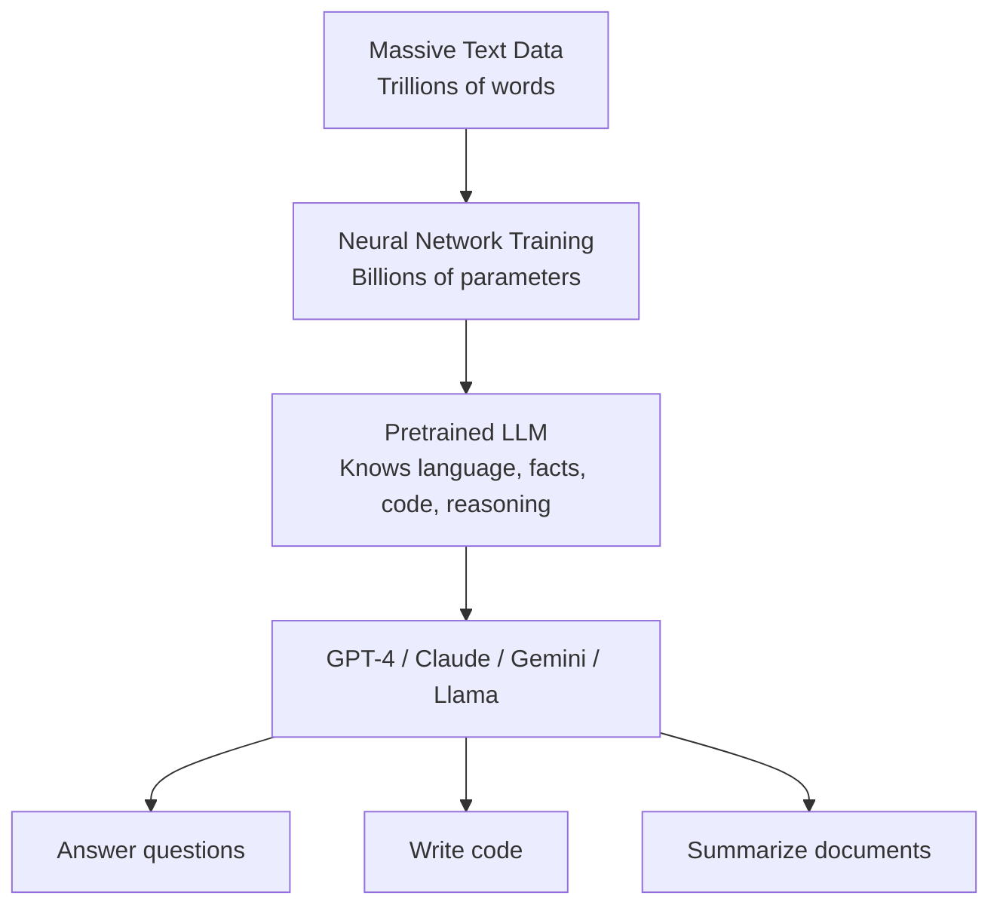
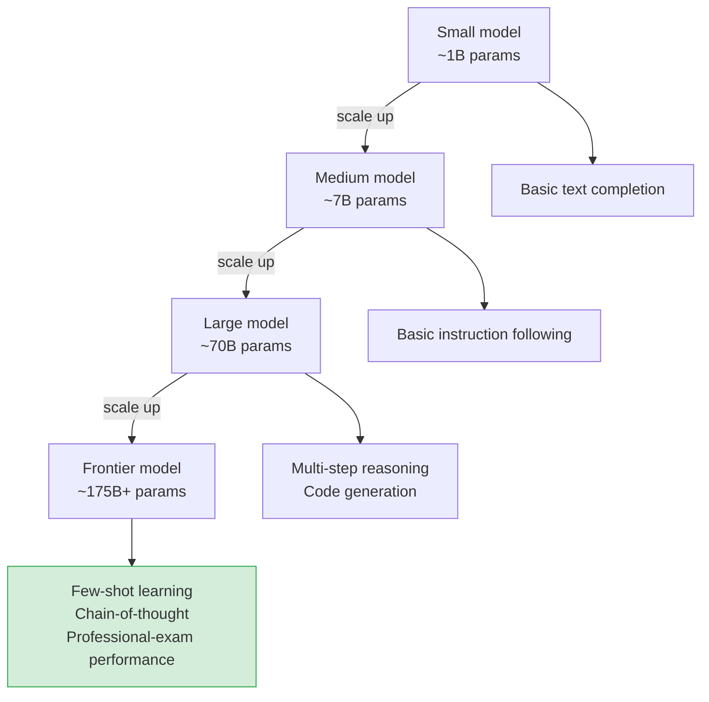

# LLM Fundamentals — Theory

Imagine a student who spent years reading the entire internet — every Wikipedia article, book, Reddit thread, academic paper, and GitHub repo. After all that reading, they can answer almost any question, write in any style, explain any concept, and write code. That student is an LLM.

👉 This is why we need **Large Language Models** — they compress the patterns of human language and knowledge into a single model that can generate useful text on demand.

---

## 📌 Learning Priority

**Must Learn** — core concepts, needed to understand the rest of this file:
[What an LLM Is](#what-actually-is-an-llm) · [Emergent Capabilities](#emergent-capabilities) · [Base vs Chat Model](#base-model-vs-chat-model)

**Should Learn** — important for real projects and interviews:
[Scale Numbers](#scale-the-numbers-that-matter) · [Famous LLMs](#famous-llms-you-should-know)

**Good to Know** — useful in specific situations, not needed daily:
[What LLMs Learn](#what-does-an-llm-actually-learn)

**Reference** — skim once, look up when needed:
[Parameter and Token Counts](#scale-the-numbers-that-matter)

---

## What actually is an LLM?

An LLM (Large Language Model) is a neural network trained to predict text. Three things make it "large":

1. **Parameters** — the adjustable numbers inside the model (billions of dials)
2. **Training data** — the text it learned from (terabytes to petabytes)
3. **Compute** — the GPU time used to train it (millions of dollars)

---

## Scale: the numbers that matter

| Model | Parameters | Training tokens | Year |
|-------|-----------|----------------|------|
| GPT-1 | 117M | 1B | 2018 |
| GPT-2 | 1.5B | 40B | 2019 |
| GPT-3 | 175B | 300B | 2020 |
| GPT-4 | ~1T (estimated) | ~13T | 2023 |
| Claude 3 Opus | Unknown | Unknown | 2024 |
| Llama 3 70B | 70B | 15T | 2024 |

A **parameter** is a single number stored in the model — adjusting all of them during training is what makes the model "learn." A **token** is roughly 3/4 of a word.

---

## What does an LLM actually learn?

Training to predict the next word on trillions of examples teaches the model far more than text patterns. It emerges with:

- **Facts** — "The capital of France is Paris"
- **Reasoning patterns** — "If A > B and B > C, then A > C"
- **Code** — syntax, logic, common patterns
- **Style** — formal, casual, poetic writing
- **Common sense** — things implicit in most text

Nobody explicitly programmed these. They emerge from the training task.

---

## Emergent capabilities

Once models scale up enough, new abilities appear that weren't expected — called **emergence**.

- **Few-shot learning** — GPT-3 can solve tasks after seeing just 3 examples. GPT-2 couldn't.
- **Chain-of-thought reasoning** — Large models can "think step by step." Small models can't.
- **Code generation** — GPT-3 wrote some code; GPT-4 writes complex working programs.

---

## Famous LLMs you should know

**GPT-4 (OpenAI, 2023)** — Multimodal; passes bar and medical exams; powers ChatGPT and GitHub Copilot. Closed source.

**Claude (Anthropic, 2023–2024)** — Built with Constitutional AI safety; up to 200k token context. Claude 3 Opus = frontier quality, Haiku = fast and cheap. Closed source.

**Gemini (Google, 2023–2024)** — Natively multimodal (text, image, video, audio); powers Google products. Closed source.

**Llama (Meta, 2023–2024)** — Open weights; Llama 3 70B rivals GPT-3.5; key for privacy, local AI, and research.

---

## Base model vs chat model

| | Base model | Chat model |
|---|------------|-----------|
| Training | Next-token prediction only | + instruction tuning + RLHF |
| Behavior | Completes your text | Answers questions, follows instructions |
| Example | Llama base | ChatGPT, Claude |
| Useful for | Research, fine-tuning | Most applications |

When you chat with Claude or ChatGPT, you're using a model that has been extensively trained to be helpful. More on that in topics 05 and 06.

---

## Why "large" matters

Bigger models don't just improve at the same things — they gain qualitatively new capabilities. A 7B model follows basic instructions; a 70B model reasons multi-step; a 175B+ model writes complex working code and passes professional exams. Size isn't the only factor — data quality and training techniques matter — but scale remains the biggest driver.

---

✅ **What you just learned:** LLMs are massive neural networks trained on trillions of words that develop language understanding, reasoning, and coding ability as emergent properties of scale.

🔨 **Build this now:** Go to claude.ai or chat.openai.com. Ask: "Explain quantum entanglement to a 10-year-old, then explain it again to a PhD physicist." Notice how the same model shifts style completely.

➡️ **Next step:** How LLMs Generate Text — [02_How_LLMs_Generate_Text/Theory.md](../02_How_LLMs_Generate_Text/Theory.md)

---

## 📝 Practice Questions

- 📝 [Q38 · llm-fundamentals](../../ai_practice_questions_100.md#q38--interview--llm-fundamentals)

---

## 📂 Navigation

**In this folder:**
| File | |
|---|---|
| 📄 **Theory.md** | ← you are here |
| [📄 Cheatsheet.md](./Cheatsheet.md) | Quick reference |
| [📄 Interview_QA.md](./Interview_QA.md) | Interview prep |
| [📄 Timeline.md](./Timeline.md) | Historical timeline of LLMs |

⬅️ **Prev:** [10 Vision Transformers](../../06_Transformers/10_Vision_Transformers/Theory.md) &nbsp;&nbsp;&nbsp; ➡️ **Next:** [02 How LLMs Generate Text](../02_How_LLMs_Generate_Text/Theory.md)
