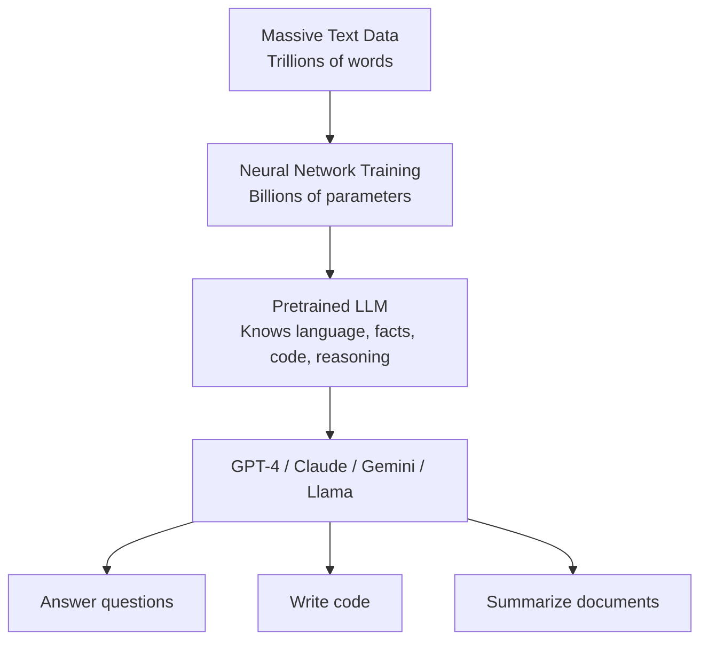

# LLM Fundamentals — Theory

Imagine a student who spent years reading the entire internet. Every Wikipedia article. Every book ever scanned. Every Reddit thread, news article, academic paper, GitHub repo, and forum post. Billions of pages of human knowledge. After all that reading, this student can answer almost any question, write in any style, explain any concept, and even write code. That student is an LLM.

👉 This is why we need **Large Language Models** — they compress the patterns of human language and knowledge into a single model that can generate useful text on demand.

---

## What actually is an LLM?

An LLM (Large Language Model) is a neural network trained to predict text.

That's it. The magic comes from doing that one thing at a truly enormous scale.

Three things make an LLM "large":
1. **Parameters** — the adjustable numbers inside the model (like billions of dials)
2. **Training data** — the text it learned from (terabytes to petabytes)
3. **Compute** — the GPU time used to train it (millions of dollars worth)

---

## Scale: the numbers that matter

| Model | Parameters | Training tokens | Year |
|-------|-----------|----------------|------|
| GPT-1 | 117M | 1B | 2018 |
| GPT-2 | 1.5B | 40B | 2019 |
| GPT-3 | 175B | 300B | 2020 |
| GPT-4 | ~1T (estimated) | ~13T | 2023 |
| Claude 3 Opus | Unknown | Unknown | 2024 |
| Llama 3 70B | 70B | 15T | 2024 |

A **parameter** is a single number stored in the model. GPT-3 has 175 billion of them. Adjusting all those numbers during training is what makes the model "learn."

A **token** is roughly 3/4 of a word. "training" = 1 token. "I am training a model" = 5 tokens. Training on 300 billion tokens means the model has processed something like 225 billion words.

---

## What does an LLM actually learn?

When the model learns to predict the next word on trillions of examples, something surprising happens. It doesn't just memorize text. It learns:

- **Facts** — "The capital of France is Paris"
- **Reasoning patterns** — "If A > B and B > C, then A > C"
- **Code** — syntax, logic, common patterns
- **Style** — how to write formally, casually, poetically
- **Arithmetic** — basic math patterns
- **Common sense** — things that go without saying in most text

Nobody explicitly programmed these. They emerge from the training task.

---

## Emergent capabilities

Here's something wild. Small models can't do certain things. But once you scale up enough, new abilities appear that weren't expected. This is called **emergence**.

Examples of emergent capabilities:
- **Few-shot learning** — GPT-3 can do tasks after seeing just 3 examples in the prompt. GPT-2 couldn't.
- **Chain-of-thought reasoning** — Large models can "think step by step" and get right answers. Small models can't.
- **Code generation** — GPT-3 could write some code. GPT-4 can write complex, working programs.

Nobody added these features manually. They appeared when the model got big enough.

---

## Famous LLMs you should know

**GPT-4 (OpenAI, 2023)**
- Multimodal (text + images)
- Passes bar exam, medical licensing exam
- Powers ChatGPT and GitHub Copilot
- Closed source (you access it via API)

**Claude (Anthropic, 2023–2024)**
- Built with safety in mind (Constitutional AI)
- Very long context window (up to 200k tokens)
- Claude 3 Opus = frontier quality, Haiku = fast and cheap
- Closed source (API access)

**Gemini (Google, 2023–2024)**
- Built natively multimodal (text, image, video, audio)
- Gemini Ultra rivals GPT-4
- Powers Google products
- Closed source (API access)

**Llama (Meta, 2023–2024)**
- Open weights — you can download and run it yourself
- Llama 3 70B rivals GPT-3.5 in many benchmarks
- Huge open-source community building on top of it
- Key for privacy, local AI, and research

---

## Base model vs chat model

Important distinction you need to know:

| | Base model | Chat model |
|---|------------|-----------|
| Training | Next-token prediction only | + instruction tuning + RLHF |
| Behavior | Completes your text | Answers questions, follows instructions |
| Example | Llama base | ChatGPT, Claude |
| Useful for | Research, fine-tuning | Most applications |

When you chat with Claude or ChatGPT, you're not using a raw base model. You're using one that has been extensively trained to be helpful and follow instructions. More on that in topics 05 and 06.

---

## Why "large" matters

Bigger models are not just faster or better at the same things. They gain qualitatively new capabilities. A 7B model can follow basic instructions. A 70B model can reason multi-step. A 175B+ model can write working complex code, pass professional exams, and generalize to tasks it's never seen.

Size isn't the only factor — data quality and training techniques matter too — but scale remains the biggest driver of LLM capability.

---

✅ **What you just learned:** LLMs are massive neural networks trained on trillions of words that develop language understanding, reasoning, and coding ability as emergent properties of scale.

🔨 **Build this now:** Go to claude.ai or chat.openai.com. Ask: "Explain quantum entanglement to a 10-year-old, then explain it again to a PhD physicist." Notice how the same model shifts style completely. That's the flexibility that comes from training on all kinds of text.

➡️ **Next step:** How LLMs Generate Text — [02_How_LLMs_Generate_Text/Theory.md](../02_How_LLMs_Generate_Text/Theory.md)

---

## 📂 Navigation

**In this folder:**
| File | |
|---|---|
| 📄 **Theory.md** | ← you are here |
| [📄 Cheatsheet.md](./Cheatsheet.md) | Quick reference |
| [📄 Interview_QA.md](./Interview_QA.md) | Interview prep |
| [📄 Timeline.md](./Timeline.md) | Historical timeline of LLMs |

⬅️ **Prev:** [10 Vision Transformers](../../06_Transformers/10_Vision_Transformers/Theory.md) &nbsp;&nbsp;&nbsp; ➡️ **Next:** [02 How LLMs Generate Text](../02_How_LLMs_Generate_Text/Theory.md)
