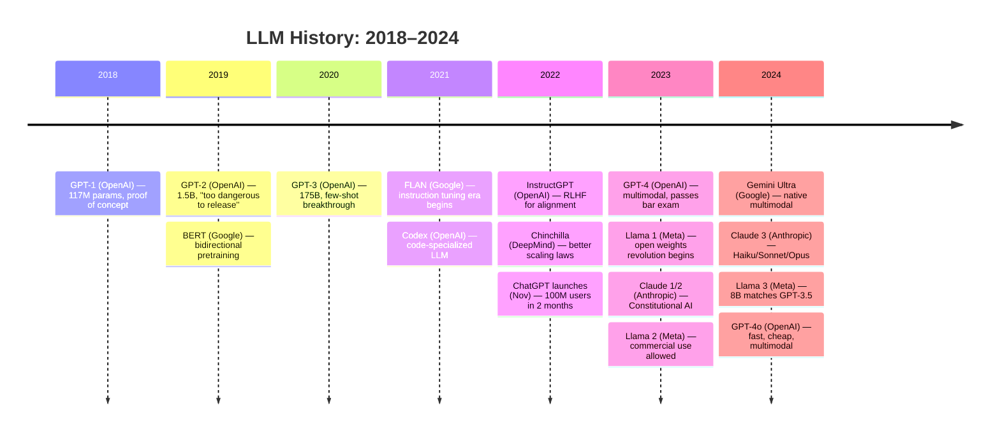

# LLM History Timeline

A visual walk through the key moments that built the LLM era — from a small research paper in 2018 to models that pass professional exams.

---

## The Timeline

---

## Detailed milestones

### 2018 — GPT-1 (OpenAI)
**Parameters:** 117M
**Training data:** BooksCorpus (~1B tokens)
**Key innovation:** Showed that pretraining a transformer on raw text, then fine-tuning on a task, outperforms task-specific models. The "pretrain then fine-tune" paradigm was born.
**What it could suddenly do:** Beat specialized NLP models on several benchmarks without task-specific architecture changes.
**Limitation:** Needed fine-tuning for every new task. Could not generalize in-context.

---

### 2019 — GPT-2 (OpenAI)
**Parameters:** 1.5B
**Training data:** WebText (~40B tokens, filtered Reddit links)
**Key innovation:** Scaled up GPT-1 significantly. Introduced web-scraped data. Showed emergent zero-shot task generalization.
**What it could suddenly do:** Write coherent multi-paragraph essays, complete stories, generate plausible news articles.
**Famous moment:** OpenAI initially refused to release the full model, calling it "too dangerous." This was the first moment LLMs made mainstream news.
**Also in 2019:** BERT (Google) introduced bidirectional pretraining — understanding context from both left and right. Dominated NLU tasks for years.

---

### 2020 — GPT-3 (OpenAI)
**Parameters:** 175B
**Training data:** ~300B tokens (Common Crawl, books, Wikipedia, WebText2)
**Key innovation:** Few-shot learning. You could put a few examples in the prompt and the model would generalize — no fine-tuning needed.
**What it could suddenly do:**
- Answer questions from just examples in the prompt
- Write code from English descriptions
- Translate, summarize, and classify text with no task-specific training
- Pass some professional-level writing tests
**Impact:** The "foundation model" era begins. Every major tech company starts LLM programs.

---

### 2021 — Codex and FLAN
**Codex (OpenAI):** GPT-3 fine-tuned on GitHub code. Powers GitHub Copilot. First time AI-assisted coding became mainstream.

**FLAN (Google):** Fine-tuning on 60+ NLP tasks described as instructions. Showed that instruction-formatted fine-tuning dramatically improved zero-shot generalization. The blueprint for instruction tuning.

---

### 2022 — InstructGPT, Chinchilla, ChatGPT
**InstructGPT (OpenAI, Jan 2022):** Applied RLHF to GPT-3. Humans ranked model outputs. A reward model learned human preferences. The policy model was updated with PPO. Result: a 1.3B InstructGPT model was preferred to raw 175B GPT-3 by human evaluators. Safety and helpfulness via RLHF was proven.

**Chinchilla (DeepMind, Mar 2022):** Showed that Gopher (280B, DeepMind) and GPT-3 (175B) were undertrained. For a given compute budget, you should use fewer parameters but train on more tokens. Chinchilla at 70B, trained on 1.4T tokens, beat models 3x its size. Rewrote the industry's training strategy.

**ChatGPT (OpenAI, Nov 2022):** Launched as a demo of InstructGPT-style RLHF applied to GPT-3.5. Reached 100 million users in 2 months — fastest consumer product adoption in history. LLMs became a household topic.

---

### 2023 — GPT-4, Llama, Claude
**GPT-4 (OpenAI, Mar 2023):**
- Architecture: likely Mixture-of-Experts
- Multimodal: accepts text and images
- Passes bar exam (90th percentile), SAT (1300+), medical licensing exam
- Context: 8k → 32k tokens
- Still the benchmark leader for most complex reasoning tasks for over a year

**Llama 1 (Meta, Feb 2023):**
- 7B–65B parameters, open weights (research license)
- 65B Llama matches GPT-3 175B on many benchmarks
- Ignited a massive open-source LLM ecosystem
- Within weeks: Alpaca, Vicuna, WizardLM — community fine-tunes multiplied

**Claude 1 and 2 (Anthropic, 2023):**
- Built using Constitutional AI (RLAIF — AI feedback instead of human raters)
- Claude 2: 100k token context window (huge leap for long documents)
- Focused on safety, honesty, and helpfulness as explicit design goals

**Llama 2 (Meta, Jul 2023):** Commercial use allowed (up to 700M monthly users). 7B, 13B, 70B versions. 70B matches GPT-3.5 on most tasks. Training on 2T tokens with Chinchilla-informed ratios.

---

### 2024 — Gemini, Claude 3, Llama 3, GPT-4o
**Gemini Ultra (Google, Feb 2024):**
- Native multimodal — trained on text, images, video, audio together
- First model to match GPT-4 on MMLU benchmark
- 1M token context window in later versions
- Deep Google integration (Search, Workspace, Pixel)

**Claude 3 (Anthropic, Mar 2024):**
- Three sizes: Haiku (fast, cheap) / Sonnet (balanced) / Opus (frontier)
- Opus matches or beats GPT-4 on most benchmarks
- 200k token context window
- Strong reasoning, coding, and safety

**Llama 3 (Meta, Apr 2024):**
- 8B and 70B released openly
- 8B model trained on 15T tokens — beats many models 3x its size
- 70B rivals GPT-3.5 / Claude Haiku on most tasks
- 405B model later released — frontier open-weight capability

**GPT-4o (OpenAI, May 2024):**
- "o" = omni — handles text, image, audio natively
- 2x faster and 50% cheaper than GPT-4 Turbo
- Real-time voice conversation capability
- Made frontier AI much more accessible at lower cost

---

## What changed with each era

| Era | Defining shift |
|-----|----------------|
| 2018–2019 | Pretrain + fine-tune replaces task-specific models |
| 2020 | Few-shot learning: prompting replaces fine-tuning for many tasks |
| 2021 | Instruction tuning: models follow natural language instructions |
| 2022 | RLHF: models aligned to human preferences. ChatGPT goes viral |
| 2023 | Open weights (Llama): LLMs democratized. Multimodal (GPT-4) |
| 2024 | Native multimodal standard. Cost drops sharply. Long context normal |

---

## The trend line

- Every year: 10x more training compute
- Every 2 years: new paradigm (pretraining → few-shot → instruction tuning → RLHF → multimodal)
- Cost per token: dropped ~100x from GPT-3 API launch to GPT-4o
- Context window: 2048 tokens (GPT-3) → 1M tokens (Gemini 1.5 Pro)

The pace has not slowed. If anything, it has accelerated.

---

## 📂 Navigation

**In this folder:**
| File | |
|---|---|
| [📄 Theory.md](./Theory.md) | Core concepts |
| [📄 Cheatsheet.md](./Cheatsheet.md) | Quick reference |
| [📄 Interview_QA.md](./Interview_QA.md) | Interview prep |
| 📄 **Timeline.md** | ← you are here |

⬅️ **Prev:** [10 Vision Transformers](../../06_Transformers/10_Vision_Transformers/Theory.md) &nbsp;&nbsp;&nbsp; ➡️ **Next:** [02 How LLMs Generate Text](../02_How_LLMs_Generate_Text/Theory.md)
