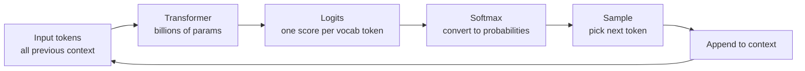

# How LLMs Generate Text — Theory

You know autocomplete on your phone? You type "I'm going to the" and it suggests "store", "gym", "beach." Now imagine that autocomplete had read every book, article, and conversation ever written — its predictions become so accurate it can write whole essays, explain complex ideas, generate working code, or compose poetry, one word at a time.

That's an LLM. At its core: **what word comes next?**

👉 This is why we need **token-by-token generation** — repeatedly predicting the next word is all you need to produce any kind of text output.

---

## From text to tokens

Before the model can generate anything, your text gets split into **tokens** — sub-word units, not words.

```
"ChatGPT" → "Chat" + "G" + "PT"   (3 tokens)
"running" → "running"              (1 token)
"tokenization" → "token" + "ization" (2 tokens)
" hello" → " hello"               (1 token, note the space)
```

The model has a **vocabulary** of all possible tokens — typically 32,000 to 100,000. Every output token is chosen from this vocabulary.

---

## The generation loop



1. **Input**: all tokens so far (prompt + anything generated already)
2. **Transformer**: produces a score (logit) for every token in the vocabulary
3. **Softmax**: converts scores to probabilities (all sum to 1.0)
4. **Sample**: pick the next token based on those probabilities
5. **Repeat**: append the new token to context, go again

This loop runs until the model produces a stop token or hits the max length.

---

## What the probability distribution looks like

After processing "The sky is", the model might produce:

| Token | Probability |
|-------|------------|
| " blue" | 42% |
| " clear" | 18% |
| " dark" | 12% |
| " cloudy" | 8% |
| " beautiful" | 5% |
| (all other tokens) | 15% |

The model doesn't "think" — it outputs a probability distribution and we pick from it.

---

## Temperature: the creativity dial

Temperature controls how much you flatten or sharpen probabilities before sampling.

- **Low (0.1–0.3):** Top token gets more probability — predictable, safe. Good for factual Q&A, code, structured output.
- **High (0.8–1.2):** Probabilities spread out — surprising, creative, potentially incoherent. Good for creative writing, brainstorming.
- **Temperature = 0:** Always pick the highest-probability token — called **greedy decoding**. Deterministic, but can get stuck in repetitive loops.

---

## Greedy vs sampling

**Greedy decoding**: always pick the most probable token.
- Pro: fast, deterministic. Con: repetitive or "safe" outputs; misses good paths requiring a less-likely first token.

**Sampling**: pick randomly according to probabilities.
- Pro: diverse, creative outputs. Con: incoherent if temperature is too high.

Most production systems use sampling with moderate temperature (0.3–0.7).

---

## Top-p sampling (nucleus sampling)

Top-p restricts choices to the smallest set of tokens whose cumulative probability reaches p.

Example with top-p = 0.9: rank tokens by probability, keep adding until cumulative probability ≥ 0.9, sample only from those. If the model is confident (top 3 tokens = 95%), you sample from 3. If uncertain, you sample from a wider pool. It adapts to context.

**Top-k sampling**: keep the top k tokens regardless of probability. Top-p is generally preferred because it adapts.

In practice, apply top-p first to get candidates, then apply temperature to reshape probabilities within that set, then sample.

---

## Why this matters for your applications

- **Set temperature right**: creative tasks → higher; factual tasks → lower
- **Debug repetitive output**: model stuck looping → try higher temperature or presence penalty
- **Understand non-determinism**: same prompt twice → different outputs (unless temperature=0)
- **Control quality**: for structured output (JSON, code), low temperature is safer

---

## The "stochastic parrot" critique

Some critics call LLMs "stochastic parrots" — just predicting probable tokens from training data without real understanding. Partially right (LLMs work by statistical pattern matching, not a world model), partially wrong (patterns learned at scale give rise to genuine reasoning and generalization to new problems). The mechanism is simple; the emergent behavior at scale is genuinely complex.

---

✅ **What you just learned:** LLMs generate text token by token by repeatedly sampling from a probability distribution over the vocabulary, shaped by temperature and top-p parameters.

🔨 **Build this now:** Call any LLM API. Run the same prompt 5 times with temperature=0 — you should get identical outputs. Then run it 5 times with temperature=1.0 — you should get 5 different outputs.

➡️ **Next step:** Pretraining — [03_Pretraining/Theory.md](../03_Pretraining/Theory.md)

---

## 🛠️ Practice Project

Apply what you just learned → **[B4: LLM Chatbot with Memory](../../22_Capstone_Projects/04_LLM_Chatbot_with_Memory/03_GUIDE.md)**
> This project uses: understanding token-by-token generation to set the right max_tokens, temperature, and stop sequences


---

## 📝 Practice Questions

- 📝 [Q39 · llm-text-generation](../../ai_practice_questions_100.md#q39--thinking--llm-text-generation)


---

## 📂 Navigation

**In this folder:**
| File | |
|---|---|
| 📄 **Theory.md** | ← you are here |
| [📄 Cheatsheet.md](./Cheatsheet.md) | Quick reference |
| [📄 Interview_QA.md](./Interview_QA.md) | Interview prep |

⬅️ **Prev:** [01 LLM Fundamentals](../01_LLM_Fundamentals/Theory.md) &nbsp;&nbsp;&nbsp; ➡️ **Next:** [03 Pretraining](../03_Pretraining/Theory.md)
