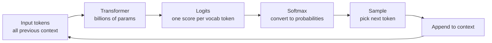

# How LLMs Generate Text — Theory

You know that autocomplete on your phone? You type "I'm going to the" and it suggests "store", "gym", "beach." It's guessing what word probably comes next based on what you've typed so far.

Now imagine that autocomplete had read every book, article, and conversation ever written. Its predictions become so accurate it can write whole essays, explain complex ideas, generate working code, or compose poetry — one word at a time.

That's an LLM. The whole thing, at its core, is: **what word comes next?**

👉 This is why we need **token-by-token generation** — because predicting the next word repeatedly is all you need to produce any kind of text output.

---

## From text to tokens

Before the model can generate anything, your text gets split into **tokens**.

A token is not the same as a word. It's a sub-word unit. Common words are one token. Rare words split into multiple tokens.

```
"ChatGPT" → "Chat" + "G" + "PT"   (3 tokens)
"running" → "running"              (1 token)
"tokenization" → "token" + "ization" (2 tokens)
" hello" → " hello"               (1 token, note the space)
```

The model has a **vocabulary** of all possible tokens — typically 32,000 to 100,000 tokens. Every output token is chosen from this vocabulary.

---

## The generation loop

Here's what happens every time an LLM generates one token:



1. **Input**: all tokens so far (your prompt + anything generated already)
2. **Transformer**: processes all of it, produces a score (logit) for every token in the vocabulary
3. **Softmax**: converts scores into probabilities (all sum to 1.0)
4. **Sample**: pick the next token based on those probabilities
5. **Repeat**: append the new token to context, go again

This loop runs until the model produces a stop token or hits the max length.

---

## What the probability distribution looks like

After processing "The sky is", the model might produce something like:

| Token | Probability |
|-------|------------|
| " blue" | 42% |
| " clear" | 18% |
| " dark" | 12% |
| " cloudy" | 8% |
| " beautiful" | 5% |
| (all other tokens) | 15% |

The model doesn't "think" — it just outputs a probability distribution and we pick from it.

---

## Temperature: the creativity dial

Temperature controls how much you flatten or sharpen those probabilities before sampling.

**Low temperature (e.g., 0.1–0.3):**
- Top token gets even more probability
- Output is predictable, repetitive, safe
- Good for: factual Q&A, code, structured output

**High temperature (e.g., 0.8–1.2):**
- Probabilities spread out more
- Output is surprising, creative, potentially incoherent
- Good for: creative writing, brainstorming, variety

**Temperature = 0:**
- Always pick the single highest-probability token
- Called **greedy decoding** — deterministic, no randomness
- Can get stuck in repetitive loops

Think of temperature as: how adventurous is the model being? Low = safe. High = wild.

---

## Greedy vs sampling

**Greedy decoding**: always pick the most probable token.
- Pro: fast, deterministic
- Con: can produce repetitive or "safe" outputs; misses good paths that require a less-likely first token

**Sampling**: pick randomly according to probabilities.
- Pro: diverse, creative outputs
- Con: can produce incoherent text if temperature is too high

Most production systems use sampling with moderate temperature (0.3–0.7).

---

## Top-p sampling (nucleus sampling)

Instead of picking from the full vocabulary, top-p sampling restricts choices to the smallest set of tokens whose cumulative probability reaches p.

Example with top-p = 0.9:
- Rank tokens by probability
- Keep adding tokens to the candidate set until cumulative probability ≥ 0.9
- Sample only from those tokens

This way: if the model is confident (top 3 tokens = 95% probability), you sample from just 3. If the model is uncertain, you sample from a wider pool. It adapts to context.

**Top-k sampling**: similar idea, but keep the top k tokens regardless of probability. Top-p is generally preferred because it adapts.

---

## Temperature + top-p together

In practice, most APIs let you set both. They work together:
1. Apply top-p to get the candidate tokens
2. Apply temperature to reshape probabilities within that set
3. Sample

Most Claude and OpenAI API calls default to something like temperature=1.0, top-p=0.99 — essentially free sampling with full vocabulary, relying on the model's trained distributions.

---

## Why this matters for your applications

Understanding generation means you can:
- **Set temperature right**: creative tasks → higher, factual tasks → lower
- **Debug repetitive output**: model stuck looping → try higher temperature or presence penalty
- **Understand non-determinism**: same prompt twice → different outputs (unless temperature=0)
- **Control quality**: for structured output (JSON, code), low temperature is safer

---

## The "stochastic parrot" critique

Some critics call LLMs "stochastic parrots" — they just predict probable next tokens from training data without real understanding. This is partially right and partially wrong.

Right: LLMs don't have a world model. They work by statistical pattern matching.
Wrong: the patterns learned at scale give rise to genuine reasoning, generalization to new problems, and capabilities that weren't in the training data explicitly.

The "predict next token" mechanism is genuinely simple. The emergent behavior that results from doing it at scale is genuinely complex.

---

✅ **What you just learned:** LLMs generate text token by token by repeatedly sampling from a probability distribution over the vocabulary, shaped by temperature and top-p parameters.

🔨 **Build this now:** Call any LLM API (or use a playground). Run the same prompt 5 times with temperature=0 — you should get identical outputs. Then run it 5 times with temperature=1.0 — you should get 5 different outputs. That one experiment makes token sampling tangible.

➡️ **Next step:** Pretraining — [03_Pretraining/Theory.md](../03_Pretraining/Theory.md)

---

## 📂 Navigation

**In this folder:**
| File | |
|---|---|
| 📄 **Theory.md** | ← you are here |
| [📄 Cheatsheet.md](./Cheatsheet.md) | Quick reference |
| [📄 Interview_QA.md](./Interview_QA.md) | Interview prep |

⬅️ **Prev:** [01 LLM Fundamentals](../01_LLM_Fundamentals/Theory.md) &nbsp;&nbsp;&nbsp; ➡️ **Next:** [03 Pretraining](../03_Pretraining/Theory.md)
