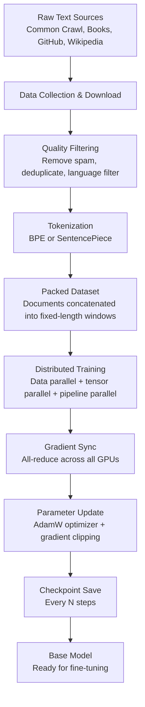

# Pretraining Architecture Deep Dive

A technical look at what pretraining actually looks like at scale — from raw text on disk to a trained model ready for fine-tuning.

---

## The full pipeline



---

## Step 1: Data collection

**Scale**: Training a frontier model requires petabytes of raw text. Common Crawl alone is ~800TB of compressed web data per crawl, run monthly since 2008.

**Key sources:**
- Common Crawl: scraped HTML from billions of web pages
- Books: digitized books via Internet Archive, gutenberg.org, licensed publishers
- Wikipedia: periodic dumps of all articles
- GitHub: public code repositories (filtered to permissive licenses)
- Academic: ArXiv papers, PubMed abstracts, Semantic Scholar

**Typical data mix by token count (approximate, Llama 3 style):**
```
CommonCrawl (filtered web): ~80%
Code (GitHub):               ~8%
Wikipedia + books:           ~5%
ArXiv + academic:            ~3%
Other curated sources:       ~4%
```

---

## Step 2: Quality filtering

Raw Common Crawl is noisy. Typical filtering pipeline:

```
1. Language detection (fastText classifier)
   → Keep primarily English (or target languages)

2. URL blocklist
   → Remove adult sites, spam domains

3. Quality heuristics (C4 / Gopher / RefinedWeb style):
   → Remove documents < 200 words
   → Remove documents with > 30% numeric characters
   → Remove documents with > 50% punctuation
   → Keep only docs where most lines end in punctuation
   → Check perplexity against a small LM (filter if too high)

4. Deduplication:
   → Exact duplicate removal (SHA-256 hash of document)
   → Near-duplicate removal (MinHash + LSH similarity)
   → N-gram deduplication at the paragraph level (Bloom filter)

5. Personal data scrubbing:
   → Remove documents containing email addresses, phone numbers (regex)
   → Some providers use NER to find and remove names + addresses
```

The result is roughly 1–5% of raw Common Crawl surviving filtering. That 1–5% is higher quality than the 100%.

---

## Step 3: Tokenization

After filtering, text is tokenized into integer token IDs.

**BPE (Byte-Pair Encoding) algorithm:**
```
1. Start with character-level vocabulary + byte fallback
2. Count all pairs of adjacent tokens in the corpus
3. Merge the most frequent pair into a new single token
4. Repeat until vocabulary size reaches target (e.g., 32,000 or 128,000)
```

This produces a vocabulary where common words are single tokens and rare words are split into pieces:
```
"the"         → [id:318]         (1 token)
"python"      → [id:28024]       (1 token)
"tokenization"→ [id:3263, id:1634] (2 tokens: "token" + "ization")
```

The tokenizer is trained once on a sample of the training data before the model is trained. It is fixed for the model's lifetime.

**Why byte fallback matters**: Without it, any character not in the vocabulary produces `[UNK]`. With byte-level BPE, every UTF-8 character can be represented as a sequence of byte tokens — no unknown tokens ever.

---

## Step 4: Data packing

Training transformers requires fixed-length inputs (e.g., sequences of 4096 or 8192 tokens).

Documents vary in length. Strategy:
```
1. Concatenate tokenized documents end-to-end with a document separator token
2. Slice into chunks of exactly context_length tokens
3. Optionally use attention masks to prevent attention across document boundaries
```

This maximizes GPU utilization — no wasted padding tokens, every position in every batch is real training signal.

**Packing with cross-document attention prevention:**
- Some implementations allow attention across document boundaries (simpler, minor quality loss)
- Others use attention masks so each document only attends within itself (correct, but more complex)

---

## Step 5: Distributed training infrastructure

Training at scale requires running across many machines. Three levels of parallelism:

### Data Parallelism (DP)
```
Model weights: identical copy on each GPU
Data: different mini-batch on each GPU
After backward pass: average gradients across all GPus (all-reduce)
```

Scales to thousands of GPUs easily. Bottleneck: all-reduce communication bandwidth.

### Tensor Parallelism (TP)
```
Weight matrix W (4096 × 4096) split across 8 GPUs:
GPU 0: W[:, 0:512]
GPU 1: W[:, 512:1024]
...
GPU 7: W[:, 3584:4096]

Each GPU computes its partial result
All-gather combines the pieces
```

Requires very fast intra-node communication (NVLink, 600GB/s+). Usually limited to GPUs within a single node (8 GPUs).

### Pipeline Parallelism (PP)
```
Model layers split across nodes:
Node 0: Embedding + layers 1–8
Node 1: Layers 9–16
Node 2: Layers 17–24
...

Micro-batches flow through the pipeline
While node 1 processes batch N, node 0 processes batch N+1
```

Reduces memory per node. Introduces "pipeline bubbles" (idle time) at the beginning and end of each batch, partially solved by "1F1B" scheduling.

### Combined: 3D Parallelism

Large models combine all three:
- TP within a node (all 8 GPUs communicate via NVLink)
- PP across nodes (inter-node communication via InfiniBand)
- DP across groups (many parallel pipeline replicas)

Llama 3 405B training used ~16,000 H100 GPUs organized in this 3D parallel configuration.

---

## Step 6: The optimizer and training dynamics

**Optimizer: AdamW**

AdamW (Adam with decoupled weight decay) is used universally for LLM pretraining:
- Maintains first moment (mean of gradients) and second moment (variance of gradients) per parameter
- Adapts learning rate per parameter
- Weight decay applied to weights, not to adaptive learning rate (the "decoupled" part)

Key hyperparameters:
- Learning rate: typically ~3e-4 peak, with warmup + cosine decay
- β1: 0.9 (first moment decay)
- β2: 0.95 (second moment decay)
- Weight decay: 0.1
- Gradient clipping: max norm = 1.0

**Learning rate schedule:**
```
Steps 0 → N_warmup:  Linear warmup (0 → peak LR)
Steps N_warmup → N_total: Cosine decay (peak LR → min LR, ~10% of peak)
```

Warmup prevents early training instability when gradients are large and the model is random.

**Gradient clipping:**
If the gradient norm exceeds a threshold (1.0), scale all gradients down so the norm = 1.0. Prevents "gradient explosions" that would destabilize training.

**Mixed precision:**
Weights stored in bfloat16 (2 bytes per parameter) for memory efficiency. A master copy in float32 is maintained for accurate gradient updates. The forward and backward passes use bfloat16; the parameter update uses float32. This halves memory for activations and significantly speeds up matrix operations on modern hardware.

---

## Step 7: Monitoring and checkpointing

**What to monitor:**
- Training loss (should decrease smoothly as a power law)
- Gradient norm (should stay stable, < 1.0 after clipping; spikes indicate instability)
- Learning rate (should follow the schedule)
- GPU utilization (should be >90%)
- Memory usage (should be stable, not growing)
- Downstream benchmark evals (MMLU, GSM8k, HumanEval) every few billion tokens

**Checkpointing:**
At large scale, hardware failures are not rare — they're expected. A cluster of 16,000 GPUs will have a GPU failure every few hours.

Checkpoints are saved:
- Every 1,000–5,000 steps (the model state: weights, optimizer state, RNG state)
- Saved to distributed storage (e.g., AWS S3, Google Cloud Storage) in parallel
- Previous N checkpoints kept in case the latest is corrupted
- Full checkpoint = model weights + optimizer moments = 2–3x model size in storage

If a training run fails, resume from the last good checkpoint. The cost of recomputation from the checkpoint is at most a few thousand steps.

---

## Step 8: Training efficiency metrics

**MFU (Model FLOPs Utilization):**
Ratio of actual compute throughput to theoretical maximum. On H100 GPUs with bfloat16, theoretical peak is ~1,980 TFLOPS. A well-optimized training run might achieve 35–55% MFU — meaning 35–55% of peak hardware capability is used for actual model computation. The rest goes to communication, memory operations, and overhead.

**Tokens per second per GPU:**
Typical ranges:
- 7B model: ~10,000–20,000 tokens/sec per H100
- 70B model: ~1,500–3,000 tokens/sec per H100
- 405B model: ~200–400 tokens/sec per H100

Training Llama 3 8B on 15T tokens at 15,000 tokens/sec/GPU on 2,048 GPUs:
```
Total tokens: 15 × 10^12
Throughput: 15,000 × 2,048 = 30.7M tokens/sec
Time: 15 × 10^12 / (30.7 × 10^6) ≈ 489,000 seconds ≈ 5.7 days
```

Actual wall-clock time is longer due to checkpointing, failures, and synchronization overhead.

---

## The output: a pretrained base model

After training completes, you have:
- Model weights: billions of float32/bfloat16 parameters
- A tokenizer (trained separately, frozen)
- Training config (hyperparameters, data mix)
- Evaluation scores on standard benchmarks

The base model can:
- Complete any text continuation impressively
- Answer questions in a completion style
- Write code if given enough context
- Show emergent reasoning abilities

The base model cannot:
- Follow instructions reliably
- Refuse harmful requests
- Maintain a helpful assistant persona
- Use structured output formats consistently

Next: instruction tuning and RLHF transform this base model into a deployable assistant.

---

## 📂 Navigation

**In this folder:**
| File | |
|---|---|
| [📄 Theory.md](./Theory.md) | Core concepts |
| [📄 Cheatsheet.md](./Cheatsheet.md) | Quick reference |
| [📄 Interview_QA.md](./Interview_QA.md) | Interview prep |
| 📄 **Architecture_Deep_Dive.md** | ← you are here |

⬅️ **Prev:** [02 How LLMs Generate Text](../02_How_LLMs_Generate_Text/Theory.md) &nbsp;&nbsp;&nbsp; ➡️ **Next:** [04 Fine Tuning](../04_Fine_Tuning/Theory.md)
