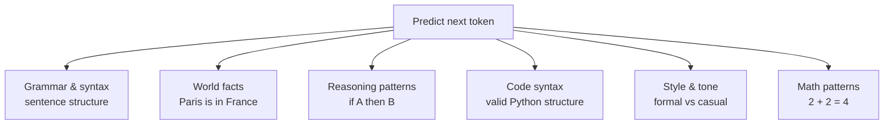

# Pretraining — Theory

Imagine a new employee joins a company on their first day. But before they do any real work, they spend six months in a library — reading every document, email, manual, report, and research paper the company has ever produced. No tasks. No supervision. Just reading everything.

After six months, they haven't done any specific job yet. But they know the company's language, culture, history, facts, and patterns cold. They're ready to be pointed at any task.

That's pretraining. The model consumes enormous amounts of text — no labels, no right/wrong feedback — just absorbing patterns. Then it's ready to be specialized.

👉 This is why we need **pretraining** — it gives the model a rich foundation of language, facts, and reasoning that any downstream task can build on.

---

## What is self-supervised learning?

Pretraining uses a trick called **self-supervised learning**. You don't need humans to label data.

The model's task is simple: given the text so far, predict the next token.

```
Input:  "The capital of France is"
Target: "Paris"
```

The "label" (Paris) was already in the text. No human needed to write it. This is why you can train on raw internet text — the supervision signal is built into the text itself.

This one objective, applied to trillions of examples, teaches the model an enormous amount.

---

## What the model actually learns

Here's the surprising thing. The model is never told "learn facts" or "learn reasoning." It's just told "predict the next word." But to predict the next word accurately, you have to understand:



All of these emerge as side effects of the training objective.

---

## The data

What goes into pretraining? A huge mixture of text sources:

| Source | What it contains | Why it's useful |
|--------|-----------------|-----------------|
| Common Crawl | Scraped web pages (raw, messy) | Breadth, current language |
| Books (BookCorpus, Project Gutenberg) | Long-form coherent text | Long-range reasoning, narrative |
| Wikipedia | Encyclopedic facts | Knowledge, structure |
| GitHub | Source code across languages | Programming ability |
| ArXiv / PubMed | Academic papers | Technical reasoning |
| StackOverflow | Q&A about programming | Code problem-solving |
| News articles | Current events, writing style | Recency, factual structure |

GPT-3 trained on ~300B tokens. Llama 3 trained on 15 trillion tokens. The quality and balance of this mixture matters enormously — more than just raw size.

---

## Data quality matters more than data quantity

You can't just dump everything into training. Bad data degrades the model. Key steps:

1. **Deduplication**: Remove duplicate documents. Near-duplicates cause the model to "memorize" instead of generalize.
2. **Quality filtering**: Remove spam, gibberish, offensive content (varies by policy). Common Crawl is noisy — filtering is essential.
3. **Language filtering**: Keep the desired language distribution.
4. **Domain balancing**: Don't let one source (e.g., Common Crawl) overwhelm everything else. Wikipedia and books are higher quality per token.
5. **PII removal**: Remove names, addresses, and personal data where possible.

---

## The training objective

Formally, pretraining minimizes **cross-entropy loss** on next-token prediction:

```
For each position i in the training data:
  - Input: tokens[0 ... i-1]
  - Target: tokens[i]
  - Loss: -log(probability the model assigns to tokens[i])
```

The model updates its billions of parameters to minimize this loss across trillions of training examples. That process is backpropagation through the transformer.

---

## The compute cost

Pretraining is extraordinarily expensive.

| Model | Estimated compute | Estimated cost |
|-------|------------------|----------------|
| GPT-3 (175B) | ~3.14 × 10²³ FLOPs | ~$4.6M |
| LLaMA 1 (65B) | ~1.0 × 10²³ FLOPs | ~$1–2M |
| GPT-4 (est.) | ~2 × 10²⁵ FLOPs | ~$50–100M |
| Llama 3 (405B) | Not disclosed | Estimated ~$30–60M |

This is why only a handful of organizations can pretrain frontier models. The barrier is not intelligence — it's infrastructure and money.

But once a model is pretrained, the cost per inference is tiny. The expensive part is done once.

---

## What "training dynamics" means

During training, several important things happen over time:

- **Loss decreases**: The model's predictions get better. A well-trained model reaches very low perplexity on held-out text.
- **Learning rate scheduling**: Usually a warmup then cosine decay. Start slow, go fast, taper off.
- **Gradient clipping**: Prevents "exploding gradients" that destabilize training.
- **Checkpointing**: Save the model every N steps. If training crashes (it does, at this scale), resume from the last checkpoint.
- **Evaluation on benchmarks**: Periodically test on standard NLP benchmarks to track capability growth.

Training a large model can take weeks to months even on thousands of GPUs.

---

## What pretraining does NOT give you

After pretraining, the model:
- Knows a lot of facts and language patterns
- Can complete text very well
- Has no idea how to answer questions helpfully
- Has no "personality" or safety behavior
- May produce harmful, biased, or incorrect outputs

That's why pretraining is just the start. Fine-tuning (topic 04), instruction tuning (topic 05), and RLHF (topic 06) are the next steps that turn a raw model into something useful and safe.

---

✅ **What you just learned:** Pretraining uses self-supervised next-token prediction on trillions of tokens to give a model broad language, knowledge, and reasoning ability before any task-specific training.

🔨 **Build this now:** Go to a HuggingFace model page (e.g., meta-llama/Llama-2-7b — not the chat version). Look at the model card. It will say it's a "base model." Try prompting it with an incomplete sentence and see how it completes it differently from a chat model. Notice it continues your text rather than answering your question.

➡️ **Next step:** Fine-Tuning — [04_Fine_Tuning/Theory.md](../04_Fine_Tuning/Theory.md)

---

## 📂 Navigation

**In this folder:**
| File | |
|---|---|
| 📄 **Theory.md** | ← you are here |
| [📄 Cheatsheet.md](./Cheatsheet.md) | Quick reference |
| [📄 Interview_QA.md](./Interview_QA.md) | Interview prep |
| [📄 Architecture_Deep_Dive.md](./Architecture_Deep_Dive.md) | Pretraining architecture deep dive |

⬅️ **Prev:** [02 How LLMs Generate Text](../02_How_LLMs_Generate_Text/Theory.md) &nbsp;&nbsp;&nbsp; ➡️ **Next:** [04 Fine Tuning](../04_Fine_Tuning/Theory.md)
