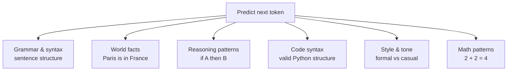
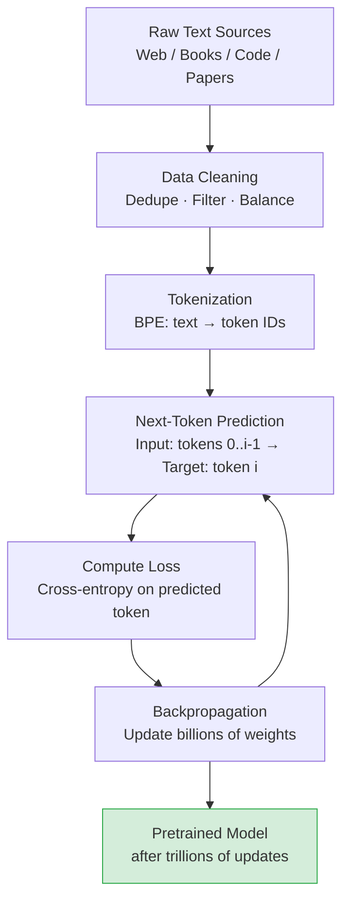

# Pretraining — Theory

Imagine a new employee who, before starting any real work, spends six months in a library reading every document, email, manual, and research paper the company has ever produced. No tasks, no supervision — just absorbing everything. Afterward they know the company's language, culture, history, and patterns cold. That's pretraining: consuming enormous text with no labels, building a rich foundation for any downstream task.

👉 This is why we need **pretraining** — it gives the model broad language, facts, and reasoning that any downstream task can build on.

---

## What is self-supervised learning?

Pretraining uses **self-supervised learning** — no human labels needed. The task: given the text so far, predict the next token.

```
Input:  "The capital of France is"
Target: "Paris"
```

The label (Paris) was already in the text. This is why you can train on raw internet text — the supervision signal is built in. Applied to trillions of examples, this one objective teaches the model an enormous amount.

---

## What the model actually learns

The model is never told "learn facts" or "learn reasoning." It's just told "predict the next word." But to predict accurately, it must understand:



All of these emerge as side effects of the training objective.

---

## The data

| Source | What it contains | Why it's useful |
|--------|-----------------|-----------------|
| Common Crawl | Scraped web pages (raw, messy) | Breadth, current language |
| Books (BookCorpus, Project Gutenberg) | Long-form coherent text | Long-range reasoning |
| Wikipedia | Encyclopedic facts | Knowledge, structure |
| GitHub | Source code | Programming ability |
| ArXiv / PubMed | Academic papers | Technical reasoning |
| StackOverflow | Q&A about programming | Code problem-solving |
| News articles | Current events | Recency, factual structure |

GPT-3 trained on ~300B tokens; Llama 3 on 15T. Quality and balance of this mixture matters enormously.



---

## Data quality over quantity

Key cleaning steps:
1. **Deduplication**: Remove duplicates — near-duplicates cause memorization instead of generalization.
2. **Quality filtering**: Remove spam, gibberish, offensive content. Common Crawl is very noisy.
3. **Language filtering**: Maintain the desired language distribution.
4. **Domain balancing**: Don't let one source overwhelm everything. Wikipedia and books are higher quality per token.
5. **PII removal**: Remove names, addresses, personal data where possible.

---

## The training objective

Pretraining minimizes **cross-entropy loss** on next-token prediction:

```
For each position i in the training data:
  - Input: tokens[0 ... i-1]
  - Target: tokens[i]
  - Loss: -log(probability the model assigns to tokens[i])
```

The model updates its billions of parameters to minimize this loss across trillions of examples via backpropagation through the transformer.

---

## The compute cost

| Model | Estimated compute | Estimated cost |
|-------|------------------|----------------|
| GPT-3 (175B) | ~3.14 × 10²³ FLOPs | ~$4.6M |
| LLaMA 1 (65B) | ~1.0 × 10²³ FLOPs | ~$1–2M |
| GPT-4 (est.) | ~2 × 10²⁵ FLOPs | ~$50–100M |
| Llama 3 (405B) | Not disclosed | ~$30–60M est. |

Only a handful of organizations can pretrain frontier models — the barrier is infrastructure and money, not intelligence. Once pretrained, inference cost is tiny.

---

## Training dynamics

- **Loss decreases** over time; a well-trained model reaches very low perplexity on held-out text.
- **Learning rate scheduling**: warmup then cosine decay.
- **Gradient clipping**: prevents exploding gradients.
- **Checkpointing**: save every N steps; resume after crashes (common at scale).
- Training can take weeks to months even on thousands of GPUs.

---

## What pretraining does NOT give you

After pretraining, the model knows facts and language patterns, can complete text well — but has no idea how to answer questions helpfully, has no personality or safety behavior, and may produce harmful or incorrect outputs. Fine-tuning (topic 04), instruction tuning (topic 05), and RLHF (topic 06) turn a raw model into something useful and safe.

---

✅ **What you just learned:** Pretraining uses self-supervised next-token prediction on trillions of tokens to give a model broad language, knowledge, and reasoning ability before any task-specific training.

🔨 **Build this now:** Go to a HuggingFace model page (e.g., meta-llama/Llama-2-7b — not the chat version). Try prompting it with an incomplete sentence. Notice it continues your text rather than answering your question — that's a base model.

➡️ **Next step:** Fine-Tuning — [04_Fine_Tuning/Theory.md](../04_Fine_Tuning/Theory.md)


---

## 📝 Practice Questions

- 📝 [Q40 · pretraining](../../ai_practice_questions_100.md#q40--thinking--pretraining)


---

## 📂 Navigation

**In this folder:**
| File | |
|---|---|
| 📄 **Theory.md** | ← you are here |
| [📄 Cheatsheet.md](./Cheatsheet.md) | Quick reference |
| [📄 Interview_QA.md](./Interview_QA.md) | Interview prep |
| [📄 Architecture_Deep_Dive.md](./Architecture_Deep_Dive.md) | Pretraining architecture deep dive |

⬅️ **Prev:** [02 How LLMs Generate Text](../02_How_LLMs_Generate_Text/Theory.md) &nbsp;&nbsp;&nbsp; ➡️ **Next:** [04 Fine Tuning](../04_Fine_Tuning/Theory.md)
