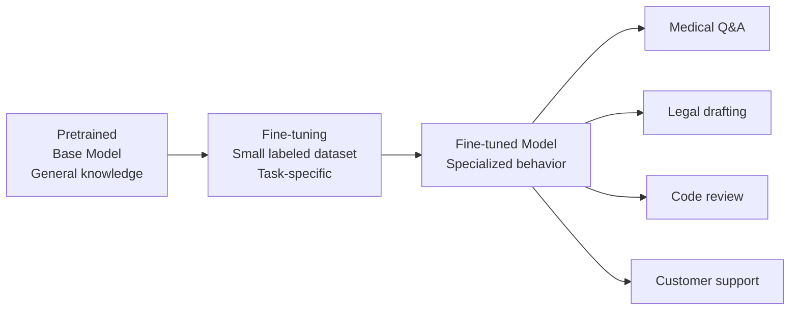
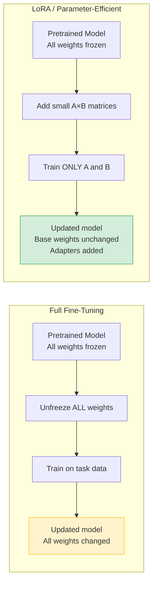
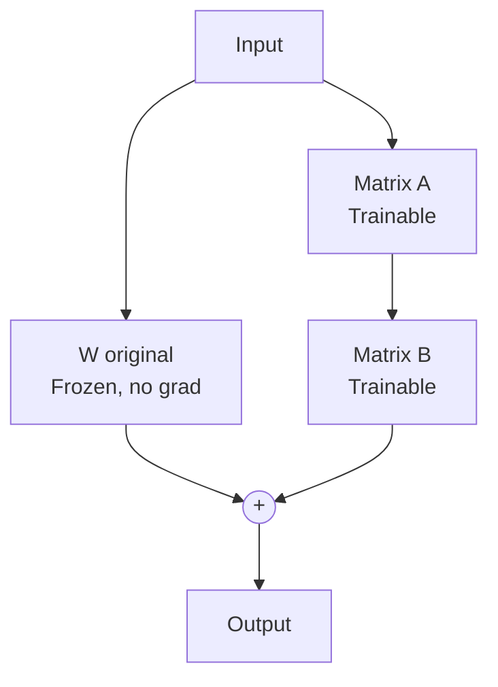

# Fine-Tuning — Theory

A new doctor graduates from medical school with broad knowledge — that's pretraining. Then they do a three-year cardiology residency: same base knowledge, now specialized. That's fine-tuning. Take a pretrained model with broad capabilities, train it further on a specific task or domain.

👉 This is why we need **fine-tuning** — pretraining gives breadth, but most applications need depth in a specific area or style.

---

## What fine-tuning actually does

Fine-tuning takes a pretrained model and continues training it on a smaller, task-specific dataset.



A few thousand high-quality examples can meaningfully change model behavior — you don't need billions.

---

## Supervised Fine-Tuning (SFT)

The most common form: provide (input, output) pairs, the model learns to produce expected outputs.

```
Input:  "Explain what a P-E ratio is to a beginner investor."
Output: "A P/E ratio, or price-to-earnings ratio, tells you how much investors..."
```

Training is the same mechanism as pretraining — minimizing next-token prediction loss — but now predicting your ideal outputs, not random internet text.

---

## Types of fine-tuning

**Full fine-tuning:** Update all model parameters. Highest quality but very expensive; same hardware as pretraining. Risk of **catastrophic forgetting** (old knowledge degraded). Used by major labs for production models.

**Instruction fine-tuning:** SFT on (instruction, output) pairs for a specific domain. Teaches the model to be an assistant for that domain.

**Domain adaptation:** Fine-tune on domain-specific text (medical journals, legal contracts, company docs). Often combined with instruction tuning.

**LoRA / QLoRA (parameter-efficient fine-tuning):** Most popular approach today. Don't update all parameters — add small trainable matrices alongside frozen original weights. 90–95% fewer trainable parameters, near-full-quality results, can run on consumer GPUs.



---

## LoRA: Low-Rank Adaptation

Instead of updating the full weight matrix W (e.g., 4096 × 4096 = 16M parameters), LoRA trains two small matrices:

```
W_updated = W_original + A × B

where:
  W_original: frozen (4096 × 4096) — not updated
  A: trainable (4096 × r) — small
  B: trainable (r × 4096) — small
  r: rank, typically 4–64 (you choose)
```

With r=16: 131k trainable params instead of 16M — 99% fewer. After training, A×B can be merged into W with no inference overhead.



---

## QLoRA: LoRA + Quantization

The frozen base model is stored in 4-bit quantized format (instead of 16-bit), reducing memory 4x. LoRA adapters are still trained in 16-bit. Effect: fine-tune a 65B model on a single 48GB A100 GPU — previously impossible. QLoRA is how most open-source community fine-tuning is done (Alpaca, Vicuna, WizardLM).

---

## What fine-tuning changes vs doesn't change

| Fine-tuning changes | Fine-tuning does NOT change |
|--------------------|-----------------------------|
| Output style and format | Core knowledge from pretraining |
| Task-specific accuracy | Context window size |
| Domain vocabulary fluency | Fundamental reasoning capability |
| Instruction-following behavior | Underlying architecture |
| Safety properties (somewhat) | What the model fundamentally knows |

---

## How much data do you need?

| Task | Minimum examples | Sweet spot |
|------|-----------------|------------|
| Simple format change (JSON output) | 100–500 | 1,000 |
| Tone/style adaptation | 500–1,000 | 3,000 |
| Domain Q&A | 1,000–5,000 | 10,000+ |
| Full instruction following | 10,000–50,000 | 100,000+ |
| Matching GPT-4 chat quality | 100,000+ | 1M+ |

Data quality matters enormously — 1,000 high-quality expert examples often beats 100,000 low-quality ones.

---

## When to fine-tune vs just prompt

If you need consistent behavior at scale, low latency, or your context window can't fit all examples every time → fine-tune. If you're prototyping, tasks change often, or data is scarce → prompt engineer first. See `When_to_Use.md` for the full decision framework.

---

✅ **What you just learned:** Fine-tuning adapts a pretrained model to a specific task or domain using supervised examples, with LoRA/QLoRA making this affordable even without massive compute resources.

🔨 **Build this now:** Look at Code_Example.md in this folder. Trace through the script: where is the dataset loaded? Where is LoRA configured? Where does training happen?

➡️ **Next step:** Instruction Tuning — [05_Instruction_Tuning/Theory.md](../05_Instruction_Tuning/Theory.md)

---

## 🛠️ Practice Project

Apply what you just learned → **[I4: Custom LoRA Fine-Tuning](../../22_Capstone_Projects/09_Custom_LoRA_Fine_Tuning/03_GUIDE.md)**
> This project uses: fine-tuning a small LLM with LoRA on a custom dataset — seeing exactly when/why to fine-tune vs prompt


---

## 📝 Practice Questions

- 📝 [Q41 · fine-tuning](../../ai_practice_questions_100.md#q41--design--fine-tuning)


---

## 📂 Navigation

**In this folder:**
| File | |
|---|---|
| 📄 **Theory.md** | ← you are here |
| [📄 Cheatsheet.md](./Cheatsheet.md) | Quick reference |
| [📄 Interview_QA.md](./Interview_QA.md) | Interview prep |
| [📄 Code_Example.md](./Code_Example.md) | Python code examples |
| [📄 When_to_Use.md](./When_to_Use.md) | When to fine-tune vs other approaches |

⬅️ **Prev:** [03 Pretraining](../03_Pretraining/Theory.md) &nbsp;&nbsp;&nbsp; ➡️ **Next:** [05 Instruction Tuning](../05_Instruction_Tuning/Theory.md)
