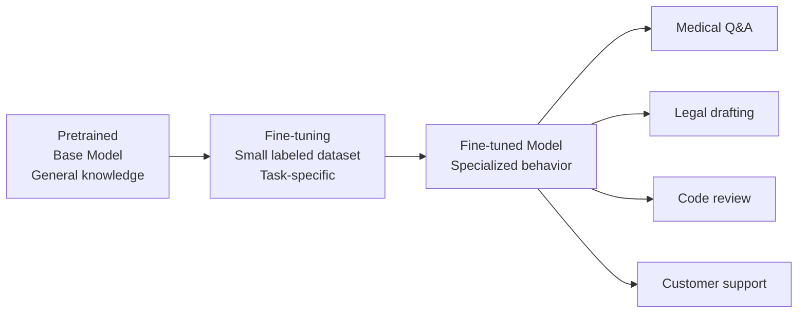
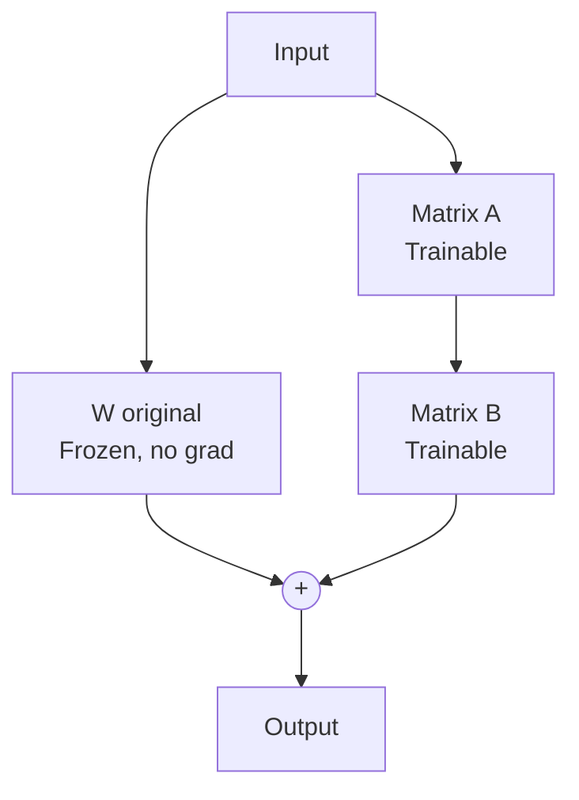

# Fine-Tuning — Theory

A new doctor graduates from medical school. They know biology, chemistry, pharmacology, anatomy, and general medicine. They've read thousands of textbooks. That's their pretraining.

Then they do a three-year residency in cardiology. Every day, they see heart patients, get corrected by senior doctors, and focus entirely on cardiovascular medicine. After the residency, they have the same base medical knowledge — but they've been specialized. They know cardiology deeply and instinctively.

That's fine-tuning. Take a pretrained model with broad capabilities. Train it further on a specific task or domain. Same base knowledge, now specialized.

👉 This is why we need **fine-tuning** — because pretraining gives you breadth, but most applications need depth in a specific area or style.

---

## What fine-tuning actually does

Fine-tuning takes a pretrained model and continues training it on a smaller, task-specific dataset.



The key: you don't need billions of examples. A few thousand high-quality examples can meaningfully change model behavior.

---

## Supervised Fine-Tuning (SFT)

The most common form. You provide (input, output) pairs. The model learns to produce the expected output for each input.

Format:
```
Input:  "Explain what a P-E ratio is to a beginner investor."
Output: "A P/E ratio, or price-to-earnings ratio, tells you how much investors..."
```

The model trains on your examples the same way it trained during pretraining — minimizing loss on next-token prediction. But now the "tokens" it's learning to predict are your ideal outputs, not random internet text.

---

## Types of fine-tuning

**Full fine-tuning:**
- Update all model parameters
- Highest quality
- Very expensive — needs same hardware as pretraining
- Risk of "catastrophic forgetting" — old knowledge can be degraded
- Used by major labs for production models

**Instruction fine-tuning:**
- Fine-tune to follow instructions in a specific format
- Dataset of (instruction, output) pairs
- Teaches the model to be an assistant for a specific domain
- This is what InstructGPT and ChatGPT were built on (more in topic 05)

**Domain adaptation:**
- Fine-tune on domain-specific text (medical journals, legal contracts, company docs)
- Improves fluency and accuracy in that domain
- Often combined with instruction tuning

**LoRA / QLoRA (parameter-efficient fine-tuning):**
- Most popular approach today for resource-limited teams
- Don't update all parameters — add small trainable matrices alongside frozen original weights
- 90–95% fewer trainable parameters
- Near-full-fine-tuning quality at a fraction of the cost
- Can run on consumer GPUs

---

## LoRA: Low-Rank Adaptation

LoRA is clever. Instead of updating the full weight matrix W (which might be 4096 × 4096 = 16M parameters), it trains two small matrices:

```
W_updated = W_original + A × B

where:
  W_original: frozen (4096 × 4096) — not updated
  A: trainable (4096 × r) — small
  B: trainable (r × 4096) — small
  r: rank, typically 4–64 (you choose)
```

If r=16, A is 4096×16 and B is 16×4096. Total trainable params for this layer: 131k instead of 16M. That's 99% fewer parameters to update.

After training, A×B can be merged into W to produce a single updated weight matrix with no inference overhead.



---

## QLoRA: LoRA + Quantization

QLoRA takes LoRA further. The frozen base model is stored in 4-bit quantized format (instead of 16-bit), reducing memory use by 4x. The LoRA adapters are still trained in 16-bit.

Effect: Fine-tune a 65B parameter model on a single 48GB A100 GPU. Previously impossible without multiple GPUs.

QLoRA is how most open-source community fine-tuning is done (Alpaca, Vicuna, WizardLM all used QLoRA or similar techniques).

---

## What fine-tuning changes vs doesn't change

| Fine-tuning changes | Fine-tuning does NOT change |
|--------------------|-----------------------------|
| Output style and format | Core knowledge from pretraining |
| Task-specific accuracy | What the model fundamentally knows |
| Domain vocabulary fluency | Context window size |
| Instruction-following behavior | Fundamental reasoning capability |
| Safety properties (somewhat) | Underlying architecture |

A fine-tuned model still "knows" what the base model knew. You're adjusting behavior, not replacing knowledge.

---

## How much data do you need?

| Task | Minimum examples | Sweet spot |
|------|-----------------|------------|
| Simple format change (JSON output) | 100–500 | 1,000 |
| Tone/style adaptation | 500–1,000 | 3,000 |
| Domain Q&A | 1,000–5,000 | 10,000+ |
| Full instruction following | 10,000–50,000 | 100,000+ |
| Matching GPT-4 chat quality | 100,000+ | 1M+ |

Data quality matters enormously. 1,000 high-quality expert examples often beats 100,000 low-quality examples.

---

## When to fine-tune vs just prompt

Fine-tuning isn't always the answer. Sometimes you can get the same result with a well-crafted prompt. See `When_to_Use.md` in this folder for the full decision framework.

Quick rule: if you need consistent behavior at scale, low latency, or your context window isn't big enough to include all your examples every time → fine-tune. If you're prototyping, tasks change often, or data is scarce → prompt engineer first.

---

✅ **What you just learned:** Fine-tuning adapts a pretrained model to a specific task or domain using supervised examples, with LoRA/QLoRA making this affordable even without massive compute resources.

🔨 **Build this now:** Look at the Code_Example.md in this folder. It shows a complete HuggingFace fine-tuning script. Even if you don't run it, trace through the code and identify: where is the dataset loaded? Where is LoRA configured? Where does training happen? Understanding the structure is the first step.

➡️ **Next step:** Instruction Tuning — [05_Instruction_Tuning/Theory.md](../05_Instruction_Tuning/Theory.md)

---

## 📂 Navigation

**In this folder:**
| File | |
|---|---|
| 📄 **Theory.md** | ← you are here |
| [📄 Cheatsheet.md](./Cheatsheet.md) | Quick reference |
| [📄 Interview_QA.md](./Interview_QA.md) | Interview prep |
| [📄 Code_Example.md](./Code_Example.md) | Python code examples |
| [📄 When_to_Use.md](./When_to_Use.md) | When to fine-tune vs other approaches |

⬅️ **Prev:** [03 Pretraining](../03_Pretraining/Theory.md) &nbsp;&nbsp;&nbsp; ➡️ **Next:** [05 Instruction Tuning](../05_Instruction_Tuning/Theory.md)
