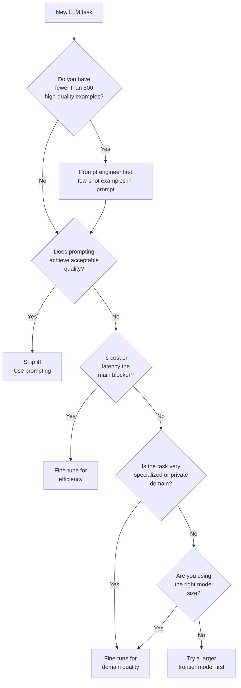

# When to Fine-Tune vs Prompt Engineer

This guide helps you decide whether to fine-tune a model or invest time in better prompt engineering. Getting this decision right can save weeks of work.

---

## The short answer

**Start with prompting. Fine-tune only when prompting consistently fails.**

Most teams over-estimate how much they need fine-tuning and under-invest in prompt engineering. A well-crafted prompt with good examples (few-shot) solves 80% of real problems.

---

## The decision flowchart



---

## Factor-by-factor comparison

### Data availability

| Data you have | Recommendation |
|--------------|----------------|
| < 100 examples | Prompt engineering only |
| 100–500 examples | Few-shot prompting (put examples in prompt) |
| 500–2,000 examples | Consider fine-tuning if latency/cost matters |
| 2,000–10,000 examples | Fine-tuning likely worthwhile |
| 10,000+ examples | Fine-tuning strongly recommended |

**Why data matters**: Fine-tuning with too few examples often produces worse results than prompting because the model overfits on the small dataset.

---

### Cost

| Situation | Recommendation |
|-----------|---------------|
| Prototype, < 1k API calls/day | Prompting (API cost is manageable) |
| Production, 100k+ calls/day | Fine-tune (long system prompts are expensive at scale) |
| Prompt is > 1,000 tokens | Fine-tune (you pay for every token in every prompt) |
| Context window is mostly examples | Fine-tune (bake those examples into the model) |

**Example**: A system prompt of 2,000 tokens × 500,000 daily calls at $0.003/1k tokens = $3,000/day just for the system prompt. Fine-tuning eliminates this overhead.

---

### Latency

| Requirement | Recommendation |
|-------------|---------------|
| Response time > 2 seconds OK | Prompting fine (long prompts OK) |
| Need < 500ms | Fine-tune (shorter prompts = faster) |
| Real-time voice / streaming | Fine-tune or use small fine-tuned model |

Long prompts are slower. A 3,000-token system prompt processes 3,000 tokens before generating a single output token. Fine-tuning puts that behavior in the weights so you can reduce prompt length dramatically.

---

### Consistency requirements

| Requirement | Recommendation |
|-------------|---------------|
| Format can vary slightly | Prompting |
| Must always output valid JSON | Fine-tune or use constrained decoding |
| Strict template every time | Fine-tune |
| Domain vocabulary must be exact | Fine-tune with domain adaptation |

Models prompted to output JSON sometimes slip up. A model fine-tuned exclusively on JSON output examples is dramatically more reliable.

---

### Task specialization

| Task type | Recommendation |
|-----------|---------------|
| General task the base model knows | Prompting |
| Domain with specialized jargon (medical, legal, finance) | Fine-tune (domain adaptation) |
| Proprietary process / company-specific formats | Fine-tune |
| Private data that can't go in prompts | Fine-tune on-premise |
| Style of a specific person/brand | Fine-tune |

If the base model has never seen your domain's terminology, prompting can't teach it vocabulary — only fine-tuning can.

---

### Speed of iteration

| Situation | Recommendation |
|-----------|---------------|
| Task requirements change weekly | Prompting (no retraining needed) |
| Stable task definition | Fine-tune (one-time cost) |
| Experimenting with task design | Prompting first |
| Production, locked-in requirements | Fine-tune |

Re-fine-tuning every time your task changes is expensive. If you're still figuring out exactly what you need, prompt first.

---

## The real cost comparison

### Prompting at scale (production system)

```
Assumptions:
- 500k API calls/day
- 2,000-token system prompt (examples + instructions)
- 200-token average user input
- 300-token average output
- Total: 2,500 input + 300 output per call
- Cost: $3.00 per 1M input tokens (e.g., Claude Sonnet)

Daily cost:
- Input: 500k × 2,500 / 1M × $3.00 = $3,750/day
- Output: 500k × 300 / 1M × $15.00 = $2,250/day
- Total: $6,000/day = $180,000/month
```

### After fine-tuning

```
After fine-tuning, system prompt shrinks from 2,000 to 100 tokens:
- Input: 500k × 400 / 1M × $3.00 = $600/day
- Output: 500k × 300 / 1M × $15.00 = $2,250/day
- Total: $2,850/day = $85,500/month

Fine-tuning break-even: If fine-tune costs $5,000 (compute + engineering time),
break-even is 5 days.

Note: These are illustrative numbers. Actual costs depend on your provider and model.
```

---

## When prompting beats fine-tuning

1. **Reasoning quality**: For complex multi-step reasoning, large frontier models (GPT-4, Claude 3 Opus) with chain-of-thought prompting usually outperform fine-tuned smaller models.

2. **Rare edge cases**: Fine-tuning trains on your dataset distribution. Unusual inputs outside that distribution may degrade. Prompting with a frontier model handles edge cases better.

3. **Explanation and transparency**: Prompted models can be asked to explain their reasoning. Fine-tuned models may produce correct outputs without explainable traces.

4. **Up-to-date knowledge**: If your task requires recent knowledge not in pretraining, RAG + prompting beats fine-tuning (fine-tuning doesn't add knowledge efficiently).

5. **Fast prototyping**: Time-to-first-result is hours with prompting vs days with fine-tuning.

---

## Decision matrix

| Factor | Prompt | Fine-tune |
|--------|--------|-----------|
| Data available | < 500 examples | 1,000+ examples |
| Budget | Low | Can invest $500–$5k |
| Latency need | Flexible | Strict (< 500ms) |
| Cost at scale | Low volume | High volume |
| Task stability | Changing | Stable |
| Consistency need | Moderate | High |
| Domain specificity | General | Specialized |
| Privacy | OK with API | Private data |

---

## Common mistakes

**Mistake 1: Fine-tuning without a baseline**
Always measure prompting quality first. If prompting gets 85% accuracy and fine-tuning gets 87%, the 2% gain may not justify the cost and complexity.

**Mistake 2: Fine-tuning with bad data**
Low-quality training examples produce a model that confidently gives low-quality outputs. Garbage in, garbage out — but at a higher cost.

**Mistake 3: Fine-tuning to teach facts**
Fine-tuning teaches behavior, not new facts reliably. If you need the model to know information it doesn't know, use RAG (retrieval-augmented generation), not fine-tuning.

**Mistake 4: Skipping eval after fine-tuning**
Fine-tuning can degrade general capabilities. Always evaluate your fine-tuned model on both your target task and a set of general capabilities before deploying.

**Mistake 5: Fine-tuning when the model size is the problem**
If a 7B model gives poor quality on your task even when fine-tuned, you might just need a larger model. Try GPT-4 or Claude 3 Opus first to establish the quality ceiling.

---

## Summary recommendation

```
1. Define your task clearly. Write 20 example (input, ideal output) pairs.
2. Write a good system prompt. Test with a frontier model (GPT-4, Claude 3 Opus).
3. If quality is good enough: ship it with prompting.
4. If quality is not good enough: try chain-of-thought, better examples, different models.
5. If still failing OR cost/latency is a blocker: now consider fine-tuning.
6. If data < 1,000 examples: collect more data before fine-tuning.
7. Fine-tune, evaluate carefully, compare to baseline.
```

---

## 📂 Navigation

**In this folder:**
| File | |
|---|---|
| [📄 Theory.md](./Theory.md) | Core concepts |
| [📄 Cheatsheet.md](./Cheatsheet.md) | Quick reference |
| [📄 Interview_QA.md](./Interview_QA.md) | Interview prep |
| [📄 Code_Example.md](./Code_Example.md) | Python code examples |
| 📄 **When_to_Use.md** | ← you are here |

⬅️ **Prev:** [03 Pretraining](../03_Pretraining/Theory.md) &nbsp;&nbsp;&nbsp; ➡️ **Next:** [05 Instruction Tuning](../05_Instruction_Tuning/Theory.md)
