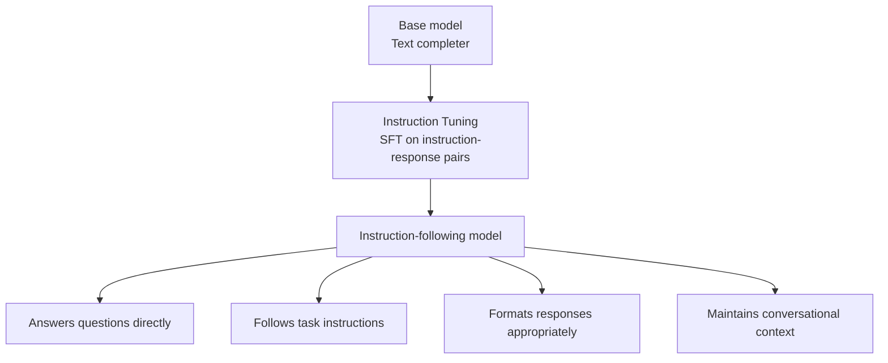
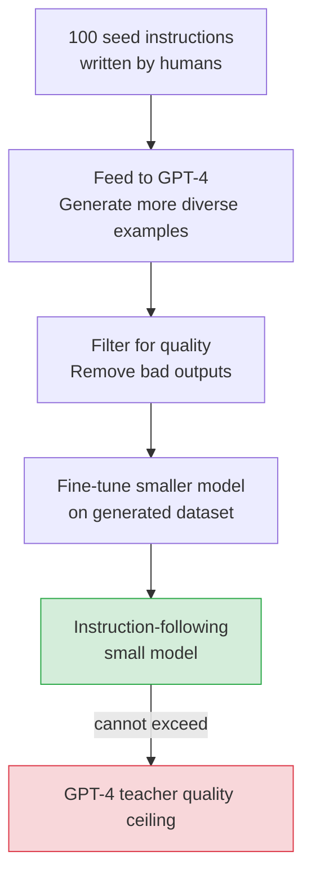

# Instruction Tuning — Theory

Imagine a library with every book ever written and a librarian who has read all of it. The problem: when you ask a question, they don't answer — they give you a page from a relevant book. A raw excerpt. That's a pretrained model: it continues text, not answers questions. Ask "What is DNA?" and it might produce: "...is a molecule that carries genetic information. DNA was first described by..."

Instruction tuning teaches that librarian to actually answer questions.

👉 This is why we need **instruction tuning** — pretraining creates text completors, but users need assistants that follow instructions.

---

## Why base models don't just work

A base model has one trained behavior: predict what text comes next. Given a question, it might:
- Continue with more question text
- Give a partial answer with no formatting
- Write what a Wikipedia article would say next
- Generate more words without addressing the question

The model hasn't been trained to recognize "this is a user asking me something and I should answer helpfully."

---

## What instruction tuning is

Instruction tuning is supervised fine-tuning on (instruction, response) pairs. The model learns:
- "When given an instruction, complete the task asked for"
- "A response should be direct, helpful, and address the instruction"
- "Different instruction types need different response types"



---

## The dataset format

**Alpaca format (3 fields):**
```json
{
  "instruction": "Translate the following sentence to Spanish.",
  "input": "The weather is beautiful today.",
  "output": "El tiempo está hermoso hoy."
}
```

**Chat format (roles):**
```json
[
  {"role": "system", "content": "You are a helpful assistant."},
  {"role": "user", "content": "Translate to Spanish: The weather is beautiful today."},
  {"role": "assistant", "content": "El tiempo está hermoso hoy."}
]
```

The model is only trained to predict the `output`/`assistant` content — not the instruction/user parts. This focuses learning on "what a good response looks like."

---

## Key instruction tuning datasets

**FLAN (Google, 2021)** — 60+ NLP tasks as natural language instructions. Showed training on diverse tasks generalizes to unseen tasks. "Finetuned Language Models Are Zero-Shot Learners."

**Alpaca (Stanford, 2023)** — 52,000 pairs generated by prompting GPT-3.5 ("self-instruct"). Fine-tuned Llama 7B to outperform models 10x its size on instruction following.

**InstructGPT (OpenAI, 2022)** — ~13,000 human-written examples + RLHF. Direct predecessor to ChatGPT. Showed a 1.3B instruction-tuned model was preferred over raw 175B GPT-3.

**ShareGPT / Open Instruct / FLAN v2** — Real ChatGPT conversations and diverse instruction mixes at scale. Used for most production open-source fine-tuning.

---

## What changes after instruction tuning

Before:
```
Prompt: "What is the speed of light?"
Output: "What is the speed of light? This question has fascinated physicists for
         centuries. The measurement of the speed of light was..."
```

After:
```
Prompt: "What is the speed of light?"
Output: "The speed of light is approximately 299,792,458 meters per second
         (about 186,000 miles per second) in a vacuum."
```

What does NOT change: underlying knowledge, context window size, tendency to hallucinate, or safety (that requires RLHF).

---

## How many tasks/instructions are needed?

Surprisingly few. FLAN showed just 60 diverse tasks improved generalization to hundreds of unseen tasks — diversity matters more than scale. Key findings from FLAN-T5:
- More tasks = better zero-shot generalization
- Chain-of-thought examples = better reasoning
- Larger base model + instruction tuning = much stronger than either alone

Alpaca used only 52k examples to significantly improve a 7B base model. Marginal gains per example drop quickly.

---

## The self-instruct loop

```
1. Write 100 seed instructions manually
2. Feed to GPT-4: "Generate 10 more diverse instructions and responses like these"
3. Filter for quality
4. Fine-tune a smaller model on the result
```

Stanford's Alpaca used this to fine-tune Llama 7B for ~$500. Limitation: the student can't exceed the teacher model's quality ceiling.



---

✅ **What you just learned:** Instruction tuning fine-tunes a pretrained model on (instruction, response) pairs to transform it from a text completer into an assistant that follows user instructions.

🔨 **Build this now:** Take a base model and an instruction-tuned version of the same model. Give both: "List 5 facts about the moon." The base model will continue text weirdly; the instruction-tuned one gives a clean list.

➡️ **Next step:** RLHF — [06_RLHF/Theory.md](../06_RLHF/Theory.md)


---

## 📝 Practice Questions

- 📝 [Q42 · instruction-tuning](../../ai_practice_questions_100.md#q42--normal--instruction-tuning)


---

## 📂 Navigation

**In this folder:**
| File | |
|---|---|
| 📄 **Theory.md** | ← you are here |
| [📄 Cheatsheet.md](./Cheatsheet.md) | Quick reference |
| [📄 Interview_QA.md](./Interview_QA.md) | Interview prep |

⬅️ **Prev:** [04 Fine Tuning](../04_Fine_Tuning/Theory.md) &nbsp;&nbsp;&nbsp; ➡️ **Next:** [06 RLHF](../06_RLHF/Theory.md)
