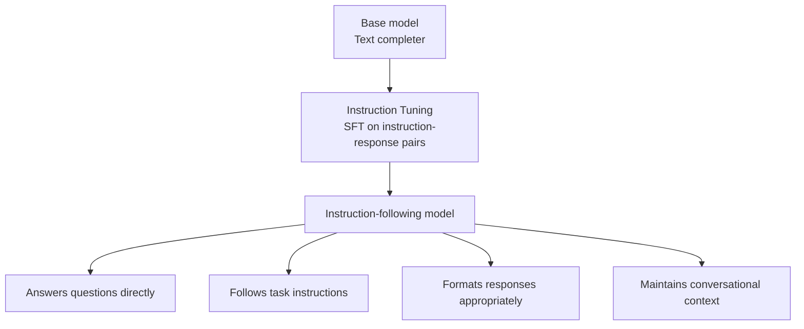

# Instruction Tuning — Theory

Imagine a massive city library. It has every book, journal, and record ever written — millions of documents covering everything humanity knows. And there's a librarian who has read all of it.

Here's the problem: when you ask the librarian a question, they don't answer you. They give you a page from a relevant book. A raw excerpt. Text that follows from what you said — but not actually an answer to your question.

That's a raw pretrained model. It's trained to continue text, not to answer questions. Ask it "What is DNA?" and it might give you: "...is a molecule that carries genetic information. DNA was first described by..."

Instruction tuning is teaching that librarian to actually answer questions. To say "DNA is a molecule that..." in response to your question, not just append more text.

👉 This is why we need **instruction tuning** — because pretraining creates text completors, but users need assistants that follow instructions.

---

## Why base models don't just work

A base (pretrained) model has one trained behavior: predict what text comes next.

If you type a question, it sees that as text to complete. It might:
- Continue with more question text ("What is the tallest mountain in...?")
- Give a partial answer with no formatting
- Write what a Wikipedia article would say next, rather than answering directly
- Ignore the implicit question and just generate more words

The model hasn't been trained to recognize "this is a user asking me something and I should answer helpfully." It treats everything as text to continue.

---

## What instruction tuning is

Instruction tuning is supervised fine-tuning on a dataset of (instruction, response) pairs. The model learns:

- "When someone gives me an instruction, I should complete the task they asked for"
- "A response should be direct, helpful, and address the instruction"
- "Different types of instructions (questions, rewrites, classifications, code) need different types of responses"



---

## The dataset format

Instruction tuning datasets have a specific structure:

**Alpaca format (3 fields):**
```json
{
  "instruction": "Translate the following sentence to Spanish.",
  "input": "The weather is beautiful today.",
  "output": "El tiempo está hermoso hoy."
}
```

**Chat format (roles):**
```json
[
  {"role": "system", "content": "You are a helpful assistant."},
  {"role": "user", "content": "Translate to Spanish: The weather is beautiful today."},
  {"role": "assistant", "content": "El tiempo está hermoso hoy."}
]
```

The key difference from pretraining: the model is only trained to predict the `output` / `assistant` content — not the instruction/user parts. This focuses the learning on "what a good response looks like."

---

## Key instruction tuning datasets

**FLAN (Google, 2021) — the pioneer**
- 60+ NLP tasks converted into natural language instructions
- Same task expressed many ways: "Summarize:", "Give a brief description:", "TL;DR:"
- Showed that training on diverse tasks with instruction format generalizes to unseen tasks
- "Finetuned Language Models Are Zero-Shot Learners"

**Alpaca (Stanford, 2023)**
- 52,000 instruction-response pairs
- Generated by prompting GPT-3.5 to create training data ("self-instruct")
- Showed you could create instruction datasets cheaply with AI-generated data
- Fine-tuned Llama 7B → Alpaca, which outperformed models 10x its size on instruction following

**InstructGPT (OpenAI, 2022)**
- Human-written instruction dataset (~13,000 examples)
- Combined with RLHF (covered in topic 06)
- The direct predecessor to ChatGPT
- Showed that instruction-tuned 1.3B model was preferred over raw 175B GPT-3

**ShareGPT / Open Instruct / FLAN v2**
- Real user conversations from ChatGPT (ShareGPT)
- Diverse instruction mixes at scale
- Used for most production open-source fine-tuning

---

## What changes after instruction tuning

Before instruction tuning:
```
Prompt: "What is the speed of light?"
Output: "What is the speed of light? This question has fascinated physicists for
         centuries. The measurement of the speed of light was..."
```

After instruction tuning:
```
Prompt: "What is the speed of light?"
Output: "The speed of light is approximately 299,792,458 meters per second
         (about 186,000 miles per second) in a vacuum."
```

The model learned to recognize that a question needs a direct answer. It learned response format. It learned to be helpful.

What does NOT change:
- The model's underlying knowledge
- Context window size
- Its tendency to hallucinate when uncertain
- Safety — instruction tuning doesn't prevent harmful outputs (that requires RLHF)

---

## How many tasks/instructions are needed?

Surprisingly few. The FLAN paper showed that training on just 60 diverse tasks improved generalization to hundreds of unseen tasks. Diversity matters more than scale.

Key insight from "Scaling Instruction-Finetuned Language Models" (FLAN-T5 paper):
- More tasks = better zero-shot generalization
- Chain-of-thought examples in the instruction dataset = better reasoning
- Larger base model + instruction tuning = much stronger than either alone

Alpaca used only 52k examples to significantly improve a 7B base model. GPT-4-level instruction datasets may use millions of examples, but the marginal gains per example drop quickly.

---

## The self-instruct loop

A cheap way to generate instruction datasets: use an existing AI to generate training data for a smaller model.

```
1. Write 100 seed instructions manually
2. Feed them to GPT-4 with prompt: "Generate 10 more diverse instructions and responses like these"
3. Filter the generated data for quality
4. Fine-tune a smaller model on the result
```

Stanford's Alpaca used this to fine-tune Llama 7B for ~$500. The resulting model followed instructions surprisingly well despite much cheaper training data than OpenAI's human-labeled sets.

Limitation: the ceiling is the quality of the teacher model (GPT-4). The student can't exceed the teacher.

---

✅ **What you just learned:** Instruction tuning fine-tunes a pretrained model on (instruction, response) pairs to transform it from a text completer into an assistant that follows user instructions.

🔨 **Build this now:** Take a base model (e.g., a HuggingFace base model in a playground) and an instruction-tuned version of the same model. Give both the same prompt: "List 5 facts about the moon." Compare how differently they respond. The base model will continue the text weirdly; the instruction-tuned one will give you a clean list.

➡️ **Next step:** RLHF — [06_RLHF/Theory.md](../06_RLHF/Theory.md)

---

## 📂 Navigation

**In this folder:**
| File | |
|---|---|
| 📄 **Theory.md** | ← you are here |
| [📄 Cheatsheet.md](./Cheatsheet.md) | Quick reference |
| [📄 Interview_QA.md](./Interview_QA.md) | Interview prep |

⬅️ **Prev:** [04 Fine Tuning](../04_Fine_Tuning/Theory.md) &nbsp;&nbsp;&nbsp; ➡️ **Next:** [06 RLHF](../06_RLHF/Theory.md)
