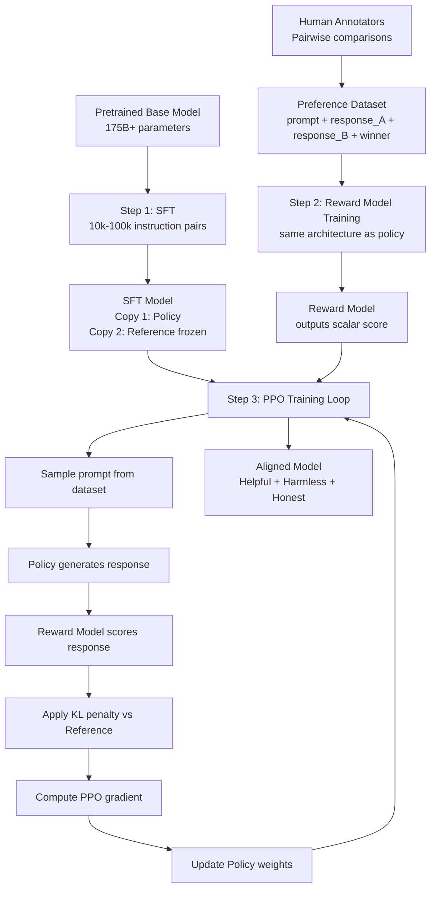
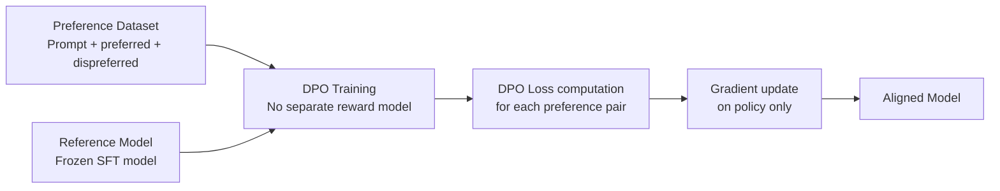

# RLHF Architecture Deep Dive

A detailed walkthrough of the full RLHF pipeline — all three stages, the models involved, the data flows, and the key implementation details.

---

## The full RLHF system



---

## Stage 1: Supervised Fine-Tuning in detail

### Data requirements

The SFT dataset for RLHF is typically different from generic instruction datasets. Key properties:

- **Higher quality bar**: Fewer examples but each one is carefully written by domain experts or skilled contractors
- **Diverse coverage**: Covers sensitive topics, edge cases, refusals, and nuanced scenarios — the things RLHF will need to improve
- **InstructGPT scale**: OpenAI used ~13,000 examples for their initial SFT. Anthropic reportedly uses larger sets.
- **Format**: Conversation format (system/user/assistant) rather than flat instruction format

### Training details

- Learning rate: 1e-5 to 2e-5 (lower than standard fine-tuning)
- Epochs: 1–3
- Optimizer: AdamW
- Hardware: Same as pretraining — multiple A100/H100s for 70B+ models

### Output

Two identical copies of the SFT model are made:
1. **Policy model**: Will be updated by RL
2. **Reference model**: Frozen. Used to compute KL divergence. Never updated.

---

## Stage 2: Reward Model Training in detail

### Data collection

**Who annotates:**
- Contractors trained on specific guidelines (OpenAI's scale contractors, specialized firms)
- Calibration sessions ensure inter-annotator agreement
- Quality control removes outlier annotators

**What annotators compare:**
- Pairs or groups (up to 9) of responses to the same prompt
- Ranking: "from best to worst"
- Sometimes: Likert scale rating plus pairwise comparison

**Typical annotation throughput:**
- ~50–100 comparisons per annotator per hour
- 30,000–500,000 comparisons total per RLHF run
- Ongoing collection — the reward model is periodically retrained

### Architecture

The reward model typically:
- Uses the same transformer architecture as the policy
- Removes the final "language modeling head" (token probability output)
- Replaces it with a single linear layer outputting a scalar score
- Often initialized from the SFT model (same weights) — better initialization than random

### Training objective

Bradley-Terry model for pairwise preferences:

```
P(y_w preferred over y_l) = σ(r(x, y_w) - r(x, y_l))

Loss = -E[log σ(r(x, y_w) - r(x, y_l))]
```

Where:
- σ = sigmoid function
- r(x, y) = reward model score for prompt x and response y
- y_w = preferred response
- y_l = dispreferred response

Intuition: the loss is minimized when the preferred response scores higher than the dispreferred one. The reward model learns to assign scores that reflect human preferences.

### Reward model evaluation

**Before using it for RL**, validate the reward model:
- Held-out comparison accuracy (should be ~70–80%+ correct on test comparisons)
- Correlation with human preference on new examples
- Test on adversarial pairs (reward hacking probes)
- Check for known biases (length bias, sycophancy bias, recency bias)

---

## Stage 3: PPO Training in detail

### The RL problem formulation

```
State (s):         prompt + tokens generated so far
Action (a):        next token to generate
Policy (π):        language model — P(next token | state)
Reward (R):        reward model score (given at end of episode)
Episode:           generating a complete response
Discount (γ):      1.0 (undiscounted — we care about total response quality)
```

Note: unlike most RL, the reward is only given at the END of an episode (complete response), not at each token step. The intermediate "reward" per token is approximated using the value function.

### The PPO objective

```
L_PPO = E_t[min(
    r_t(θ) × A_t,
    clip(r_t(θ), 1-ε, 1+ε) × A_t
)]

r_t(θ) = π_θ(a_t | s_t) / π_θ_old(a_t | s_t)   # probability ratio
A_t = advantage estimate (how much better this action was than expected)
ε = 0.2 (clip range)
```

The clip ensures that no single policy update changes any token's probability by more than ε.

### Adding the KL penalty

The full reward used in RLHF PPO:

```
R_total = r_RM(x, y) - β × KL(π_θ(y|x) || π_ref(y|x))

KL = Σ_t [log π_θ(a_t | s_t) - log π_ref(a_t | s_t)]
```

The KL is computed per token (summed over the response), giving a fine-grained constraint. The coefficient β balances reward optimization vs KL constraint.

### One PPO training step

```
1. Sample a batch of prompts from the dataset
2. For each prompt, generate a response with the current policy (rollout)
3. Score each (prompt, response) with the reward model → r_RM
4. Compute per-token KL divergence vs reference model → KL
5. Compute per-token advantage estimates using the value function
6. Compute PPO loss + value function loss
7. Update policy and value function weights
8. Repeat for K epochs on this rollout batch (PPO reuse)
9. Repeat from step 1 with new prompts
```

### Value function

The policy model has a separate head (linear layer) that serves as the value function V(s): the estimated total future reward from this state. Training the value function alongside the policy provides:
- Lower-variance advantage estimates (A = R - V)
- More stable policy gradient updates

### Monitoring training

Track these metrics:
```
reward_mean:      ↑ over time (model gets better)
reward_std:       should stabilize
kl_divergence:    should stay bounded (< 10-20 nats)
policy_loss:      should decrease
value_loss:       should decrease
response_length:  watch for reward hacking (should not explode)
ppl_on_holdout:   language quality — should not degrade
```

---

## RLAIF: The Constitutional AI Variant

Anthropic's approach replaces human annotators with an AI model guided by a constitution.

### The constitution

A written document of principles, e.g.:
```
1. Choose the response that is least likely to cause harm.
2. Choose the response that is most helpful to the user.
3. Choose the response that best complies with the request.
4. Choose the response that demonstrates good values.
5. Choose the response that a thoughtful person would be proud of.
```

### AI feedback pipeline

```
1. Generate candidate responses with a "helpful-only" SFT model
2. For each prompt, generate multiple responses
3. Prompt a capable AI model (Claude Opus / GPT-4):
   "Here are two responses to this prompt. According to the principle
   [randomly selected from constitution], which is better? Response A or B?"
4. Use the AI's preference as training signal for the reward model
5. Train Preference Model (PM) from AI-generated comparisons
6. Apply RL (same as RLHF) against this PM
```

### Scale advantages

- Human annotators: 100 comparisons/hour × $20/hour = $0.20/comparison
- AI annotators (GPT-4): ~$0.03/comparison, unlimited throughput, 24/7
- Can generate 1M+ comparisons for the cost of 15,000 human ones

### Consistency advantages

- AI annotator applies principles consistently (no fatigue, no mood)
- Principles are explicit and auditable — you can read them
- New principles can be added by updating the constitution document

---

## DPO Architecture

For comparison, here's how DPO simplifies the pipeline:



DPO training is standard fine-tuning with a special loss function. No RL loop, no value function, no reward model. The entire alignment is done in a single training phase with supervised-style optimization.

---

## Comparing outputs: base vs SFT vs RLHF

**Prompt**: "Write a Python function to check if a number is prime."

**Base model output:**
```
def is_prime(n):
    prime = True
    for i in range(2, n):
        ...

EXAMPLES:
is_prime(2) = True
is_prime(4) = False
is_prime function Python implementation...
```

**SFT model output:**
```python
def is_prime(n):
    if n < 2:
        return False
    for i in range(2, int(n**0.5) + 1):
        if n % i == 0:
            return False
    return True
```

**RLHF model output:**
```python
def is_prime(n):
    """Check if a number is prime. Returns True if prime, False otherwise."""
    if n < 2:
        return False
    if n == 2:
        return True
    if n % 2 == 0:
        return False
    for i in range(3, int(n**0.5) + 1, 2):  # Only check odd numbers
        if n % i == 0:
            return False
    return True

# Example usage:
print(is_prime(17))  # True
print(is_prime(4))   # False
```

The RLHF model adds: docstring, correct edge cases, efficiency improvement (step 2), and a usage example — because humans consistently prefer code with these qualities.

---

## 📂 Navigation

**In this folder:**
| File | |
|---|---|
| [📄 Theory.md](./Theory.md) | Core concepts |
| [📄 Cheatsheet.md](./Cheatsheet.md) | Quick reference |
| [📄 Interview_QA.md](./Interview_QA.md) | Interview prep |
| 📄 **Architecture_Deep_Dive.md** | ← you are here |

⬅️ **Prev:** [05 Instruction Tuning](../05_Instruction_Tuning/Theory.md) &nbsp;&nbsp;&nbsp; ➡️ **Next:** [07 Context Windows and Tokens](../07_Context_Windows_and_Tokens/Theory.md)
