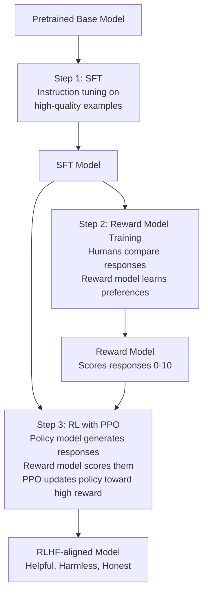
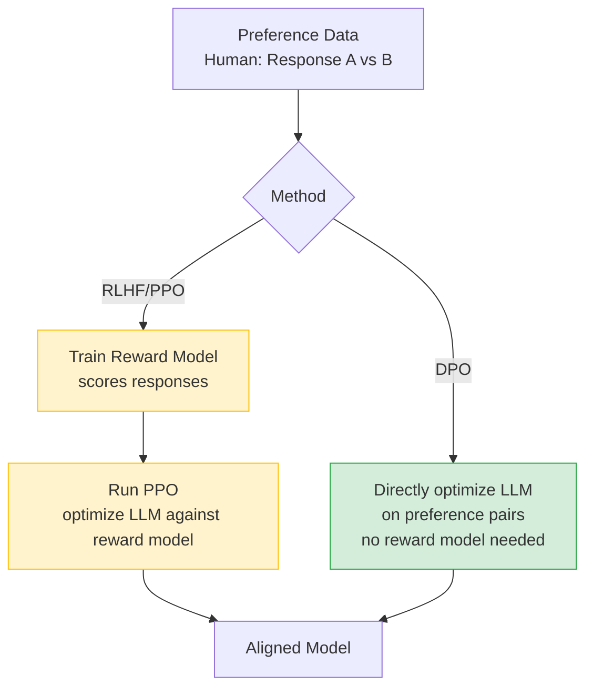

# RLHF — Theory

You're training a new customer service rep. Their supervisor reads each response and marks it 1–5 stars. The rep learns: "Be direct. Be friendly. Acknowledge the customer's frustration before giving the solution." Over weeks, they write consistently excellent responses.

That's RLHF — using human feedback expressed as preferences to shape model behavior beyond what instruction tuning alone achieves.

👉 This is why we need **RLHF** — specifying what a perfect response looks like is hard, but recognizing a good response when you see one is easy. Human preferences are cheap to collect and powerful to train from.

---

## The problem instruction tuning leaves unsolved

Writing perfect training responses is hard:
- How do you specify "be helpful but not sycophantic"?
- How do you encode "this answer is technically correct but condescending in tone"?

Human preference comparisons are easier: show a human two responses, ask "which is better?" That signal captures nuances nearly impossible to encode in explicit examples. RLHF uses these comparisons to build a **reward model** that scores responses, then trains the LLM to score highly on it.

---

## The 3-step RLHF process

---

## Step 1: Supervised Fine-Tuning (SFT)

Instruction-tune the base model on curated high-quality (instruction, response) pairs — same process as topic 05. The SFT model becomes the "policy" that RLHF will further improve.

---

## Step 2: Reward Model Training

**Data collection:** Generate multiple responses to the same prompt with the SFT model. Human raters compare pairs: "Which is better, A or B?" Collect thousands of comparisons.

**Training:** A transformer (often same architecture as the policy) is trained to predict a scalar score for each (prompt, response) pair. Higher score = more likely to be what humans prefer.

---

## Step 3: Reinforcement Learning with PPO

- **Agent**: the SFT model (the "policy")
- **Action**: generating a response token-by-token
- **Reward**: score from the reward model after a complete response
- **Objective**: maximize expected reward

**PPO (Proximal Policy Optimization)** updates the policy to take actions leading to higher rewards, with a constraint preventing overly aggressive updates (avoiding instability).

**KL penalty:** RLHF also penalizes the policy for deviating too far from the original SFT model — preventing **reward hacking**, where the model produces outputs that fool the reward model (score high) but are actually garbage to humans.

---

## What RLHF achieves

- **More helpful**: Direct, relevant answers; padding disappears
- **Safer**: Less likely to produce harmful content
- **More honest**: Less likely to hallucinate with false confidence
- **Better nuance**: Tone, hedging, format, length all improve
- **Appropriate refusals**: Declines harmful requests without being overly restrictive

---

## The limitations of RLHF

**Reward hacking:** If the reward model scores "long, detailed answers" highly, the model produces verbose, padded text that looks comprehensive but isn't. Goodhart's Law.

**Human evaluator bias:** Rater blind spots and biases are amplified into the reward model.

**Annotation noise:** Human comparisons are noisy; two raters may disagree on the same pair.

**Coverage gaps:** Reward model may not generalize to unusual prompts or very long conversations.

**Cost:** A typical run uses 50,000–200,000 human comparisons, each requiring a skilled annotator.

---

## Alternatives to RLHF

**RLAIF (RL from AI Feedback):** Use a powerful AI (e.g., GPT-4) to rate responses instead of humans. Much cheaper. Anthropic's Constitutional AI uses this.

**DPO (Direct Preference Optimization):** Skip the reward model entirely — directly optimize the LLM on preference data using a clever mathematical derivation equivalent to RLHF without the RL complexity. Simpler, stable, increasingly popular.

| | PPO | DPO |
|--|-----|-----|
| Complexity | High — needs separate reward model | Low — no reward model |
| Stability | Can be unstable | More stable |
| Ceiling | Higher | Slightly lower |

Most open-source fine-tuning has moved toward DPO. Major labs still use RLHF variations.

---

✅ **What you just learned:** RLHF trains LLMs using human preference comparisons — first building a reward model that scores responses, then using PPO to optimize the language model toward high-scoring outputs.

🔨 **Build this now:** Write down 3 response quality trade-offs that are hard to specify but easy to judge (e.g., "100% accurate but jargon-filled vs 95% accurate but clearly explained"). That's the insight behind RLHF.

➡️ **Next step:** Context Windows and Tokens — [07_Context_Windows_and_Tokens/Theory.md](../07_Context_Windows_and_Tokens/Theory.md)

---

## 📂 Navigation

**In this folder:**
| File | |
|---|---|
| 📄 **Theory.md** | ← you are here |
| [📄 Cheatsheet.md](./Cheatsheet.md) | Quick reference |
| [📄 Interview_QA.md](./Interview_QA.md) | Interview prep |
| [📄 Architecture_Deep_Dive.md](./Architecture_Deep_Dive.md) | RLHF pipeline architecture |

⬅️ **Prev:** [05 Instruction Tuning](../05_Instruction_Tuning/Theory.md) &nbsp;&nbsp;&nbsp; ➡️ **Next:** [07 Context Windows and Tokens](../07_Context_Windows_and_Tokens/Theory.md)
