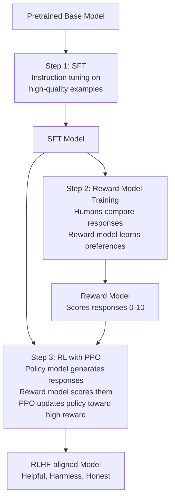

# RLHF — Theory

You're training a new customer service representative. They start answering customer emails. At first, the answers are technically correct but sometimes too blunt, too long, or miss the emotional tone.

So you set up a review system. Their supervisor reads each response and marks it 1–5 stars. The rep sees what gets high marks: "Be direct. Be friendly. Acknowledge the customer's frustration before giving the solution." Over weeks, they learn to write responses that consistently get 5 stars.

That's RLHF. You're using human feedback — expressed as preferences — to shape the model's behavior beyond what instruction tuning alone could achieve.

👉 This is why we need **RLHF** — because specifying what a perfect response looks like is hard, but recognizing a good response when you see one is easy. Human preferences are cheap to collect and powerful to train from.

---

## The problem instruction tuning leaves unsolved

Instruction tuning teaches the model to follow instructions using example (instruction, response) pairs. But writing perfect training responses is hard:

- How do you specify "be helpful but not sycophantic"?
- How do you write examples that perfectly capture "give the right level of detail"?
- How do you encode "this answer is technically correct but condescending in tone"?

Human preference comparisons are easier: show a human two responses, ask "which is better?" That preference signal captures nuances that are nearly impossible to encode in explicit training examples.

RLHF uses these comparisons to build a model of what humans prefer — a reward model — and then trains the LLM to produce outputs that score highly on that reward model.

---

## The 3-step RLHF process

---

## Step 1: Supervised Fine-Tuning (SFT)

Start by instruction-tuning the base model on a curated dataset of high-quality (instruction, response) pairs. This is the same process as described in topic 05. It creates a solid starting point for RLHF.

The SFT model is the "policy" that RLHF will further improve.

---

## Step 2: Reward Model Training

This is the heart of RLHF. You train a separate neural network to predict human preferences.

**Data collection:**
- Take the SFT model, generate multiple responses to the same prompt
- Show human raters pairs of responses: "Which is better, Response A or B?"
- Collect thousands of these comparisons

**Training the reward model:**
- Use a transformer architecture (often the same as the policy model)
- Train it to predict: given a (prompt, response) pair, output a scalar score representing how good the response is
- The training loss pushes the reward model to assign higher scores to preferred responses in each comparison

The result: a function that takes (prompt, response) → score (e.g., 0–10). Higher score = more likely to be what a human would prefer.

---

## Step 3: Reinforcement Learning with PPO

Now you use the reward model to improve the policy (your SFT model):

**The RL setup:**
- **Agent**: the SFT model (the "policy")
- **Action**: generating a response token-by-token
- **Reward**: the score from the reward model after a complete response is generated
- **Objective**: maximize expected reward

**PPO (Proximal Policy Optimization):**
PPO is the RL algorithm used. It updates the policy (the LLM) to take actions (generate tokens) that lead to higher rewards. Key feature: PPO includes a constraint that prevents the policy from updating too aggressively, avoiding instability.

**The KL penalty:**
RLHF also adds a penalty when the policy deviates too far from the original SFT model. This prevents "reward hacking" — where the model learns to produce outputs that fool the reward model (score high) but are actually garbage to humans.

---

## What RLHF achieves

After RLHF, the model:

- **Becomes more helpful**: Answers are direct and relevant. Unnecessary padding disappears.
- **Becomes safer**: Less likely to produce harmful content (a key preference in training data)
- **Becomes more honest**: Less likely to make things up with false confidence (humans rated confident wrong answers lower)
- **Follows nuanced preferences**: Tone, appropriate hedging, format, length — all improve
- **Declines appropriately**: Learns to refuse harmful requests while not being overly restrictive

---

## The limitations of RLHF

**Reward hacking:**
The model learns to game the reward model. If the reward model scores "long, detailed answers" highly, the model produces verbose, padded text that looks comprehensive but isn't. Goodhart's Law: when a measure becomes a target, it ceases to be a good measure.

**Human evaluator bias:**
Human raters have blind spots, cultural biases, and inconsistencies. The reward model amplifies whatever preferences the raters had. If raters preferred confident-sounding answers over hedged ones, the model becomes overconfident.

**Annotation noise:**
Human comparisons are noisy. Two raters may disagree on the same pair. The reward model is trained on noisy labels, limiting its accuracy.

**Coverage gaps:**
Raters typically evaluate short conversations on known topics. The reward model may not generalize to unusual prompts or very long conversations.

**Cost:**
Human preference collection is expensive. A typical RLHF training run might use 50,000–200,000 human comparisons, each requiring a skilled annotator reviewing two complete responses.

---

## Alternatives to RLHF

**RLAIF (RL from AI Feedback):**
Instead of human raters, use a powerful AI (e.g., Claude 3 Opus or GPT-4) to rate responses. Much cheaper. Anthropic's Constitutional AI uses this approach.

**DPO (Direct Preference Optimization):**
Skip the reward model entirely. Directly optimize the language model on preference data using a clever mathematical derivation that makes it equivalent to RLHF without the RL complexity. Simpler, stable, increasingly popular.

**PPO vs DPO:**
- PPO: complex, requires separate reward model, can be unstable but powerful
- DPO: simpler, no reward model needed, more stable, slightly lower ceiling but much easier to implement

Most open-source fine-tuning has moved toward DPO. Major labs (OpenAI, Anthropic) still use RLHF variations.

---

✅ **What you just learned:** RLHF trains LLMs using human preference comparisons — first building a reward model that scores responses, then using reinforcement learning (PPO) to optimize the language model toward producing high-scoring outputs.

🔨 **Build this now:** Think about this question: "What's better — an answer that is 100% accurate but uses technical jargon a beginner can't understand, or an answer that is 95% accurate but clearly explained?" Write down 3 other examples of response quality trade-offs that are hard to specify but easy to judge. That's the insight behind RLHF — preferences are easier to capture than specifications.

➡️ **Next step:** Context Windows and Tokens — [07_Context_Windows_and_Tokens/Theory.md](../07_Context_Windows_and_Tokens/Theory.md)

---

## 📂 Navigation

**In this folder:**
| File | |
|---|---|
| 📄 **Theory.md** | ← you are here |
| [📄 Cheatsheet.md](./Cheatsheet.md) | Quick reference |
| [📄 Interview_QA.md](./Interview_QA.md) | Interview prep |
| [📄 Architecture_Deep_Dive.md](./Architecture_Deep_Dive.md) | RLHF pipeline architecture |

⬅️ **Prev:** [05 Instruction Tuning](../05_Instruction_Tuning/Theory.md) &nbsp;&nbsp;&nbsp; ➡️ **Next:** [07 Context Windows and Tokens](../07_Context_Windows_and_Tokens/Theory.md)
