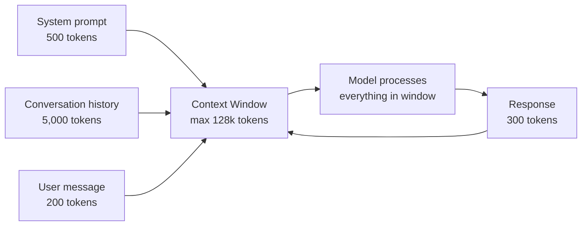

# Context Windows and Tokens — Theory

You're on a phone call with a really knowledgeable friend. The call has been going on for hours. But here's the catch: your friend can only remember the last 10 minutes of the conversation. Anything you discussed before that is completely gone. If you said "remember that thing I mentioned earlier about the project timeline?" — they genuinely have no idea what you're talking about.

That's the context window. The model can only "see" and use what's within its window. Everything outside it is invisible.

👉 This is why we need to understand **context windows and tokens** — because they define what the model knows about your conversation and set real limits on what it can process.

---

## What is a token?

A token is the basic unit of text an LLM processes. Not a word — a chunk of text.

Most tokenizers use **Byte Pair Encoding (BPE)** which learns common subword patterns:

```
"the"           → 1 token
"cat"           → 1 token
"running"       → 1 token
"tokenization"  → 2 tokens: "token" + "ization"
"ChatGPT"       → 3 tokens: "Chat" + "G" + "PT"
"2024"          → 1 token
"!!!"           → 3 tokens (one per exclamation)
" hello"        → 1 token (the space is part of the token)
```

**Rule of thumb**: 1 token ≈ 0.75 words, or 4 characters

Why does this matter? Because:
- API costs are per token
- Context windows are measured in tokens
- Speed is measured in tokens per second

---

## Token counting in practice

| Text | Approximate tokens |
|------|--------------------|
| 1 word | ~1.3 tokens |
| 1 sentence (average) | 15–20 tokens |
| 1 paragraph | 75–100 tokens |
| 1 page of text | ~400–500 tokens |
| 1 short story | ~3,000–5,000 tokens |
| 1 novel (like Harry Potter book 1) | ~180,000 tokens |
| This Theory.md file | ~2,000 tokens |

Code tends to use more tokens per "concept" than prose. Python:
```python
for i in range(10):
    print(i)
```
= roughly 15–20 tokens, but 5 lines of text.

---

## What is the context window?

The context window (also called context length) is the maximum number of tokens the model can process in a single forward pass.



Everything in the window is "in memory." The model can attend to any part of it when generating each token.

Anything outside the window — earlier messages, older documents — simply does not exist to the model. It cannot refer to, reason about, or remember it.

---

## How context windows have grown

| Model | Context window | Year |
|-------|---------------|------|
| GPT-2 | 1,024 tokens | 2019 |
| GPT-3 | 4,096 tokens | 2020 |
| GPT-3.5 | 16,384 tokens | 2023 |
| GPT-4 | 128,000 tokens | 2023 |
| Claude 3 | 200,000 tokens | 2024 |
| Gemini 1.5 Pro | 1,000,000 tokens | 2024 |

1,000,000 tokens ≈ 750,000 words ≈ 8–10 novels. That's the entire Lord of the Rings trilogy plus several other books in a single context.

---

## Why context windows matter for applications

**For chatbots:**
Every message in the conversation takes up tokens. A long conversation will eventually fill the context window. Once full, old messages must be dropped or summarized. This is why very long chat sessions sometimes "forget" earlier parts of the conversation.

**For RAG (Retrieval-Augmented Generation):**
Instead of fitting all your documents in the context (even 1M tokens is finite), RAG retrieves only the relevant documents and puts them in the context. The context window is your working memory; RAG controls what goes into it.

**For code assistants:**
A 100-file codebase might be 500,000 tokens. With a 200k context window, you can fit most of a medium codebase. With a 4k window, you can only fit a few files — hence why code assistants need smart file selection.

**For document analysis:**
A legal contract: ~15,000 tokens. A financial report: ~20,000 tokens. With 128k+ context windows, you can analyze entire documents at once.

---

## Positional encoding and context limits

Transformers need to know the position of each token. This is done through positional encoding.

The original sinusoidal encoding couldn't extrapolate beyond training length. Modern approaches like **RoPE (Rotary Position Embedding)** are better at generalizing to longer lengths, but they still degrade:

- A model trained with 4k context won't simply "work" at 128k
- Models are explicitly trained on long contexts to handle them well
- "Lost in the middle": research shows models recall beginning and end of very long contexts better than the middle

---

## The KV cache: how generation handles context

During generation, the model needs to compute attention over all previous tokens for every new token. Without optimization, this would be O(n²) in context length.

The **Key-Value (KV) cache** stores the attention keys and values computed for each token in the context. When generating token n+1, only the new token's KV pairs need to be computed — the rest are retrieved from cache.

Trade-off: KV cache uses GPU memory proportional to context length. A 200k token context on a large model can require hundreds of gigabytes of KV cache — often more than the model weights themselves.

---

## The "lost in the middle" problem

Research (Liu et al., 2023) showed something counterintuitive: even when documents are within the context window, models recall information better from:
- The very beginning of the context (primacy effect)
- The very end of the context (recency effect)
- Middle of long contexts: recall drops significantly

Practical implication: if you're stuffing multiple documents into a context window for analysis, put the most important information first or last. Don't bury critical information in the middle.

---

✅ **What you just learned:** Tokens are the basic unit of LLM text (roughly 0.75 words each), and the context window is the maximum tokens a model can process at once — defining its working memory and driving API costs.

🔨 **Build this now:** Go to platform.openai.com/tokenizer or use `tiktoken` in Python. Paste in a paragraph of text and count the tokens. Then paste in the same paragraph in a different language and compare the token counts. Notice how languages with different scripts tokenize very differently.

```python
import tiktoken
enc = tiktoken.encoding_for_model("gpt-4")
text = "Hello, how many tokens is this sentence?"
tokens = enc.encode(text)
print(f"Token count: {len(tokens)}")
print(f"Tokens: {tokens}")
```

➡️ **Next step:** Hallucination and Alignment — [08_Hallucination_and_Alignment/Theory.md](../08_Hallucination_and_Alignment/Theory.md)

---

## 📂 Navigation

**In this folder:**
| File | |
|---|---|
| 📄 **Theory.md** | ← you are here |
| [📄 Cheatsheet.md](./Cheatsheet.md) | Quick reference |
| [📄 Interview_QA.md](./Interview_QA.md) | Interview prep |

⬅️ **Prev:** [06 RLHF](../06_RLHF/Theory.md) &nbsp;&nbsp;&nbsp; ➡️ **Next:** [08 Hallucination and Alignment](../08_Hallucination_and_Alignment/Theory.md)
