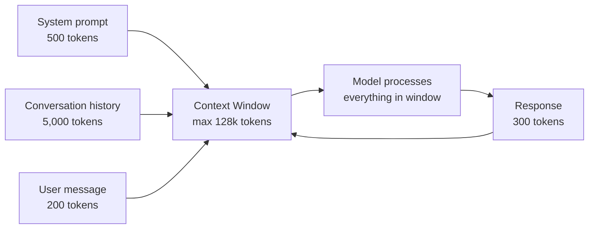
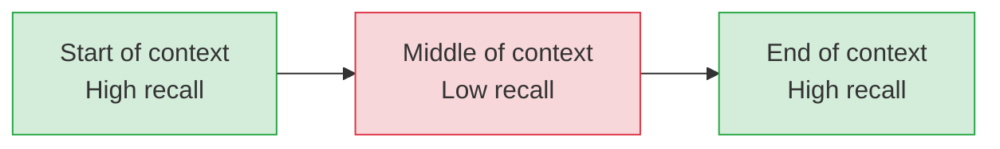

# Context Windows and Tokens — Theory

You're on a phone call with a knowledgeable friend who can only remember the last 10 minutes of the conversation. Anything before that is completely gone. If you say "remember that thing I mentioned about the project timeline?" — they genuinely have no idea.

That's the context window: the model can only use what's within its window. Everything outside is invisible.

👉 This is why we need to understand **context windows and tokens** — they define what the model knows and set real limits on what it can process.

---

## What is a token?

A token is the basic unit of text an LLM processes — a chunk of text, not necessarily a word. Most tokenizers use **Byte Pair Encoding (BPE)**:

```
"the"           → 1 token
"cat"           → 1 token
"running"       → 1 token
"tokenization"  → 2 tokens: "token" + "ization"
"ChatGPT"       → 3 tokens: "Chat" + "G" + "PT"
"2024"          → 1 token
"!!!"           → 3 tokens (one per exclamation)
" hello"        → 1 token (the space is part of the token)
```

**Rule of thumb**: 1 token ≈ 0.75 words, or 4 characters

This matters because API costs are per token, context windows are measured in tokens, and speed is measured in tokens per second.

---

## Token counting in practice

| Text | Approximate tokens |
|------|--------------------|
| 1 word | ~1.3 tokens |
| 1 sentence (average) | 15–20 tokens |
| 1 paragraph | 75–100 tokens |
| 1 page of text | ~400–500 tokens |
| 1 short story | ~3,000–5,000 tokens |
| 1 novel (Harry Potter book 1) | ~180,000 tokens |

Code uses more tokens per "concept" than prose.

---

## What is the context window?

The context window is the maximum number of tokens the model can process in a single forward pass. Everything in the window is "in memory" — the model can attend to any part of it.



Anything outside the window — earlier messages, older documents — simply does not exist to the model.

---

## How context windows have grown

| Model | Context window | Year |
|-------|---------------|------|
| GPT-2 | 1,024 tokens | 2019 |
| GPT-3 | 4,096 tokens | 2020 |
| GPT-3.5 | 16,384 tokens | 2023 |
| GPT-4 | 128,000 tokens | 2023 |
| Claude 3 | 200,000 tokens | 2024 |
| Gemini 1.5 Pro | 1,000,000 tokens | 2024 |

1,000,000 tokens ≈ 750,000 words ≈ the entire Lord of the Rings trilogy plus several other books.

---

## Why context windows matter for applications

**For chatbots:** Long conversations fill the context window. Old messages must be dropped or summarized — why very long sessions sometimes "forget" earlier parts.

**For RAG:** Instead of fitting all documents in context (even 1M tokens is finite), RAG retrieves only relevant documents. The context window is your working memory; RAG controls what goes into it.

**For code assistants:** A 100-file codebase might be 500,000 tokens. With a 200k window you can fit most of a medium codebase; with a 4k window you can only fit a few files.

**For document analysis:** A legal contract is ~15,000 tokens; a financial report ~20,000. With 128k+ context you can analyze entire documents at once.

---

## Positional encoding and context limits

Transformers need to know each token's position. **RoPE (Rotary Position Embedding)** is better than original sinusoidal encoding at generalizing to longer lengths, but models still degrade beyond their training length — they must be explicitly trained on long contexts to handle them well.

**Lost in the middle:** Research shows models recall the beginning and end of very long contexts better than the middle (Liu et al., 2023).



Practical implication: put the most important information first or last, not buried in the middle.

---

## The KV cache

During generation, the model computes attention over all previous tokens for every new token — O(n²) without optimization. The **Key-Value (KV) cache** stores attention keys and values for each context token, so only the new token's KV pairs need computing.

Trade-off: KV cache uses GPU memory proportional to context length. A 200k token context on a large model can require hundreds of gigabytes — often more than the model weights themselves.

---

✅ **What you just learned:** Tokens are the basic unit of LLM text (roughly 0.75 words each), and the context window is the maximum tokens a model can process at once — defining its working memory and driving API costs.

🔨 **Build this now:** Use platform.openai.com/tokenizer or `tiktoken` in Python. Paste a paragraph and count its tokens. Then paste the same paragraph in another language and compare — languages tokenize very differently.

```python
import tiktoken
enc = tiktoken.encoding_for_model("gpt-4")
text = "Hello, how many tokens is this sentence?"
tokens = enc.encode(text)
print(f"Token count: {len(tokens)}")
print(f"Tokens: {tokens}")
```

➡️ **Next step:** Hallucination and Alignment — [08_Hallucination_and_Alignment/Theory.md](../08_Hallucination_and_Alignment/Theory.md)

---

## 🛠️ Practice Project

Apply what you just learned → **[B4: LLM Chatbot with Memory](../../20_Projects/00_Beginner_Projects/04_LLM_Chatbot_with_Memory/Project_Guide.md)**
> This project uses: managing conversation history to stay within the context window, tracking token usage per turn

---

## 📂 Navigation

**In this folder:**
| File | |
|---|---|
| 📄 **Theory.md** | ← you are here |
| [📄 Cheatsheet.md](./Cheatsheet.md) | Quick reference |
| [📄 Interview_QA.md](./Interview_QA.md) | Interview prep |

⬅️ **Prev:** [06 RLHF](../06_RLHF/Theory.md) &nbsp;&nbsp;&nbsp; ➡️ **Next:** [08 Hallucination and Alignment](../08_Hallucination_and_Alignment/Theory.md)
