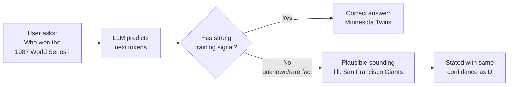

# Hallucination and Alignment — Theory

Picture a very confident intern on their first week. You ask them a question they don't know the answer to. Instead of saying "I don't know," they fill in the gaps with their best guess — stated with total confidence. The answer sounds perfectly plausible. It has the right structure. But it's wrong.

Now imagine that intern has read everything ever written and is incredibly articulate. They still guess — but their guesses are so fluent and well-structured that you have no idea they're guessing. That's LLM hallucination.

👉 This is why we need to understand **hallucination and alignment** — because a fluent, confident wrong answer is often worse than "I don't know," and making AI reliably helpful and honest is an unsolved engineering challenge.

---

## What hallucination actually is

Hallucination is when an LLM generates text that is factually incorrect, made up, or unsupported — but presented with the same fluency and confidence as correct information.

The term comes from neuroscience (the brain perceiving things that aren't there). In LLMs, the "hallucination" is the model generating plausible-sounding text that isn't grounded in reality.

Examples:
- Citing a scientific paper that doesn't exist
- Stating that a historical event happened on the wrong date
- Making up a quote attributed to a real person
- Claiming a company has a feature it doesn't have
- Inventing legal statutes or court cases

The danger: it's hard to tell a hallucination from a correct answer. Both look the same.

---

## Why hallucination happens

LLMs don't look things up. They generate text based on statistical patterns.

The model doesn't "know" the difference between "I'm confident about this" and "I'm guessing." It just generates what tokens are most probable given the context. If the training data was sparse or ambiguous about a fact, the model generates something plausible — not something verified.

**Key insight**: LLMs are pattern matchers, not databases. When you query a database, it either finds the data or says "not found." When you query an LLM, it always generates something — whether it knows the answer or not.

---

## Factuality vs fluency tradeoff

There's a fundamental tension in language model training:

- The pretraining objective (next-token prediction) rewards **fluency** — coherent, readable text
- But fluency and factuality are not the same thing
- A made-up fact stated confidently can have higher probability than an honest "I'm not sure"
- RLHF helps, but humans who rated responses sometimes preferred confident-sounding answers over hedged-but-honest ones

This means models are, at their core, trained to produce plausible-sounding text — not to produce true text.

---

## Types of hallucination

**Factual hallucination**: States incorrect facts ("Einstein won the Nobel Prize in 1912" — it was 1921).

**Entity hallucination**: Makes up names, titles, dates, URLs ("You can read more at arxiv.org/abs/2024.99999").

**Attribution hallucination**: Attributes real quotes to wrong people, or invents quotes entirely.

**Logical hallucination**: The reasoning seems valid but contains subtle errors that lead to wrong conclusions.

**Temporal hallucination**: The model states current facts about the world but uses outdated information from its training data as if it's current.

**Self-hallucination**: The model invents things about itself — "I was trained with X technique" (may be wrong).

---

## What is alignment?

Alignment is the broader challenge of making AI systems behave in accordance with human values and intentions. Hallucination is one alignment failure. But alignment also covers:

- **Harmful content**: Does the model refuse to help with dangerous activities?
- **Honesty**: Does the model accurately represent its uncertainty?
- **Helpfulness**: Is the model actually useful, or just technically compliant?
- **Sycophancy**: Does the model tell users what they want to hear rather than what's true?
- **Fairness**: Does the model treat all users equally? Does it have biases?

The famous Anthropic framing: **Helpful, Harmless, Honest** (HHH).

Getting all three right simultaneously is hard. Being very "Harmless" can make the model refuse too much and become less "Helpful." Being very "Helpful" can lead to providing dangerous information.

---

## Constitutional AI (Anthropic's approach)

Constitutional AI is Anthropic's method for teaching models to be aligned using a written set of principles (a "constitution") and AI feedback.

The process:
1. Give the model a harmful prompt
2. Ask the model to critique its own response based on the constitution
3. Ask the model to revise the response to better align with the principles
4. Use AI (not just humans) to rate which response is more aligned
5. Train on these AI-generated preference comparisons

This scales alignment training beyond what's possible with human raters alone and makes the guiding principles explicit and auditable.

---

## Why alignment is still unsolved

Even after RLHF and Constitutional AI, models still:
- Hallucinate facts they weren't trained on
- Are occasionally sycophantic
- Have blind spots and biases from training data
- Can be "jailbroken" with clever prompting
- May have behaviors that differ between evaluations and deployment

The alignment problem is not fully solved. Every major model has known failure modes. The field continues to develop new techniques — but it's an arms race between alignment improvements and the complexity of the models being aligned.

---

✅ **What you just learned:** LLM hallucination happens because models generate statistically probable text, not verified facts — and alignment is the ongoing challenge of making AI helpful, safe, and honest simultaneously.

🔨 **Build this now:** Ask an LLM: "List 5 academic papers on [a very specific niche topic]." Then Google each paper title. How many actually exist? Count the hallucinations. Now ask the same question but add: "Only list papers you're very confident exist. If you're unsure, say so." See if the behavior changes.

➡️ **Next step:** Using LLM APIs — [09_Using_LLM_APIs/Theory.md](../09_Using_LLM_APIs/Theory.md)

---

## 📂 Navigation

**In this folder:**
| File | |
|---|---|
| 📄 **Theory.md** | ← you are here |
| [📄 Cheatsheet.md](./Cheatsheet.md) | Quick reference |
| [📄 Interview_QA.md](./Interview_QA.md) | Interview prep |
| [📄 Mitigation_Strategies.md](./Mitigation_Strategies.md) | Hallucination mitigation strategies |

⬅️ **Prev:** [07 Context Windows and Tokens](../07_Context_Windows_and_Tokens/Theory.md) &nbsp;&nbsp;&nbsp; ➡️ **Next:** [09 Using LLM APIs](../09_Using_LLM_APIs/Theory.md)
