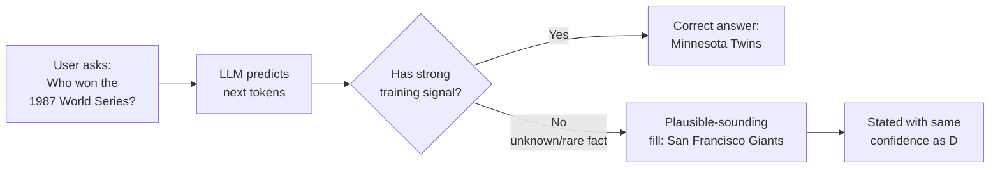
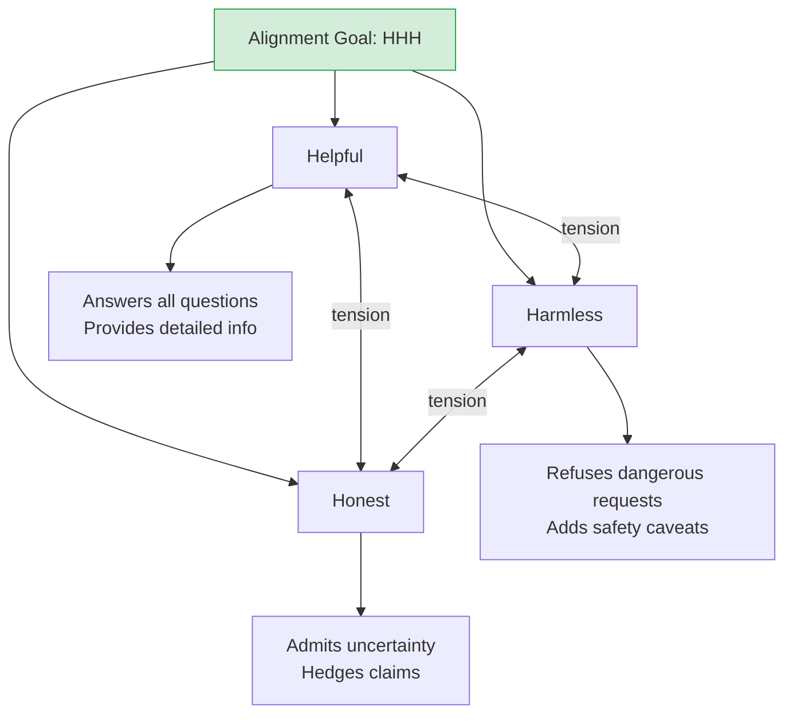
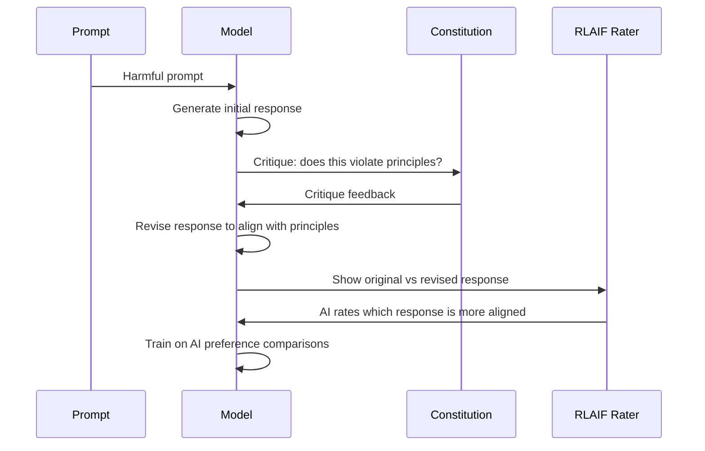

# Hallucination and Alignment — Theory

Picture a very confident intern on their first week. Asked a question they don't know, instead of saying "I don't know," they fill the gap with a plausible-sounding guess — stated with total confidence. Now imagine that intern has read everything ever written and is incredibly articulate. Their guesses are so fluent you can't tell them from real answers. That's LLM hallucination.

👉 This is why we need to understand **hallucination and alignment** — a fluent, confident wrong answer is often worse than "I don't know," and making AI reliably helpful and honest is an unsolved engineering challenge.

---

## What hallucination actually is

Hallucination is when an LLM generates factually incorrect, made-up, or unsupported content — presented with the same fluency and confidence as correct information.

Examples:
- Citing a scientific paper that doesn't exist
- Stating a historical event happened on the wrong date
- Making up a quote attributed to a real person
- Claiming a company has a feature it doesn't have
- Inventing legal statutes or court cases

The danger: hallucinations and correct answers look identical.

---

## Why hallucination happens

LLMs don't "know" the difference between "I'm confident about this" and "I'm guessing" — they generate the most probable tokens given context. When training data was sparse or ambiguous about a fact, the model generates something plausible, not something verified.

**Key insight:** LLMs are pattern matchers, not databases. A database either finds the data or returns "not found." An LLM always generates something — whether it knows the answer or not.

---

## Factuality vs fluency

The pretraining objective rewards **fluency** — coherent, readable text. But fluency and factuality are not the same. A made-up fact stated confidently can have higher probability than an honest "I'm not sure." RLHF helps, but raters sometimes preferred confident-sounding answers over hedged-but-honest ones. Models are trained to produce plausible-sounding text — not necessarily true text.

---

## Types of hallucination

- **Factual**: Incorrect facts ("Einstein won the Nobel Prize in 1912" — it was 1921)
- **Entity**: Made-up names, titles, URLs ("arxiv.org/abs/2024.99999")
- **Attribution**: Real quotes attributed to wrong people, or invented quotes
- **Logical**: Valid-seeming reasoning with subtle errors leading to wrong conclusions
- **Temporal**: Current-sounding facts based on outdated training data
- **Self-hallucination**: Invented claims about itself ("I was trained with X technique")

---

## What is alignment?

Alignment is the broader challenge of making AI behave in accordance with human values and intentions. Hallucination is one failure mode; others include:

- **Harmful content**: Does the model refuse to help with dangerous activities?
- **Honesty**: Does the model accurately represent its uncertainty?
- **Sycophancy**: Does the model tell users what they want to hear rather than what's true?
- **Fairness**: Does it treat users equally? Does it have biases?

Anthropic's framing: **Helpful, Harmless, Honest (HHH)**. Getting all three simultaneously is hard — being very "Harmless" makes the model refuse too much (less "Helpful"); being very "Helpful" can lead to providing dangerous information.

---

## Constitutional AI (Anthropic's approach)

Constitutional AI uses a written set of principles (a "constitution") and AI feedback to scale alignment training.

The model critiques its own response, revises it, then AI (not just humans) rates the comparisons. This scales beyond what human raters alone can cover and makes guiding principles explicit and auditable.

---

## Why alignment is still unsolved

Even after RLHF and Constitutional AI, models still:
- Hallucinate facts they weren't trained on
- Are occasionally sycophantic
- Have blind spots and biases from training data
- Can be "jailbroken" with clever prompting
- May behave differently between evaluations and deployment

The alignment problem is not fully solved. Every major model has known failure modes, and the field is an ongoing arms race between alignment improvements and model complexity.

---

✅ **What you just learned:** LLM hallucination happens because models generate statistically probable text, not verified facts — and alignment is the ongoing challenge of making AI helpful, safe, and honest simultaneously.

🔨 **Build this now:** Ask an LLM: "List 5 academic papers on [a very specific niche topic]." Google each title. How many actually exist? Now add: "Only list papers you're very confident exist. If unsure, say so." See if behavior changes.

➡️ **Next step:** Using LLM APIs — [09_Using_LLM_APIs/Theory.md](../09_Using_LLM_APIs/Theory.md)

---

## 🛠️ Practice Project

Apply what you just learned → **[B5: Intelligent Document Analyzer](../../20_Projects/00_Beginner_Projects/05_Intelligent_Document_Analyzer/Project_Guide.md)**
> This project uses: prompts that reduce hallucination (cite sources, say "I don't know"), grounding the model in document context

---

## 📂 Navigation

**In this folder:**
| File | |
|---|---|
| 📄 **Theory.md** | ← you are here |
| [📄 Cheatsheet.md](./Cheatsheet.md) | Quick reference |
| [📄 Interview_QA.md](./Interview_QA.md) | Interview prep |
| [📄 Mitigation_Strategies.md](./Mitigation_Strategies.md) | Hallucination mitigation strategies |

⬅️ **Prev:** [07 Context Windows and Tokens](../07_Context_Windows_and_Tokens/Theory.md) &nbsp;&nbsp;&nbsp; ➡️ **Next:** [09 Using LLM APIs](../09_Using_LLM_APIs/Theory.md)
