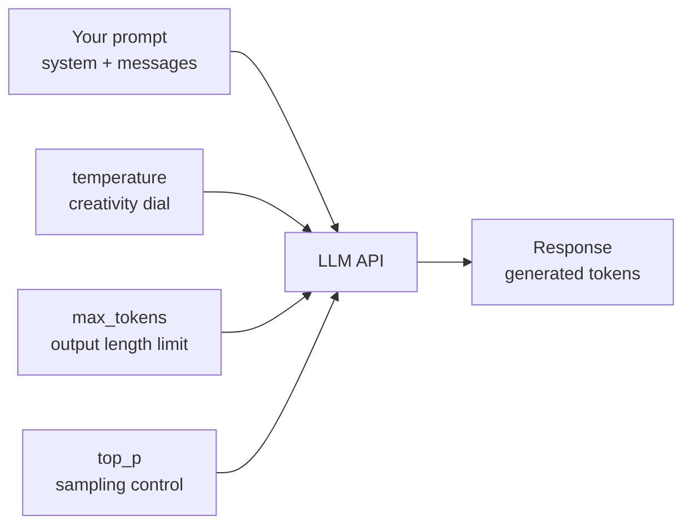

# Using LLM APIs — Theory

You've hired the world's smartest assistant. They can answer almost any question, write code, summarize documents, translate languages, and more. But they charge per sentence they speak. And you get billed separately for every word you say to them.

You want to: give clear instructions, get precise answers, avoid wasting words, and make sure they don't bill you for a 5-minute speech when a 3-sentence answer would do.

That's working with LLM APIs. You get enormous capability — but you need to be intentional about how you use it or costs spiral, and the "assistant" can go in unexpected directions.

👉 This is why we need to understand **LLM APIs** — because the difference between a prototype that costs $2/day and one that costs $2,000/day is usually how you structure your calls.

---

## What is an LLM API?

An LLM API is a REST endpoint that lets you send text (your prompt) and receive generated text back. Under the hood:
1. Your text is tokenized
2. The tokens go through the model's forward pass
3. The model generates response tokens
4. Tokens are detokenized back to text
5. You receive the text response

You never touch the model directly. You send HTTP requests and receive HTTP responses.

---

## The messages format

Modern LLM APIs (Anthropic Claude, OpenAI GPT) use a structured messages format with roles:

```json
{
  "model": "claude-3-5-sonnet-20241022",
  "max_tokens": 1024,
  "system": "You are a helpful assistant that responds concisely.",
  "messages": [
    {"role": "user", "content": "What is the speed of light?"},
    {"role": "assistant", "content": "The speed of light is approximately 299,792,458 meters per second in a vacuum."},
    {"role": "user", "content": "How long does it take light to travel from the Sun to Earth?"}
  ]
}
```

**Three roles:**
- `system`: instructions for the model — sets its behavior, persona, constraints. Processed once, not shown to the user.
- `user`: what the human said
- `assistant`: what the model said (or is about to say)

Including previous turns in `messages` is how you create multi-turn conversations. The model has no memory between calls — you must explicitly pass history.

---

## Key parameters you control



| Parameter | What it does | Typical values |
|-----------|-------------|---------------|
| `temperature` | Randomness of output | 0 (deterministic) to 1.0 (creative) |
| `max_tokens` | Maximum output length | 256 for short, 4096 for long |
| `top_p` | Nucleus sampling | 0.9–0.99 for most uses |
| `stop` | Stop sequences — generation halts here | `["\n\n", "###"]` |
| `stream` | Stream tokens as generated vs wait for full response | true/false |

---

## Streaming

By default, APIs return the full response once it's complete. With streaming, tokens arrive as they're generated — you get the first word immediately, not after 5 seconds.

For user-facing applications, streaming is almost always better UX. It feels faster even if total time is the same.

```python
import anthropic

client = anthropic.Anthropic()

# Streaming example
with client.messages.stream(
    model="claude-3-5-sonnet-20241022",
    max_tokens=1024,
    messages=[{"role": "user", "content": "Explain quantum computing in 3 paragraphs."}]
) as stream:
    for text in stream.text_stream:
        print(text, end="", flush=True)  # Print as it arrives
```

---

## Error handling

LLM APIs can fail. You need to handle errors gracefully.

Common errors:
- **429 Rate limit**: Too many requests per minute. Wait and retry.
- **500 Server error**: Model inference failed. Retry with backoff.
- **400 Bad request**: Your prompt was malformed. Fix the request.
- **401 Unauthorized**: Invalid API key.
- **413 Payload too large**: Your prompt exceeds context limit.

Always use exponential backoff for retryable errors (429, 500, 502, 503):

```python
import time
import anthropic

def call_with_retry(client, messages, max_retries=3):
    for attempt in range(max_retries):
        try:
            response = client.messages.create(
                model="claude-3-5-sonnet-20241022",
                max_tokens=1024,
                messages=messages
            )
            return response
        except anthropic.RateLimitError:
            wait_time = 2 ** attempt  # 1s, 2s, 4s
            time.sleep(wait_time)
        except anthropic.APIStatusError as e:
            if e.status_code >= 500 and attempt < max_retries - 1:
                time.sleep(2 ** attempt)
            else:
                raise
    raise Exception("Max retries exceeded")
```

---

## Structured output: getting JSON back

Raw LLM output is text. For programmatic use, you often need structured JSON. Two approaches:

**1. Prompt engineering (simpler, less reliable):**
```
Extract the name and age from this text. Respond ONLY with valid JSON in this format:
{"name": "string", "age": number}

Text: "John Smith is 34 years old and works in Seattle."
```

**2. Tool use / function calling (more reliable):**
Claude and GPT-4 support "tools" — you define a JSON schema, and the model fills it in. The API returns structured data, not text.

```python
response = client.messages.create(
    model="claude-3-5-sonnet-20241022",
    max_tokens=1024,
    tools=[{
        "name": "extract_person",
        "description": "Extract person information from text",
        "input_schema": {
            "type": "object",
            "properties": {
                "name": {"type": "string", "description": "Person's full name"},
                "age": {"type": "integer", "description": "Person's age"}
            },
            "required": ["name", "age"]
        }
    }],
    messages=[{
        "role": "user",
        "content": "John Smith is 34 years old and works in Seattle."
    }]
)
# The response will be a tool_use block with structured JSON
```

See Code_Cookbook.md for complete examples.

---

## Cost management basics

Every token costs money. The formula:

```
Cost = (input_tokens × input_price_per_million / 1,000,000)
     + (output_tokens × output_price_per_million / 1,000,000)
```

Output tokens cost 3–5x more than input tokens per token. Strategies to control costs:

1. **Be concise in system prompts**: Don't repeat instructions. Use short, clear system prompts.
2. **Set max_tokens appropriately**: Don't use max_tokens=4096 for tasks that need 100 tokens.
3. **Use smaller models for simpler tasks**: Claude Haiku is 20x cheaper than Claude Opus. Use it for classification, extraction, simple Q&A.
4. **Cache common prompts**: If you send the same system prompt every time, prompt caching (supported by Anthropic and OpenAI) can reduce input costs by 90%.
5. **Batch requests**: For offline processing, batch API costs less per token.

See Cost_Guide.md for detailed analysis.

---

✅ **What you just learned:** LLM APIs take structured messages (system/user/assistant), support streaming and structured output, require error handling with retries, and have costs you can manage with smart prompt design and model selection.

🔨 **Build this now:** Run your first Anthropic API call. Install the SDK (`pip install anthropic`), get an API key from console.anthropic.com, and run this:

```python
import anthropic
client = anthropic.Anthropic()
response = client.messages.create(
    model="claude-3-5-haiku-20241022",
    max_tokens=100,
    messages=[{"role": "user", "content": "What is 17 × 23? Show your work."}]
)
print(response.content[0].text)
print(f"Input tokens: {response.usage.input_tokens}")
print(f"Output tokens: {response.usage.output_tokens}")
```

Notice the usage object — that's your cost tracker.

➡️ **Next step:** LLM Applications — [08_LLM_Applications/](../../08_LLM_Applications/)

---

## 📂 Navigation

**In this folder:**
| File | |
|---|---|
| 📄 **Theory.md** | ← you are here |
| [📄 Cheatsheet.md](./Cheatsheet.md) | Quick reference |
| [📄 Interview_QA.md](./Interview_QA.md) | Interview prep |
| [📄 Code_Cookbook.md](./Code_Cookbook.md) | Code cookbook for LLM API calls |
| [📄 Cost_Guide.md](./Cost_Guide.md) | Cost optimization guide |

⬅️ **Prev:** [08 Hallucination and Alignment](../08_Hallucination_and_Alignment/Theory.md) &nbsp;&nbsp;&nbsp; ➡️ **Next:** [01 Prompt Engineering](../../08_LLM_Applications/01_Prompt_Engineering/Theory.md)