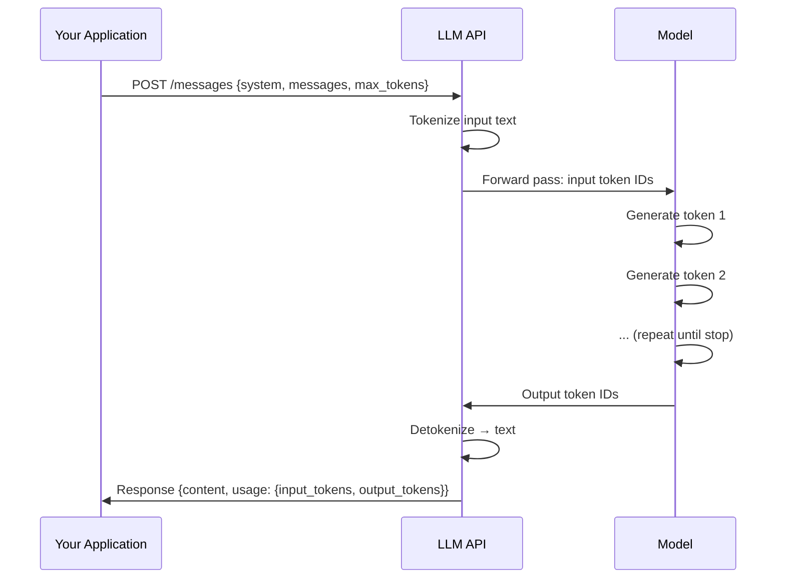

# Using LLM APIs — Theory

You've hired the world's smartest assistant who charges per sentence spoken — and you get billed for every word you say to them. You want to give clear instructions, get precise answers, avoid wasting words, and keep them from billing you for a 5-minute speech when 3 sentences would do.

That's working with LLM APIs: enormous capability, but you need to be intentional or costs spiral.

👉 This is why we need to understand **LLM APIs** — the difference between a prototype costing $2/day and one costing $2,000/day is usually how you structure your calls.

---

## What is an LLM API?

A REST endpoint: send text (your prompt), receive generated text back.



---

## The messages format

Modern APIs (Anthropic Claude, OpenAI GPT) use structured messages with roles:

```json
{
  "model": "claude-3-5-sonnet-20241022",
  "max_tokens": 1024,
  "system": "You are a helpful assistant that responds concisely.",
  "messages": [
    {"role": "user", "content": "What is the speed of light?"},
    {"role": "assistant", "content": "The speed of light is approximately 299,792,458 meters per second in a vacuum."},
    {"role": "user", "content": "How long does it take light to travel from the Sun to Earth?"}
  ]
}
```

**Three roles:**
- `system`: behavior, persona, constraints — processed once, not shown to the user
- `user`: what the human said
- `assistant`: what the model said (or is about to say)

Including previous turns is how you create multi-turn conversations. The model has no memory between calls — you must explicitly pass history.

---

## Key parameters you control

| Parameter | What it does | Typical values |
|-----------|-------------|---------------|
| `temperature` | Randomness of output | 0 (deterministic) to 1.0 (creative) |
| `max_tokens` | Maximum output length | 256 for short, 4096 for long |
| `top_p` | Nucleus sampling | 0.9–0.99 for most uses |
| `stop` | Stop sequences — generation halts here | `["\n\n", "###"]` |
| `stream` | Stream tokens as generated vs wait for full response | true/false |

---

## Streaming

By default, APIs return the full response once complete. With streaming, tokens arrive as generated — the first word appears immediately, not after 5 seconds. For user-facing applications, streaming is almost always better UX.

```python
import anthropic

client = anthropic.Anthropic()

with client.messages.stream(
    model="claude-3-5-sonnet-20241022",
    max_tokens=1024,
    messages=[{"role": "user", "content": "Explain quantum computing in 3 paragraphs."}]
) as stream:
    for text in stream.text_stream:
        print(text, end="", flush=True)  # Print as it arrives
```

---

## Error handling

Common errors and handling:

- **429 Rate limit**: Too many requests per minute. Wait and retry.
- **500 Server error**: Model inference failed. Retry with backoff.
- **400 Bad request**: Malformed prompt. Fix the request.
- **401 Unauthorized**: Invalid API key.
- **413 Payload too large**: Prompt exceeds context limit.

Always use exponential backoff for retryable errors (429, 500, 502, 503):

```python
import time
import anthropic

def call_with_retry(client, messages, max_retries=3):
    for attempt in range(max_retries):
        try:
            response = client.messages.create(
                model="claude-3-5-sonnet-20241022",
                max_tokens=1024,
                messages=messages
            )
            return response
        except anthropic.RateLimitError:
            wait_time = 2 ** attempt  # 1s, 2s, 4s
            time.sleep(wait_time)
        except anthropic.APIStatusError as e:
            if e.status_code >= 500 and attempt < max_retries - 1:
                time.sleep(2 ** attempt)
            else:
                raise
    raise Exception("Max retries exceeded")
```

---

## Structured output: getting JSON back

**1. Prompt engineering (simpler, less reliable):**
```
Extract the name and age from this text. Respond ONLY with valid JSON:
{"name": "string", "age": number}

Text: "John Smith is 34 years old and works in Seattle."
```

**2. Tool use / function calling (more reliable):**

```python
response = client.messages.create(
    model="claude-3-5-sonnet-20241022",
    max_tokens=1024,
    tools=[{
        "name": "extract_person",
        "description": "Extract person information from text",
        "input_schema": {
            "type": "object",
            "properties": {
                "name": {"type": "string", "description": "Person's full name"},
                "age": {"type": "integer", "description": "Person's age"}
            },
            "required": ["name", "age"]
        }
    }],
    messages=[{"role": "user", "content": "John Smith is 34 years old and works in Seattle."}]
)
# The response will be a tool_use block with structured JSON
```

See Code_Cookbook.md for complete examples.

---

## Cost management

```
Cost = (input_tokens × input_price_per_million / 1,000,000)
     + (output_tokens × output_price_per_million / 1,000,000)
```

Output tokens cost 3–5x more than input tokens. Cost control strategies:

1. **Be concise in system prompts**: Short, clear instructions.
2. **Set max_tokens appropriately**: Don't use 4096 for tasks needing 100 tokens.
3. **Use smaller models for simpler tasks**: Claude Haiku is 20x cheaper than Opus. Use it for classification, extraction, simple Q&A.
4. **Cache common prompts**: Prompt caching can reduce input costs by 90%.
5. **Batch requests**: Batch API costs less per token for offline processing.

See Cost_Guide.md for detailed analysis.

---

✅ **What you just learned:** LLM APIs take structured messages (system/user/assistant), support streaming and structured output, require error handling with retries, and have costs you can manage with smart prompt design and model selection.

🔨 **Build this now:** Run your first Anthropic API call:

```python
import anthropic
client = anthropic.Anthropic()
response = client.messages.create(
    model="claude-3-5-haiku-20241022",
    max_tokens=100,
    messages=[{"role": "user", "content": "What is 17 × 23? Show your work."}]
)
print(response.content[0].text)
print(f"Input tokens: {response.usage.input_tokens}")
print(f"Output tokens: {response.usage.output_tokens}")
```

The usage object is your cost tracker.

➡️ **Next step:** LLM Applications — [08_LLM_Applications/](../../08_LLM_Applications/)

---

## 🛠️ Practice Project

Apply what you just learned → **[B4: LLM Chatbot with Memory](../../20_Projects/00_Beginner_Projects/04_LLM_Chatbot_with_Memory/Project_Guide.md)**
> This project uses: Anthropic SDK, messages API, streaming with stream=True, error handling, API key management

---

## 📂 Navigation

**In this folder:**
| File | |
|---|---|
| 📄 **Theory.md** | ← you are here |
| [📄 Cheatsheet.md](./Cheatsheet.md) | Quick reference |
| [📄 Interview_QA.md](./Interview_QA.md) | Interview prep |
| [📄 Code_Cookbook.md](./Code_Cookbook.md) | Code cookbook for LLM API calls |
| [📄 Cost_Guide.md](./Cost_Guide.md) | Cost optimization guide |

⬅️ **Prev:** [08 Hallucination and Alignment](../08_Hallucination_and_Alignment/Theory.md) &nbsp;&nbsp;&nbsp; ➡️ **Next:** [01 Prompt Engineering](../../08_LLM_Applications/01_Prompt_Engineering/Theory.md)
