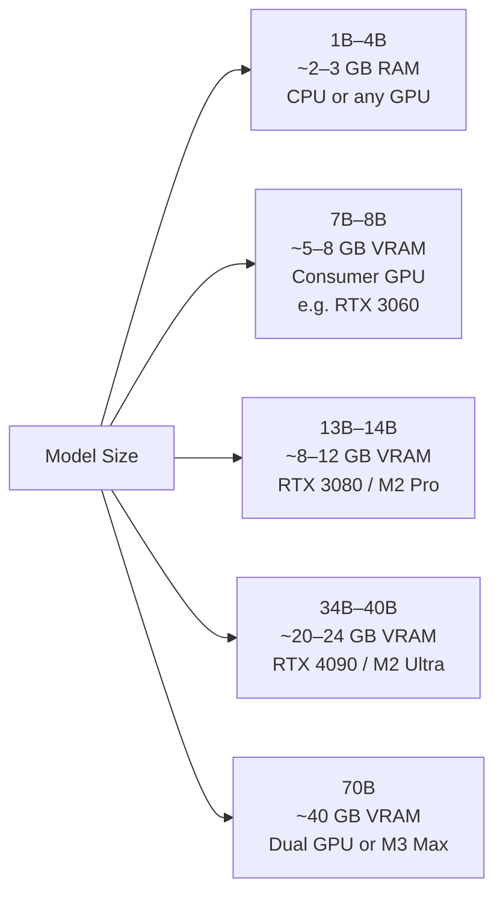

# Ollama — Local LLM Inference

## The Story 📖

A hospital wants to build a chatbot that helps doctors query patient records in natural language. They reach for the OpenAI API — then legal stops them. Patient data is protected under HIPAA. You cannot send it to a third-party API. The data cannot leave the hospital's servers.

This scenario plays out constantly in healthcare, finance, legal, and defense. The answer is **local LLM inference**: running the model on your own hardware, where data never leaves the network perimeter.

The problem is that running a 70-billion-parameter model requires 140GB of GPU memory — out of reach for most teams. Enter **quantization**: compress the model from 32-bit floats to 4-bit integers, reducing memory usage by 8x with minimal quality loss. A 70B model now fits in 40GB. A 7B model fits in a single consumer GPU.

**Ollama** is the easiest way to run quantized open-source models locally. One command installs it. One command downloads and runs a model. No Python dependencies, no CUDA configuration, no Docker.

👉 This is why we need **Ollama** — to run powerful LLMs locally with a one-line setup, enabling privacy-preserving AI without cloud dependency.

---

## 📌 Learning Priority

**Must Learn** — core concepts, needed to understand the rest of this file:
[What Is Ollama](#what-is-ollama) · [Why It Exists](#why-it-exists--the-problem-it-solves) · [REST API Usage](#step-3-rest-api)

**Should Learn** — important for real projects and interviews:
[Model Sizes and Hardware](#step-2-understand-model-sizes-and-hardware-requirements) · [OpenAI-Compatible Interface](#step-5-openai-compatible-interface) · [Local RAG Example](#step-6-local-rag-with-ollama)

**Good to Know** — useful in specific situations, not needed daily:
[GGUF Quantization Math](#the-math--technical-side-simplified) · [Common Mistakes](#common-mistakes-to-avoid-)

**Reference** — skim once, look up when needed:
[Quantization Format Table](#step-2-understand-model-sizes-and-hardware-requirements)

---

## What is Ollama?

**Ollama** is an open-source tool that packages LLM inference into a local server with a simple CLI and REST API. It handles model downloading, quantization, hardware detection, and serving — exposing a familiar API that mirrors the OpenAI interface.

What Ollama gives you:
- A **CLI** to pull, run, and manage models (`ollama run llama3`)
- A **local REST API** at `http://localhost:11434` — compatible with OpenAI's API format
- A **Python and JavaScript library** for programmatic access
- Automatic **GPU/CPU detection** — uses Metal (Apple Silicon), CUDA (NVIDIA), or CPU fallback
- Built-in **quantization** — models are distributed as GGUF files (a compressed format)

Popular models available through Ollama:
- **Llama 3.1 / 3.2** (Meta) — strong general-purpose model, 8B to 70B variants
- **Mistral / Mixtral** — fast and capable, popular for coding and instruction-following
- **Phi-3 / Phi-4** (Microsoft) — small but surprisingly capable, 3B–14B
- **Gemma 2** (Google) — balanced quality/speed, 2B–27B
- **Qwen 2.5** (Alibaba) — excellent multilingual and coding
- **DeepSeek-R1** — reasoning model, runs locally in distilled form
- **Llava** — multimodal (vision + language)
- **nomic-embed-text** — embedding model for local RAG

---

## Why It Exists — The Problem It Solves

**1. Data privacy and compliance**
Healthcare (HIPAA), finance (GDPR, SOC2), legal, and defense cannot send data to external APIs. Local inference is the only option.

**2. Cost at scale**
At 10 million API calls/month, cloud LLM costs can reach $50K+/month. A one-time GPU investment may be cheaper at sufficient scale.

**3. Offline / air-gapped operation**
Edge devices, factory floors, military systems, and rural applications cannot depend on internet connectivity.

**4. Latency control**
No network round-trip. A local inference call on a fast GPU can be faster than a cloud API for short prompts.

👉 Without local inference: you either violate compliance, pay cloud costs indefinitely, or have no AI in offline environments. With Ollama: a single workstation with a consumer GPU becomes an LLM server.

---

## How It Works — Step by Step

### Step 1: Install and Run

```bash
# Install Ollama (macOS / Linux)
curl -fsSL https://ollama.com/install.sh | sh

# Pull a model (downloads quantized GGUF weights)
ollama pull llama3.2

# Run interactively in the terminal
ollama run llama3.2
>>> Why is the sky blue?

# Run with a one-shot prompt
ollama run llama3.2 "Explain quantum entanglement in one paragraph"

# List downloaded models
ollama list

# Remove a model
ollama rm llama3.2

# Show model info and parameters
ollama show llama3.2
```

### Step 2: Understand Model Sizes and Hardware Requirements



**Quantization levels (Q4 is the sweet spot):**

| Format | Bits | Memory | Quality Loss |
|---|---|---|---|
| **F16** | 16-bit float | ~2× model params | None (reference) |
| **Q8_0** | 8-bit int | ~1× model params | Minimal |
| **Q4_K_M** | 4-bit int | ~0.5× model params | Small — recommended |
| **Q3_K_M** | 3-bit int | ~0.4× model params | Noticeable |
| **Q2_K** | 2-bit int | ~0.25× model params | Significant |

`ollama pull llama3.2` automatically downloads the Q4_K_M variant — the best quality/size tradeoff.

### Step 3: REST API

Ollama exposes a local HTTP server at `http://localhost:11434` when running.

```python
import requests

# Chat completion (OpenAI-compatible format)
response = requests.post(
    "http://localhost:11434/api/chat",
    json={
        "model": "llama3.2",
        "messages": [
            {"role": "system", "content": "You are a helpful assistant."},
            {"role": "user", "content": "What is gradient descent?"}
        ],
        "stream": False,
    }
)
print(response.json()["message"]["content"])

# Generate (raw completion, non-chat format)
response = requests.post(
    "http://localhost:11434/api/generate",
    json={
        "model": "llama3.2",
        "prompt": "The capital of France is",
        "stream": False,
    }
)
print(response.json()["response"])

# Embeddings
response = requests.post(
    "http://localhost:11434/api/embed",
    json={
        "model": "nomic-embed-text",
        "input": "The quick brown fox jumps over the lazy dog"
    }
)
embedding = response.json()["embeddings"][0]    # list of floats
```

### Step 4: Python Library

```python
import ollama

# Basic chat
response = ollama.chat(
    model="llama3.2",
    messages=[
        {"role": "user", "content": "Explain transformers in 3 sentences"}
    ]
)
print(response["message"]["content"])

# Streaming
for chunk in ollama.chat(
    model="llama3.2",
    messages=[{"role": "user", "content": "Write a haiku about Python"}],
    stream=True,
):
    print(chunk["message"]["content"], end="", flush=True)

# Embeddings for local RAG
embedding = ollama.embed(
    model="nomic-embed-text",
    input="How does backpropagation work?"
)["embeddings"][0]
```

### Step 5: OpenAI-Compatible Interface

Ollama mirrors the OpenAI API format, allowing you to use it as a drop-in replacement:

```python
from openai import OpenAI

# Point the OpenAI client at your local Ollama server
client = OpenAI(
    base_url="http://localhost:11434/v1",
    api_key="ollama",    # any string works — Ollama ignores it
)

response = client.chat.completions.create(
    model="llama3.2",
    messages=[
        {"role": "system", "content": "You are a concise assistant."},
        {"role": "user", "content": "What is RAG?"}
    ],
    temperature=0.7,
)
print(response.choices[0].message.content)
```

This means any existing code using the OpenAI SDK works with Ollama by changing `base_url` and `model` name.

### Step 6: Local RAG with Ollama

```python
import ollama
import numpy as np
from sklearn.metrics.pairwise import cosine_similarity

documents = [
    "RAG stands for Retrieval-Augmented Generation.",
    "ARIMA models require stationarity for time series.",
    "Transformers use self-attention to process sequences.",
]

# Step 1: Embed all documents
def embed(text):
    return ollama.embed(model="nomic-embed-text", input=text)["embeddings"][0]

doc_embeddings = np.array([embed(doc) for doc in documents])

# Step 2: Query
query = "What does RAG stand for?"
query_embedding = np.array([embed(query)])

# Step 3: Find most relevant document
similarities = cosine_similarity(query_embedding, doc_embeddings)[0]
best_doc = documents[similarities.argmax()]

# Step 4: Generate answer with context
response = ollama.chat(
    model="llama3.2",
    messages=[{
        "role": "user",
        "content": f"Context: {best_doc}\n\nQuestion: {query}"
    }]
)
print(response["message"]["content"])
```

---

## The Math / Technical Side (Simplified)

**GGUF (GPT-Generated Unified Format)** is the file format Ollama uses. It stores model weights, tokenizer, and metadata in a single binary file. Quantization maps 32-bit floats to lower-bit integers:

`x_quantized = round(x / scale) + zero_point`

Where `scale` and `zero_point` are computed per block of weights to minimize reconstruction error. Q4_K_M uses a mixed-precision approach with some critical layers kept at higher precision.

**Memory estimation:**
`VRAM (GB) ≈ (model_params × bits_per_param) / (8 × 1024³)`

For a 7B parameter model at Q4 (4 bits):
`7,000,000,000 × 4 / (8 × 1,073,741,824) ≈ 3.3 GB`

Plus KV cache overhead for the context window: typically adds 0.5–2 GB for typical context lengths.

---

## Where You'll See This in Real AI Systems

- **Healthcare AI**: HIPAA-compliant document Q&A over patient records using Llama 3 + Ollama, data never leaves the hospital's servers
- **Enterprise code assistants**: companies like Cursor and Continue.dev support Ollama as a backend for code completion without sending code to cloud APIs
- **Offline edge deployment**: factory floor defect detection systems running small vision-language models on local workstations without internet
- **Developer workflows**: local AI-powered CLI tools, git commit message generation, code review assistants using Ollama's REST API
- **Private RAG systems**: legal firms building document search over confidential case files using nomic-embed-text + Llama 3 entirely on-premises

---

## Common Mistakes to Avoid ⚠️

- **Under-provisioning RAM**: if VRAM is insufficient, Ollama falls back to CPU and RAM — generation becomes 10–100x slower. Always check model size vs available VRAM before pulling.
- **Using F16 models when Q4 is fine**: the quality difference between Q4_K_M and F16 is minimal for most tasks, but the memory difference is 4x. Start with Q4.
- **Not using the OpenAI-compatible endpoint**: if you already have OpenAI SDK code, point it at `localhost:11434/v1` — no need to rewrite anything.
- **Forgetting to start the Ollama server**: `ollama run model` starts interactively. For API access, run `ollama serve` in a background process first.
- **Comparing small local models to GPT-4**: a 7B local model is not competitive with a 1-trillion-parameter frontier model. Use local models where privacy matters, not where frontier capability is required.

## Connection to Other Concepts 🔗

- Relates to **Using LLM APIs** (`07_Large_Language_Models/09_Using_LLM_APIs`) — Ollama uses the same API patterns
- Relates to **RAG Systems** (`09_RAG_Systems`) — local RAG stacks use Ollama for both embeddings and generation
- Relates to **Reasoning Models** (`07_Large_Language_Models/11_Reasoning_Models`) — DeepSeek-R1 distilled models run locally via Ollama
- Relates to **Quantization** (`12_Production_AI/02_Latency_Optimization`) — GGUF quantization is the core mechanism enabling local inference

---

✅ **What you just learned:** Ollama packages open-source LLMs into a local inference server with a one-command setup, exposes an OpenAI-compatible REST API, uses GGUF quantization to run 7B–70B models on consumer hardware, and enables privacy-preserving AI for compliance-sensitive environments.

🔨 **Build this now:** Install Ollama, pull `llama3.2` and `nomic-embed-text`, then build a 20-line local RAG system: embed 5 text chunks, embed a query, retrieve the best chunk, generate an answer — entirely offline.

➡️ **Next step:** [GraphRAG](../../09_RAG_Systems/10_GraphRAG/Theory.md)

---

## 📂 Navigation

**In this folder:**
| File | |
|---|---|
| 📄 **Theory.md** | ← you are here |
| [📄 Cheatsheet.md](./Cheatsheet.md) | Quick reference |
| [📄 Interview_QA.md](./Interview_QA.md) | Interview prep |

⬅️ **Prev:** [Using LLM APIs](../09_Using_LLM_APIs/Theory.md) &nbsp;&nbsp;&nbsp; ➡️ **Next:** [Reasoning Models](../11_Reasoning_Models/Theory.md)
