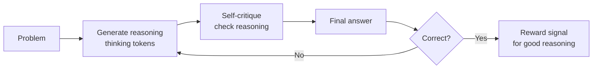

# Reasoning Models

## The Story 📖

You ask a standard LLM: "Is 9.11 greater than 9.9?" It says yes. Confidently. Wrong.

You ask a reasoning model the same question. It pauses. It thinks: "9.11 has two decimal places. 9.9 is the same as 9.90. Comparing digit by digit: 9 = 9, then 1 < 9. So 9.11 < 9.90." After 8 seconds, it says no.

The standard model pattern-matched to an answer. The reasoning model *worked it out*.

👉 This is why we need **Reasoning Models** — LLMs that spend compute thinking through a problem step by step before committing to an answer.

---

## What are Reasoning Models?

**Reasoning models** are LLMs trained to produce explicit chain-of-thought reasoning before generating a final answer. They spend **thinking tokens** — internal reasoning steps — working through a problem before outputting a response.

Key characteristics:
- **Thinking tokens**: internal reasoning steps (sometimes hidden, sometimes visible)
- **Process reward**: trained with feedback on *reasoning quality*, not just answer correctness
- **Higher latency**: 10–60 seconds typical vs milliseconds for standard models
- **Higher accuracy**: especially on math, code, science, multi-step logic

---

## Why It Exists — The Problem It Solves

Standard LLMs generate tokens left-to-right without backtracking. They commit to early tokens before seeing the full problem. For simple tasks this is fine. For complex reasoning, it fails:

1. **Multi-step math**: errors compound — one wrong step poisons everything downstream
2. **Complex code**: requires holding many constraints simultaneously, reasoning about edge cases
3. **Scientific reasoning**: requires following logical chains, not pattern matching to training data
4. **Adversarial prompts**: "clever" phrasings that trick pattern-matching models

👉 Without reasoning models: complex problems get plausible-sounding wrong answers. With reasoning models: the model checks its own work before responding.

---

## How It Works — Step by Step

### Step 1: Chain-of-Thought Training



### Step 2: Process Reward Models (PRMs)

Standard RLHF rewards correct final answers. PRMs reward **correct reasoning steps** — even if the final answer is eventually wrong. This trains the model to reason well, not just guess well.

### Step 3: Test-Time Compute Scaling

More thinking tokens = better answers (up to a point). Reasoning models can "spend" more compute at inference time on hard problems. This is different from standard models where output quality is fixed by model size.

---

## The Models

| Model | Maker | Thinking Visible | Strengths | Context |
|---|---|---|---|---|
| **o1** | OpenAI | Summary only | Math, science, code | 128k |
| **o3** | OpenAI | Summary only | Best-in-class reasoning | 200k |
| **o1-mini** | OpenAI | Summary only | Cheaper, faster o1 | 128k |
| **DeepSeek-R1** | DeepSeek | Full chain-of-thought | Open source, o1-level | 64k |
| **DeepSeek-R1-Distill** | DeepSeek | Full CoT | 7B–70B versions, runs locally | 64k |
| **Claude Extended Thinking** | Anthropic | Streaming thinking tokens | Configurable budget | 200k |
| **Gemini 2.0 Flash Thinking** | Google | Partial | Fast, multimodal | 1M |

### DeepSeek-R1: Why It Matters

DeepSeek-R1 showed full chain-of-thought reasoning at o1-level performance — and released it open source. The distilled versions (R1-Distill-Qwen-7B, R1-Distill-Llama-8B) bring reasoning capability to models small enough to run locally via Ollama.

---

## API Differences vs Standard LLMs

```python
# Standard Claude call
response = client.messages.create(
    model="claude-sonnet-4-6",
    max_tokens=1024,
    messages=[{"role": "user", "content": "Solve this math problem..."}]
)

# Claude Extended Thinking
response = client.messages.create(
    model="claude-sonnet-4-6",
    max_tokens=16000,
    thinking={
        "type": "enabled",
        "budget_tokens": 10000    # ← how many tokens to spend thinking
    },
    messages=[{"role": "user", "content": "Solve this math problem..."}]
)

# Response has two blocks: thinking block + text block
for block in response.content:
    if block.type == "thinking":
        print("Reasoning:", block.thinking)    # ← internal chain of thought
    elif block.type == "text":
        print("Answer:", block.text)           # ← final answer
```

```python
# OpenAI o1 — no temperature, no system prompt
response = client.chat.completions.create(
    model="o1-preview",
    messages=[
        {"role": "user", "content": "Solve this..."}
        # ← no system prompt supported on o1
    ]
    # ← no temperature parameter
)
```

---

## The Math / Technical Side (Simplified)

**Standard LLM**: maximize P(answer | question)

**Reasoning model**: maximize P(answer | question, reasoning_chain) where the reasoning chain is itself optimized

Process reward: R(s₁, s₂, ..., sₙ) where each sᵢ is a reasoning step — the model gets rewarded for each *correct step*, not just the final answer.

**Test-time compute scaling law**: accuracy ≈ f(log(thinking_tokens)) — doubling thinking tokens gives logarithmic accuracy gains on hard tasks.

---

## When to Use Reasoning Models

```
USE reasoning models FOR:                 DON'T USE FOR:
─────────────────────────────────────     ──────────────────────────────────
Complex math / proofs                     Simple Q&A
Multi-step algorithm design               Summarization
Tricky logic puzzles                      Translation
Scientific analysis                       Creative writing
Debugging hard edge cases                 Fast chatbots (latency kills UX)
Planning with many constraints            Cost-sensitive high-volume tasks
```

**Cost comparison** (approximate):
- Standard Sonnet: ~$3/M input tokens
- Claude Extended Thinking: thinking tokens billed separately, ~3–5× total cost
- o1: ~$15/M input, $60/M output
- DeepSeek-R1 (self-hosted via Ollama): $0 after hardware

---

## Where You'll See This in Real AI Systems

- **Code review agents**: reasoning through security vulnerabilities, not just style
- **Financial modeling**: multi-step calculations with error checking
- **Medical diagnosis support**: differential diagnosis requires following logical chains
- **Legal contract analysis**: identifying inconsistencies across long documents
- **AI tutors**: showing students step-by-step reasoning, not just answers

---

## Common Mistakes to Avoid ⚠️

- **Using reasoning models for everything**: overkill for simple tasks — wastes cost and latency
- **Setting thinking budget too low**: 1000 thinking tokens may not be enough for hard problems
- **Expecting instant responses**: UI must handle 10–60 second wait times gracefully
- **Using o1 API like GPT-4**: o1 doesn't support system prompts or temperature parameters
- **Ignoring distilled models**: DeepSeek-R1-Distill-7B runs locally and handles many reasoning tasks well

## Connection to Other Concepts 🔗

- Relates to [Extended Thinking / Chain-of-Thought](../08_Hallucination_and_Alignment/Theory.md) — reasoning models formalize CoT
- Relates to [RLHF](../06_RLHF/Theory.md) — PRMs are a variation of reward modeling
- Relates to [Ollama](../10_Ollama_Local_LLMs/Theory.md) — R1-Distill models run locally
- Relates to [AI Agents](../../10_AI_Agents/05_Planning_and_Reasoning/Theory.md) — reasoning models as agent brains

---

✅ **What you just learned:** Reasoning models spend explicit thinking tokens working through problems before answering, trained with process rewards that incentivize good reasoning steps.

🔨 **Build this now:** Compare Claude standard vs Extended Thinking on a multi-step math problem. Measure accuracy difference and cost.

➡️ **Next step:** [LLM Applications → Prompt Engineering](../../08_LLM_Applications/01_Prompt_Engineering/Theory.md)

---

## 📂 Navigation

**In this folder:**
| File | |
|---|---|
| 📄 **Theory.md** | ← you are here |
| [📄 Cheatsheet.md](./Cheatsheet.md) | Quick reference |
| [📄 Interview_QA.md](./Interview_QA.md) | Interview prep |

⬅️ **Prev:** [Ollama — Local LLMs](../10_Ollama_Local_LLMs/Theory.md) &nbsp;&nbsp;&nbsp; ➡️ **Next:** [LLM Applications](../../08_LLM_Applications/01_Prompt_Engineering/Theory.md)
