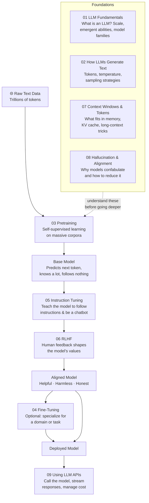

# 🧠 Large Language Models

⬅️ [06 Transformers](../06_Transformers/Readme.md) &nbsp;|&nbsp; [🏠 Home](../00_Learning_Guide/Readme.md) &nbsp;|&nbsp; [08 LLM Applications ➡️](../08_LLM_Applications/Readme.md)

> From raw text on the internet to a model that writes code, passes exams, and holds conversations — this section explains every step.

**[▶ Start here → LLM Fundamentals Theory](./01_LLM_Fundamentals/Theory.md)**

---

## At a Glance

| | |
|---|---|
| 📚 Topics | 9 topics |
| ⏱️ Est. Time | 5–7 hours |
| 📋 Prerequisites | [06 Transformers](../06_Transformers/Readme.md) |
| 🔓 Unlocks | [08 LLM Applications](../08_LLM_Applications/Readme.md) |

---

## What's in This Section

---

## Topics

| # | Topic | What You'll Learn | Files |
|---|---|---|---|
| 01 | [LLM Fundamentals](./01_LLM_Fundamentals/) | What an LLM is, scale laws, emergent abilities, and the landscape of famous models | [📖 Theory](./01_LLM_Fundamentals/Theory.md) · [⚡ Cheatsheet](./01_LLM_Fundamentals/Cheatsheet.md) · [🎯 Interview Q&A](./01_LLM_Fundamentals/Interview_QA.md) · [📅 Timeline](./01_LLM_Fundamentals/Timeline.md) |
| 02 | [How LLMs Generate Text](./02_How_LLMs_Generate_Text/) | Token-by-token prediction, probability distributions, temperature, top-p/top-k sampling | [📖 Theory](./02_How_LLMs_Generate_Text/Theory.md) · [⚡ Cheatsheet](./02_How_LLMs_Generate_Text/Cheatsheet.md) · [🎯 Interview Q&A](./02_How_LLMs_Generate_Text/Interview_QA.md) |
| 03 | [Pretraining](./03_Pretraining/) | Self-supervised learning on web-scale data, what the model actually absorbs, compute costs | [📖 Theory](./03_Pretraining/Theory.md) · [⚡ Cheatsheet](./03_Pretraining/Cheatsheet.md) · [🎯 Interview Q&A](./03_Pretraining/Interview_QA.md) · [🏗️ Architecture Deep Dive](./03_Pretraining/Architecture_Deep_Dive.md) |
| 04 | [Fine-Tuning](./04_Fine_Tuning/) | Specializing a pretrained model, LoRA, QLoRA, when to fine-tune vs just prompt | [📖 Theory](./04_Fine_Tuning/Theory.md) · [⚡ Cheatsheet](./04_Fine_Tuning/Cheatsheet.md) · [🎯 Interview Q&A](./04_Fine_Tuning/Interview_QA.md) · [💻 Code Example](./04_Fine_Tuning/Code_Example.md) · [🗺️ When to Use](./04_Fine_Tuning/When_to_Use.md) |
| 05 | [Instruction Tuning](./05_Instruction_Tuning/) | Why base models aren't chatbots, supervised fine-tuning on instructions, InstructGPT, FLAN | [📖 Theory](./05_Instruction_Tuning/Theory.md) · [⚡ Cheatsheet](./05_Instruction_Tuning/Cheatsheet.md) · [🎯 Interview Q&A](./05_Instruction_Tuning/Interview_QA.md) |
| 06 | [RLHF](./06_RLHF/) | Reinforcement Learning from Human Feedback, reward models, PPO, DPO | [📖 Theory](./06_RLHF/Theory.md) · [⚡ Cheatsheet](./06_RLHF/Cheatsheet.md) · [🎯 Interview Q&A](./06_RLHF/Interview_QA.md) · [🏗️ Architecture Deep Dive](./06_RLHF/Architecture_Deep_Dive.md) |
| 07 | [Context Windows & Tokens](./07_Context_Windows_and_Tokens/) | What a token is, context length limits, KV cache, positional encoding, long-context strategies | [📖 Theory](./07_Context_Windows_and_Tokens/Theory.md) · [⚡ Cheatsheet](./07_Context_Windows_and_Tokens/Cheatsheet.md) · [🎯 Interview Q&A](./07_Context_Windows_and_Tokens/Interview_QA.md) |
| 08 | [Hallucination & Alignment](./08_Hallucination_and_Alignment/) | Why LLMs confidently say wrong things, Constitutional AI, grounding, mitigation strategies | [📖 Theory](./08_Hallucination_and_Alignment/Theory.md) · [⚡ Cheatsheet](./08_Hallucination_and_Alignment/Cheatsheet.md) · [🎯 Interview Q&A](./08_Hallucination_and_Alignment/Interview_QA.md) · [🛡️ Mitigation Strategies](./08_Hallucination_and_Alignment/Mitigation_Strategies.md) |
| 09 | [Using LLM APIs](./09_Using_LLM_APIs/) | Calling Claude & OpenAI APIs, streaming, structured output, error handling, cost management | [📖 Theory](./09_Using_LLM_APIs/Theory.md) · [⚡ Cheatsheet](./09_Using_LLM_APIs/Cheatsheet.md) · [🎯 Interview Q&A](./09_Using_LLM_APIs/Interview_QA.md) · [📚 Code Cookbook](./09_Using_LLM_APIs/Code_Cookbook.md) · [💰 Cost Guide](./09_Using_LLM_APIs/Cost_Guide.md) |

---

## Key Concepts at a Glance

| Concept | Why It Matters in AI |
|---|---|
| Pretraining creates capability | A base model learns language, facts, and reasoning from trillions of tokens via next-token prediction — all without any labeled data |
| Instruction tuning + RLHF create behaviour | These alignment steps are what turn a raw base model into a helpful, safe, and steerable assistant |
| Fine-tuning is optional and expensive | For most tasks, smart prompting beats fine-tuning; reach for fine-tuning only when you have labeled data and a narrow, consistent task |
| Hallucination is structural, not a bug | LLMs generate probable text, not verified facts; understanding this shapes every production decision you will make |
| Tokens are the unit of everything | Cost, speed, context limits, and generation all revolve around tokens; knowing the math here saves real money |

---

## 📂 Navigation

⬅️ **Prev:** [06 Transformers](../06_Transformers/Readme.md) &nbsp;&nbsp; ➡️ **Next:** [08 LLM Applications](../08_LLM_Applications/Readme.md)
