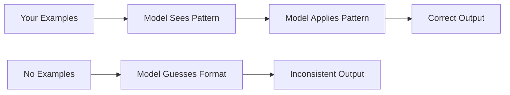
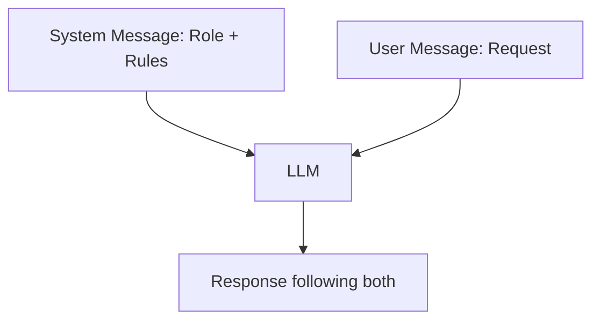

# Prompt Engineering — Theory

It's your first day as an intern at a busy company. Your manager rushes over and says: "Can you handle the client thing?" You nod. You have no idea what that means. So you spend three hours doing the wrong task entirely.

The next day, your manager says: "You're a customer success specialist. Review this email from a frustrated client named Sarah who is upset about late shipping. Write a 3-sentence reply that apologizes, explains our 48-hour resolution policy, and ends with a reassuring closing." You write the perfect reply in 10 minutes.

Same intern. Same skill level. Completely different result — just because the instructions were specific.

👉 This is why we need **Prompt Engineering** — the skill of giving an AI precise, structured instructions so you get exactly the output you need.

---

## What is a Prompt?

A prompt is everything you send to an LLM before it responds. It includes:

- The **system message** — sets the AI's role and rules (like a job description)
- The **user message** — the actual request
- Any **examples** or **context** you include

The model only knows what you tell it. Garbage in, garbage out.

---

## The Big Techniques

### 1. Zero-Shot Prompting

No examples. Just give the instruction directly.

```
Classify this review as positive, negative, or neutral:
"The product arrived on time but broke after a week."
```

Best for: simple tasks the model already knows well.
Worst for: complex reasoning, unusual formats.

---

### 2. Few-Shot Prompting

Give 2–5 examples before your actual request. The model learns the pattern.

```
Classify sentiment:
"Loved it!" → positive
"Terrible experience." → negative
"It was okay." → neutral

Now classify: "Delivery was fast but packaging was damaged."
```



Best for: classification, formatting, tasks with a specific style.

---

### 3. Chain-of-Thought (CoT) Prompting

Tell the model to think step by step before giving the final answer. This dramatically improves accuracy on math and reasoning tasks.

```
Q: A store has 24 apples. They sell half, then receive 10 more. How many remain?
A: Let me think step by step.
   - Start with 24 apples
   - Sell half: 24 / 2 = 12 remain
   - Receive 10 more: 12 + 10 = 22
   Answer: 22
```

You can trigger this with: "Think step by step", "Let's work through this", or "Show your reasoning."

Best for: math problems, multi-step logic, debugging.

---

### 4. Role Prompting

Give the model a specific identity. This changes its tone, vocabulary, and the lens it uses to answer.

```
System: You are a senior security engineer at a tech company.
You explain vulnerabilities in plain language for non-technical executives.

User: What is SQL injection?
```

The same question gets a very different answer from "You are a 5-year-old explaining to a parent" vs "You are an MIT professor teaching grad students."

---

### 5. Output Format Control

Tell the model exactly how to structure its response. Use JSON, bullet points, tables, or custom templates.

```
Extract the key info from this email.
Return as JSON with fields: sender, issue, urgency (low/medium/high).

Email: "Hi, I'm John from Acme Corp. Our login system is broken
and we have 200 users locked out. This is urgent!"
```

Expected output:
```json
{
  "sender": "John, Acme Corp",
  "issue": "Login system broken, 200 users locked out",
  "urgency": "high"
}
```

---

### 6. System vs User Messages

Most LLM APIs have two message types:

| Message Type | Purpose | Example |
|---|---|---|
| **System** | Persistent rules and role | "You are a helpful assistant. Always be concise." |
| **User** | The actual request each turn | "Summarize this article." |

System messages are like the job description. User messages are the daily tasks. The model follows system rules for the entire conversation.



---

## Putting It Together: The Perfect Prompt Structure

```
[System: Role + constraints + output format]
[Context: Background information the model needs]
[Examples: 2-3 demonstrations of what good looks like]
[Task: The actual request]
[Format: Exact output structure you want]
```

Not every prompt needs all five. But the more you include, the more predictable the output.

---

## Why Temperature Matters

Temperature controls how creative (or random) the model is.

- **Low (0.0–0.3):** Focused, deterministic. Good for facts, code, extraction.
- **Medium (0.5–0.7):** Balanced. Good for most tasks.
- **High (0.8–1.0):** Creative, unpredictable. Good for brainstorming.

For production systems that need consistent output — use low temperature.

---

✅ **What you just learned:** Prompt engineering is about giving precise role, context, examples, and format instructions so the LLM returns exactly what you need.

🔨 **Build this now:** Take any task you'd normally give ChatGPT. Rewrite the prompt with (1) a role, (2) an example, (3) an exact output format. Compare the outputs.

➡️ **Next step:** Tool Calling → `08_LLM_Applications/02_Tool_Calling/Theory.md`

---

## 📂 Navigation

**In this folder:**
| File | |
|---|---|
| 📄 **Theory.md** | ← you are here |
| [📄 Cheatsheet.md](./Cheatsheet.md) | Quick reference |
| [📄 Interview_QA.md](./Interview_QA.md) | Interview prep |
| [📄 Code_Example.md](./Code_Example.md) | Python code examples |
| [📄 Common_Mistakes.md](./Common_Mistakes.md) | Common prompt engineering mistakes |
| [📄 Prompt_Patterns.md](./Prompt_Patterns.md) | Reusable prompt patterns |

⬅️ **Prev:** [09 Using LLM APIs](../../07_Large_Language_Models/09_Using_LLM_APIs/Theory.md) &nbsp;&nbsp;&nbsp; ➡️ **Next:** [02 Tool Calling](../02_Tool_Calling/Theory.md)
