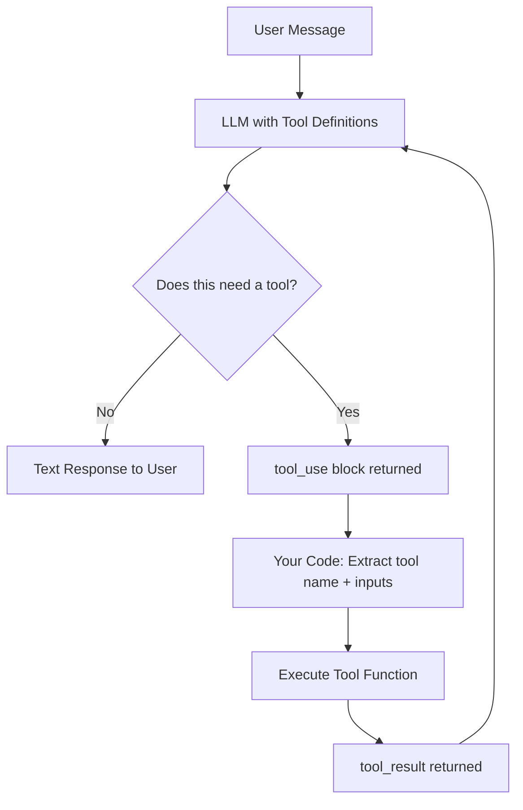
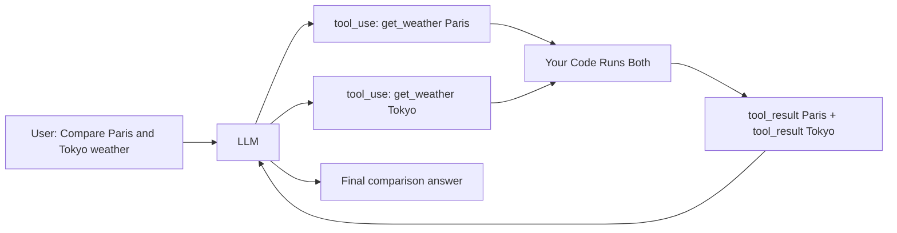
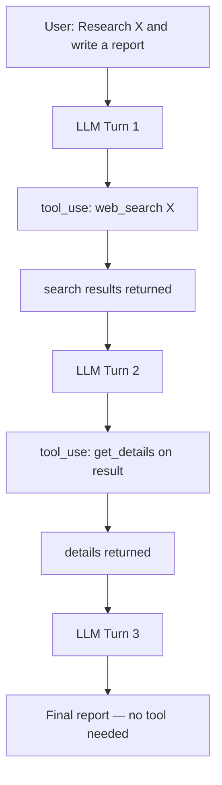

# Tool Calling — Architecture Deep Dive

## The Complete Tool Call Loop

This diagram shows exactly what happens during a single tool-calling turn, from user input to final response.



---

## Parallel Tool Calls

When the model needs multiple tools at once, it requests them all in a single response. Your code runs them together.



---

## Multi-Step Agentic Loop

For complex tasks, the model may call several tools in sequence, using each result to decide the next step.



---

## Data Flow Detail

### What the LLM sends when it wants a tool

```json
{
  "type": "tool_use",
  "id": "toolu_01XFDUDYJgAACTvnkyLAND4y",
  "name": "get_weather",
  "input": {
    "city": "Paris",
    "unit": "celsius"
  }
}
```

### What you send back as a tool result

```json
{
  "type": "tool_result",
  "tool_use_id": "toolu_01XFDUDYJgAACTvnkyLAND4y",
  "content": "{\"city\": \"Paris\", \"temperature\": 18, \"condition\": \"Cloudy\"}"
}
```

The `tool_use_id` links the result to the original request. This matters for parallel calls — you send multiple results, each with the matching ID.

---

## Message History Structure

The full conversation history for a tool call looks like this:

```
messages = [
  # Turn 1: User asks
  {"role": "user", "content": "What's the weather in Paris?"},

  # Turn 2: Model requests a tool
  {"role": "assistant", "content": [
    {"type": "tool_use", "id": "abc123", "name": "get_weather", "input": {"city": "Paris"}}
  ]},

  # Turn 3: You return the result
  {"role": "user", "content": [
    {"type": "tool_result", "tool_use_id": "abc123", "content": "{\"temp\": 18}"}
  ]},

  # Turn 4: Model gives final answer (end_turn)
  {"role": "assistant", "content": [
    {"type": "text", "text": "The weather in Paris is 18°C and cloudy."}
  ]}
]
```

---

## Tool Definition Architecture

Each tool needs three fields. The description is the most important — it controls when the model calls the tool.

```
Tool Definition
├── name: snake_case identifier
├── description: when to use + what it does (model reads this)
└── input_schema (JSON Schema)
    ├── type: "object"
    ├── properties
    │   ├── param1: {type, description}
    │   └── param2: {type, enum, description}
    └── required: [list of required params]
```

---

## Error Handling Architecture

Always return a tool_result even when things go wrong:

```
Tool execution fails
       |
       v
Catch exception in your code
       |
       v
Return tool_result with is_error=True
+ error message as content
       |
       v
LLM sees error, adapts its approach
(retries, uses different tool, or reports to user)
```

Never swallow errors silently. The model can only adapt if it knows what went wrong.

---

## Choosing tool_choice Behavior

The API lets you control whether the model must use a tool:

| Setting | Behavior | When to Use |
|---------|----------|-------------|
| `auto` (default) | Model decides | Most use cases |
| `any` | Model must use at least one tool | When you know a tool is required |
| `tool` (specific name) | Model must use this exact tool | Forcing structured output extraction |
| `none` | Model cannot use tools | When you want a plain text response |

---

## 📂 Navigation

**In this folder:**
| File | |
|---|---|
| [📄 Theory.md](./Theory.md) | Core concepts |
| [📄 Cheatsheet.md](./Cheatsheet.md) | Quick reference |
| [📄 Interview_QA.md](./Interview_QA.md) | Interview prep |
| [📄 Code_Example.md](./Code_Example.md) | Python code examples |
| 📄 **Architecture_Deep_Dive.md** | ← you are here |

⬅️ **Prev:** [01 Prompt Engineering](../01_Prompt_Engineering/Theory.md) &nbsp;&nbsp;&nbsp; ➡️ **Next:** [03 Structured Outputs](../03_Structured_Outputs/Theory.md)
