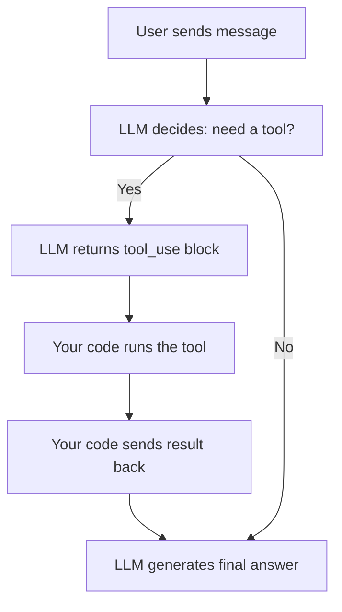
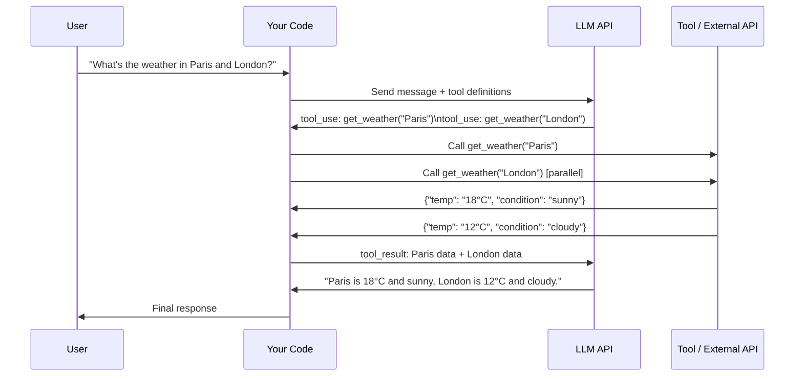

# Tool Calling — Theory

You hire a brilliant analyst. They can write flawlessly and reason through complex problems, but they can't look anything up — no internet, no phone, no calculator. So you give them a specific phone: Button 1 calls the weather service, Button 2 calls the company database, Button 3 calls a calculator. Now they can say "Let me check the weather" (press 1), get the answer, and fold it into their response.

That's tool calling: giving an LLM specific "phones" it can use when it decides it needs them.

👉 This is why we need **Tool Calling** — so LLMs can take real actions in the world, not just speak from memory.

---

## 📌 Learning Priority

**Must Learn** — core concepts, needed to understand the rest of this file:
[What Is Tool Calling](#what-is-tool-calling) · [Tool Call Cycle](#the-tool-call-cycle) · [Tool Definition Structure](#the-tool-definition-structure)

**Should Learn** — important for real projects and interviews:
[Parallel Tool Calls](#parallel-tool-calls) · [Real Use Cases](#real-use-cases)

**Good to Know** — useful in specific situations, not needed daily:
[Why It Is Powerful](#why-is-this-powerful) · [How Model Decides](#how-the-model-decides-to-use-a-tool)

---

## What Is Tool Calling?

Tool calling (also called function calling) lets you define functions the model can request to use. The model decides when to use them; your code executes them and sends back results. The model doesn't run the tool itself — it says "I want to call this tool with these inputs."

---

## The Tool Call Cycle



1. User asks: "What's the weather in Paris?"
2. LLM sees it has a `get_weather` tool. Returns a `tool_use` response (not text yet).
3. Your code calls the actual weather API.
4. Your code sends the result back as a `tool_result` message.
5. LLM generates the final user-facing response using the real data.

---

## Why Is This Powerful?

Without tools, an LLM can only use what it was trained on. With tools, it can:

- Look up **real-time data** (weather, stock prices, news)
- Query **your database** (customer records, product catalog)
- Perform **precise calculations** (no more hallucinated math)
- Call **external APIs** (send emails, create calendar events)
- Run **code** and get actual results

The model becomes an orchestrator — it reasons about what needs to happen, delegates to tools, and synthesizes the results.

---

## How the Model Decides to Use a Tool

Each tool definition has a **name**, a **description** (critical — tells the model WHEN to use it), and an **input schema**. The model reads descriptions and decides "does this question require one of these tools?" A vague description leads to misuse — write clear, specific descriptions.

---

## Parallel Tool Calls

The model can request multiple tools in one response:

```
User: "What's the weather in Paris and London?"

LLM response (single turn):
  tool_use: get_weather("Paris")
  tool_use: get_weather("London")
```



---

## The Tool Definition Structure

```json
{
  "name": "get_weather",
  "description": "Get the current weather for a specific city. Use this when the user asks about weather conditions, temperature, or forecast.",
  "input_schema": {
    "type": "object",
    "properties": {
      "city": {
        "type": "string",
        "description": "The city name, e.g. 'Paris' or 'New York'"
      },
      "unit": {
        "type": "string",
        "enum": ["celsius", "fahrenheit"],
        "description": "Temperature unit"
      }
    },
    "required": ["city"]
  }
}
```

---

## Real Use Cases

| Use Case | Tool | What It Does |
|----------|------|-------------|
| Customer support bot | `lookup_order(order_id)` | Fetches order status from DB |
| Finance assistant | `get_stock_price(ticker)` | Returns live stock data |
| Coding assistant | `run_code(code)` | Executes code, returns output |
| Research agent | `web_search(query)` | Returns search results |
| Calendar assistant | `create_event(title, time)` | Creates a calendar entry |

---

✅ **What you just learned:** Tool calling lets LLMs request specific functions at runtime — your code executes them and returns results, turning the model into an orchestrator that can interact with the real world.

🔨 **Build this now:** Define a simple `get_joke(topic)` tool that returns a hardcoded joke. Wire it up to the Anthropic API so the model can call it when asked for a joke about a specific topic.

➡️ **Next step:** Structured Outputs → `08_LLM_Applications/03_Structured_Outputs/Theory.md`


---

## 📝 Practice Questions

- 📝 [Q48 · tool-calling](../../ai_practice_questions_100.md#q48--thinking--tool-calling)


---

## 📂 Navigation

**In this folder:**
| File | |
|---|---|
| 📄 **Theory.md** | ← you are here |
| [📄 Cheatsheet.md](./Cheatsheet.md) | Quick reference |
| [📄 Interview_QA.md](./Interview_QA.md) | Interview prep |
| [📄 Code_Example.md](./Code_Example.md) | Python code examples |
| [📄 Architecture_Deep_Dive.md](./Architecture_Deep_Dive.md) | Tool calling architecture |

⬅️ **Prev:** [01 Prompt Engineering](../01_Prompt_Engineering/Theory.md) &nbsp;&nbsp;&nbsp; ➡️ **Next:** [03 Structured Outputs](../03_Structured_Outputs/Theory.md)
