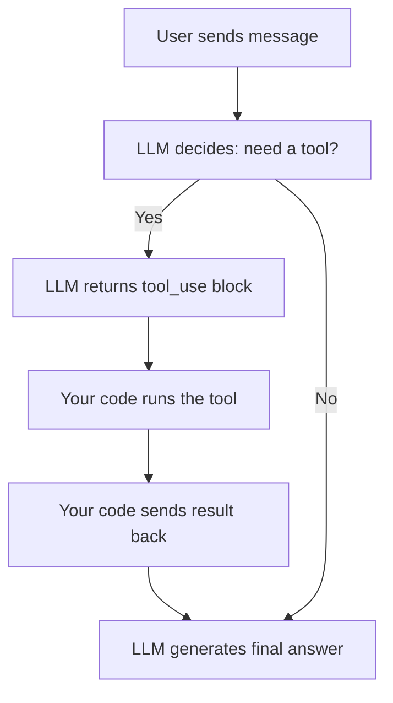

# Tool Calling — Theory

You hire a brilliant analyst. They can write flawlessly, reason through complex problems, and draft strategies overnight. But there's one catch — they can't look anything up. No internet. No phone. No calculator. Just what they already know.

So you give them a phone. Not any phone — a very specific one. Button 1 calls the weather service. Button 2 calls the company database. Button 3 calls a calculator. Now your analyst can say "Let me check the weather" (press 1), get the answer, and fold it into their response.

That's tool calling. You give an LLM specific "phones" it can use when it decides it needs them.

👉 This is why we need **Tool Calling** — so LLMs can take real actions in the world, not just speak from memory.

---

## What Is Tool Calling?

Tool calling (also called function calling) lets you define a set of functions the model can request to use. The model decides when to use them, and you execute them in your code.

The model doesn't run the tool itself. It just says "I want to call this tool with these inputs." Your code runs it and sends back the result.

---

## The Tool Call Cycle

Here's exactly what happens:



**Step by step:**
1. User asks: "What's the weather in Paris?"
2. LLM sees it has a `get_weather` tool. Returns a `tool_use` response (not a text response yet).
3. Your code sees the tool request, calls the actual weather API.
4. Your code sends the weather data back to the LLM as a `tool_result` message.
5. LLM generates the final user-facing response using the real data.

---

## Why Is This Powerful?

Without tools, an LLM can only use what it was trained on. With tools, it can:

- Look up **real-time data** (weather, stock prices, news)
- Query **your database** (customer records, product catalog)
- Perform **precise calculations** (no more hallucinated math)
- Call **external APIs** (send emails, create calendar events)
- Run **code** and get actual results

The model becomes an orchestrator — it reasons about what needs to happen, delegates the actual action to tools, and synthesizes the results.

---

## How the Model Decides to Use a Tool

You give the model tool definitions. Each definition has:
- A **name** (e.g., `get_weather`)
- A **description** — this is critical, it tells the model WHEN to use it
- An **input schema** — what parameters the tool takes

The model reads your tool descriptions and decides "does this question require one of these tools?" If yes, it returns a structured tool call request instead of a text response.

**Key insight:** Write clear, specific tool descriptions. The model uses them to decide when and how to call the tool. A vague description leads to misuse.

---

## Parallel Tool Calls

The model can request multiple tools in one response. This is called parallel tool calling.

```
User: "What's the weather in Paris and London?"

LLM response (single turn):
  tool_use: get_weather("Paris")
  tool_use: get_weather("London")
```

Your code runs both in parallel, returns both results, and the model generates a single answer comparing the two cities. Much faster than sequential calls.

---

## The Tool Definition Structure

```json
{
  "name": "get_weather",
  "description": "Get the current weather for a specific city. Use this when the user asks about weather conditions, temperature, or forecast.",
  "input_schema": {
    "type": "object",
    "properties": {
      "city": {
        "type": "string",
        "description": "The city name, e.g. 'Paris' or 'New York'"
      },
      "unit": {
        "type": "string",
        "enum": ["celsius", "fahrenheit"],
        "description": "Temperature unit"
      }
    },
    "required": ["city"]
  }
}
```

---

## Real Use Cases

| Use Case | Tool | What It Does |
|----------|------|-------------|
| Customer support bot | `lookup_order(order_id)` | Fetches order status from DB |
| Finance assistant | `get_stock_price(ticker)` | Returns live stock data |
| Coding assistant | `run_code(code)` | Executes code, returns output |
| Research agent | `web_search(query)` | Returns search results |
| Calendar assistant | `create_event(title, time)` | Creates a calendar entry |

---

✅ **What you just learned:** Tool calling lets LLMs request specific functions at runtime — your code executes them and returns results, turning the model into an orchestrator that can interact with the real world.

🔨 **Build this now:** Define a simple `get_joke(topic)` tool that returns a hardcoded joke. Wire it up to the Anthropic API so the model can call it when asked for a joke about a specific topic.

➡️ **Next step:** Structured Outputs → `08_LLM_Applications/03_Structured_Outputs/Theory.md`

---

## 📂 Navigation

**In this folder:**
| File | |
|---|---|
| 📄 **Theory.md** | ← you are here |
| [📄 Cheatsheet.md](./Cheatsheet.md) | Quick reference |
| [📄 Interview_QA.md](./Interview_QA.md) | Interview prep |
| [📄 Code_Example.md](./Code_Example.md) | Python code examples |
| [📄 Architecture_Deep_Dive.md](./Architecture_Deep_Dive.md) | Tool calling architecture |

⬅️ **Prev:** [01 Prompt Engineering](../01_Prompt_Engineering/Theory.md) &nbsp;&nbsp;&nbsp; ➡️ **Next:** [03 Structured Outputs](../03_Structured_Outputs/Theory.md)
