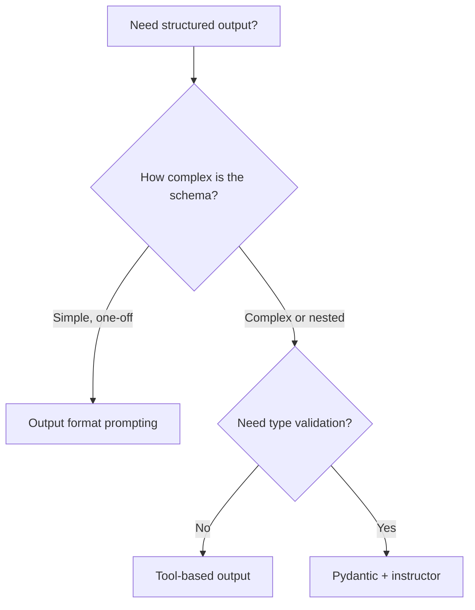

# Structured Outputs — Theory

You need a quote from a contractor. You ask: "How much to repaint the living room?" They send back a three-page letter with their history, paint preferences, and three anecdotes — buried on page two: "$800." You just needed the number. In a specific format. For your spreadsheet.

LLMs are the same. Ask a free-form question and you get an essay. In production, you need clean JSON your code can parse, every single time.

👉 This is why we need **Structured Outputs** — to make LLMs respond in exact, predictable formats your code can reliably parse.

---

## Why This Matters

LLMs generate text token by token — natural language prose by default. Your code needs JSON with fields, types, and predictable shapes.

**Without structured outputs:**
```
"The sender appears to be Sarah from Acme Corp. She seems quite
frustrated about a payment issue and describes it as urgent."
```

**With structured outputs:**
```json
{
  "sender": "Sarah",
  "company": "Acme Corp",
  "issue": "payment problem",
  "urgency": "high"
}
```

Same information. Completely different usefulness in code.

---

## Three Ways to Get Structured Output

### Method 1: Output Format Prompting

Tell the model in the prompt exactly what format you want.

```
Extract contact info from this email.
Return ONLY this JSON — no explanation, no markdown:
{"name": "...", "email": "...", "company": "..."}
```

Works most of the time. Fails sometimes. Needs validation.

---

### Method 2: Tool-Based Structured Output

Define a tool schema matching your desired data structure. Tell the model to use the tool. The model's `tool_use` input IS your structured output — no text parsing needed.

```python
tools = [{
    "name": "save_contact",
    "description": "Save extracted contact information",
    "input_schema": {
        "type": "object",
        "properties": {
            "name": {"type": "string"},
            "email": {"type": "string"},
            "company": {"type": "string"}
        },
        "required": ["name", "email"]
    }
}]
```

More reliable than prompt-based — the model fills in schema fields directly.

---

### Method 3: Pydantic + Structured Output Libraries

Libraries like `instructor` wrap the API and give you Python objects directly.

```python
import instructor
from pydantic import BaseModel

class Contact(BaseModel):
    name: str
    email: str
    company: str | None

client = instructor.from_anthropic(anthropic.Anthropic())
contact = client.chat.completions.create(
    model="claude-opus-4-6",
    response_model=Contact,
    messages=[{"role": "user", "content": "Extract: sarah@acme.com, Sarah Chen, Acme Corp"}]
)
print(contact.name)   # "Sarah Chen"
print(contact.email)  # "sarah@acme.com"
```

You get a typed Python object with automatic validation. The cleanest approach for production.

---

## When to Use Each Method



---

## Common Use Cases

| Use Case | Input | Structured Output |
|----------|-------|-------------------|
| Email triage | Raw email text | `{sender, issue, urgency, category}` |
| Resume parsing | PDF text | `{name, skills[], experience[]}` |
| Product extraction | Web page | `{title, price, rating, availability}` |
| Meeting notes | Transcript | `{action_items[], decisions[], attendees[]}` |
| Sentiment pipeline | Review text | `{sentiment, score, keywords[]}` |

---

## Validating Output

Never trust the model 100%. Always validate:

```python
import json

raw = response.content[0].text

try:
    data = json.loads(raw)
    assert "name" in data, "Missing name field"
    assert "email" in data, "Missing email field"
except (json.JSONDecodeError, AssertionError) as e:
    # Retry with a correction message or use a fallback
    print(f"Validation failed: {e}")
```

For production: set `temperature=0`, add retry logic, and use Pydantic for automatic validation.

---

✅ **What you just learned:** Structured outputs make LLMs return JSON or fixed templates instead of free-form prose — using prompt formatting, tool schemas, or Pydantic models with libraries like instructor.

🔨 **Build this now:** Write a prompt that extracts name, email, and urgency from a sample support email. Parse the JSON in Python. Handle the case where the JSON is malformed.

➡️ **Next step:** Embeddings → `08_LLM_Applications/04_Embeddings/Theory.md`

---

## 🛠️ Practice Project

Apply what you just learned → **[B5: Intelligent Document Analyzer](../../20_Projects/00_Beginner_Projects/05_Intelligent_Document_Analyzer/Project_Guide.md)**
> This project uses: extracting entities as structured JSON using Pydantic models, validating LLM output schema

---

## 📂 Navigation

**In this folder:**
| File | |
|---|---|
| 📄 **Theory.md** | ← you are here |
| [📄 Cheatsheet.md](./Cheatsheet.md) | Quick reference |
| [📄 Interview_QA.md](./Interview_QA.md) | Interview prep |
| [📄 Code_Example.md](./Code_Example.md) | Python code examples |

⬅️ **Prev:** [02 Tool Calling](../02_Tool_Calling/Theory.md) &nbsp;&nbsp;&nbsp; ➡️ **Next:** [04 Embeddings](../04_Embeddings/Theory.md)
