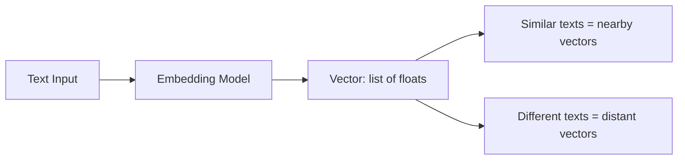
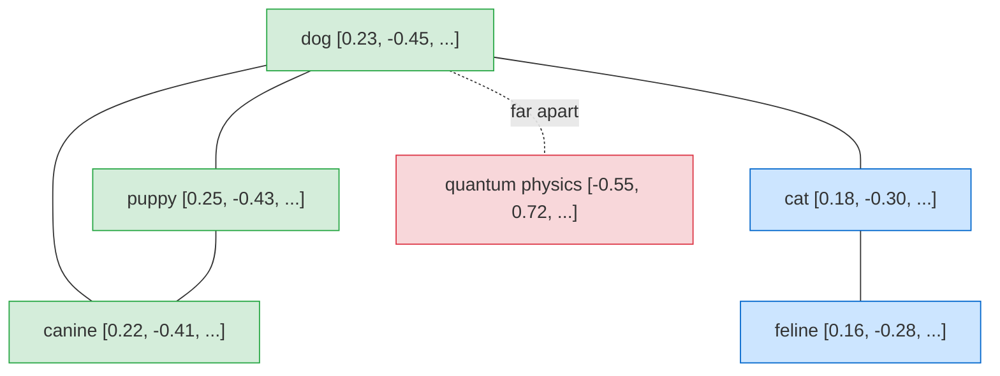

# Embeddings — Theory

Every word, sentence, and document gets a unique address in a giant city of meaning. Similar things live near each other: "Dog" and "puppy" are neighbors. "Dog" and "cat" are a few streets apart — same neighborhood (pets), different residents. "Dog" and "quantum physics" are across town in completely different districts.

Ask: "Show me everything within a 5-minute walk of 'dog'." Instantly: puppy, canine, wolf, Labrador, breed.

That's what embeddings do — they convert text into coordinates in a meaning-space city.

👉 This is why we need **Embeddings** — to turn text into numbers that capture meaning so we can do math on language: find similar content, measure distance between ideas, and enable semantic search.

---

## What Is an Embedding?

An embedding is a list of numbers (a vector) that represents the meaning of a piece of text.

```
"The dog barked loudly."  →  [0.23, -0.45, 0.11, 0.78, -0.33, ...]
                                        (1536 numbers)
```

Those 1536 numbers encode the sentence's meaning. No individual number means anything readable — their pattern together represents semantic content.

---

## How It Works



The embedding model was trained on billions of text examples to place similar meanings close together in vector space. The model is frozen — you just run text through it and get coordinates back.

The dimensions don't have human-readable labels. 1536 dimensions blend together to capture subtle meaning; no single dimension is interpretable.

---

## Cosine Similarity: Measuring Meaning Distance

To compare two embeddings, calculate cosine similarity — the angle between two vectors.

- Score **1.0** = identical meaning
- Score **0.8+** = very similar
- Score **0.5** = somewhat related
- Score near **0** = unrelated

```python
from numpy import dot
from numpy.linalg import norm

def cosine_similarity(a, b):
    return dot(a, b) / (norm(a) * norm(b))
```



---

## Dense vs Sparse Embeddings

| Type | What it is | Example | Best for |
|------|-----------|---------|---------|
| **Dense** | Compact vector (e.g. 1536 dims), all values non-zero | OpenAI embeddings, sentence-transformers | Semantic similarity, RAG |
| **Sparse** | Huge vector (50K+ dims), mostly zeros — one per vocabulary word | TF-IDF, BM25 | Keyword matching, exact terms |

Dense = captures meaning and context. Sparse = captures exact word matches. Combine both (hybrid search) for best results.

---

## Popular Embedding Models

| Model | Dimensions | Context | Speed | Cost |
|-------|-----------|---------|-------|------|
| `text-embedding-3-small` (OpenAI) | 1536 | 8K tokens | Fast | Low |
| `text-embedding-3-large` (OpenAI) | 3072 | 8K tokens | Medium | Medium |
| `all-MiniLM-L6-v2` (sentence-transformers) | 384 | 256 tokens | Very fast | Free (local) |
| `all-mpnet-base-v2` (sentence-transformers) | 768 | 384 tokens | Medium | Free (local) |
| `embed-english-v3.0` (Cohere) | 1024 | 512 tokens | Fast | Low |

For most RAG applications: start with `text-embedding-3-small` (cost-effective) or `all-MiniLM-L6-v2` (free, local).

---

## What Embeddings Enable

- **Semantic search**: find documents by meaning, not keywords
- **Recommendation**: "if you liked this article, here are similar ones"
- **Clustering**: group similar documents automatically
- **Duplicate detection**: find near-identical content
- **RAG**: retrieve relevant docs before generating an answer

---

✅ **What you just learned:** Embeddings convert text into fixed-size number vectors where similar meanings are mathematically close — enabling semantic search and comparison using cosine similarity.

🔨 **Build this now:** Embed three sentences: "I love my dog", "My puppy is adorable", and "Machine learning is complex". Use cosine similarity to show the first two are closer to each other than to the third.

➡️ **Next step:** Vector Databases → `08_LLM_Applications/05_Vector_Databases/Theory.md`

---

## 🛠️ Practice Projects

Apply what you just learned:
- → **[B5: Intelligent Document Analyzer](../../22_Capstone_Projects/05_Intelligent_Document_Analyzer/03_GUIDE.md)** — embedding document chunks for similarity comparison
- → **[I1: Semantic Search Engine](../../22_Capstone_Projects/06_Semantic_Search_Engine/03_GUIDE.md)** — embedding 1000+ documents and searching by cosine similarity


---

## 📝 Practice Questions

- 📝 [Q50 · embeddings](../../ai_practice_questions_100.md#q50--interview--embeddings)


---

## 📂 Navigation

**In this folder:**
| File | |
|---|---|
| 📄 **Theory.md** | ← you are here |
| [📄 Cheatsheet.md](./Cheatsheet.md) | Quick reference |
| [📄 Interview_QA.md](./Interview_QA.md) | Interview prep |
| [📄 Code_Example.md](./Code_Example.md) | Python code examples |

⬅️ **Prev:** [03 Structured Outputs](../03_Structured_Outputs/Theory.md) &nbsp;&nbsp;&nbsp; ➡️ **Next:** [05 Vector Databases](../05_Vector_Databases/Theory.md)
