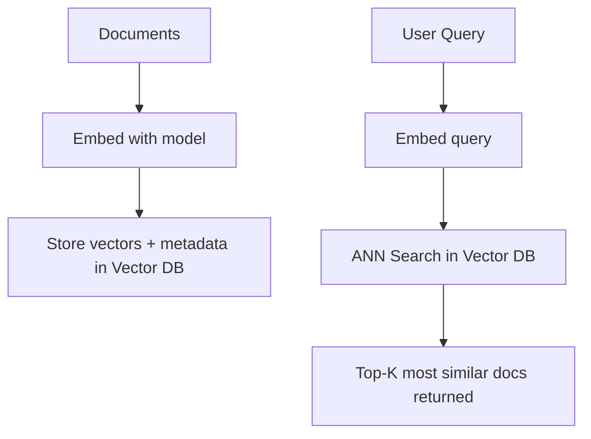
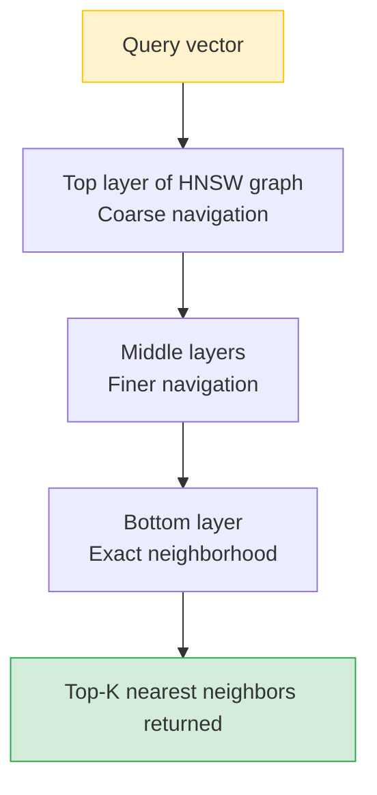

# Vector Databases — Theory

Picture a library where books aren't organized alphabetically — they're arranged by vibe and theme. You tell the librarian: "I want something like The Alchemist — a journey of self-discovery with philosophical undertones." They instantly point to 10 books with similar energy, from completely different authors, genres, and decades.

That's a vector database: instead of storing books, it stores embeddings (numeric "vibe signatures" of your documents). Instead of looking up by ID, you search by meaning.

👉 This is why we need **Vector Databases** — regular databases can't do semantic search, but vector databases find "things with similar meaning" at scale, in milliseconds.

---

## Why Regular Databases Can't Do This

A regular SQL database queries with exact matches and ranges:
```sql
SELECT * FROM docs WHERE topic = 'machine learning'
```

This only works if someone already labeled the document. It can't find a document about "gradient descent and neural networks" when you search for "AI learning systems." For semantic search, you need to compare thousands of floating-point vectors — a completely different query type.

---

## How Vector Databases Work



At indexing time: convert each document to a vector, store it with metadata. At query time: convert the user's question to a vector, find the most similar stored vectors.

---

## Approximate Nearest Neighbor (ANN) Search

Finding the exact closest vector in 10 million entries requires comparing to all 10 million — too slow. ANN algorithms trade a small amount of accuracy for massive speed gains.

**HNSW (Hierarchical Navigable Small World)** builds a multi-layer graph where each vector connects to its nearest neighbors. Search starts at the top layer and navigates toward the query, moving down as you get closer — like a GPS navigating from highway to street to exact address.

Result: top-K matches in milliseconds across 100 million vectors.



---

## What Makes a Vector Database

Beyond storing vectors, a vector database provides:

- **Indexing** (HNSW, IVF): fast ANN search
- **Metadata storage**: extra fields alongside each vector (title, date, source)
- **Metadata filtering**: "find the 10 most similar docs, but only from source=legal"
- **CRUD operations**: add, update, delete individual vectors
- **Namespaces/collections**: logical separation of document sets
- **Persistence**: data survives restarts

---

## The Main Options

| Database | Type | Best For |
|----------|------|---------|
| **Pinecone** | Cloud-managed | Production, no infrastructure headache |
| **ChromaDB** | Local + cloud | Prototyping, local development, open-source |
| **Weaviate** | Self-hosted + cloud | Advanced features, multi-modal, hybrid search |
| **pgvector** | PostgreSQL extension | You already use PostgreSQL |
| **Qdrant** | Self-hosted + cloud | High performance, Rust-based, good free tier |

---

## Metadata Filtering

Combine vector similarity search with exact metadata filters:

```python
# Find the 5 most similar docs, but only from the "legal" department in 2024
collection.query(
    query_embeddings=[query_vector],
    n_results=5,
    where={"department": "legal", "year": 2024}
)
```

This is how enterprise RAG systems scope results to the right data source, user, or time range.

---

✅ **What you just learned:** Vector databases store and search embeddings at scale using ANN algorithms like HNSW — enabling semantic search with metadata filtering that regular SQL databases can't provide.

🔨 **Build this now:** Install ChromaDB. Create a collection. Add 5 documents with different topics. Query it with a question and see which documents it returns.

➡️ **Next step:** Semantic Search → `08_LLM_Applications/06_Semantic_Search/Theory.md`

---

## 🛠️ Practice Projects

Apply what you just learned:
- → **[I1: Semantic Search Engine](../../22_Capstone_Projects/06_Semantic_Search_Engine/03_GUIDE.md)** — in-memory numpy vector store with cosine similarity
- → **[I2: Personal Knowledge Base (RAG)](../../22_Capstone_Projects/07_Personal_Knowledge_Base_RAG/03_GUIDE.md)** — ChromaDB as the vector store for your full RAG pipeline


---

## 📝 Practice Questions

- 📝 [Q51 · vector-databases](../../ai_practice_questions_100.md#q51--thinking--vector-databases)


---

## 📂 Navigation

**In this folder:**
| File | |
|---|---|
| 📄 **Theory.md** | ← you are here |
| [📄 Cheatsheet.md](./Cheatsheet.md) | Quick reference |
| [📄 Interview_QA.md](./Interview_QA.md) | Interview prep |
| [📄 Code_Example.md](./Code_Example.md) | Python code examples |
| [📄 Comparison.md](./Comparison.md) | Vector database comparison |

⬅️ **Prev:** [04 Embeddings](../04_Embeddings/Theory.md) &nbsp;&nbsp;&nbsp; ➡️ **Next:** [06 Semantic Search](../06_Semantic_Search/Theory.md)
