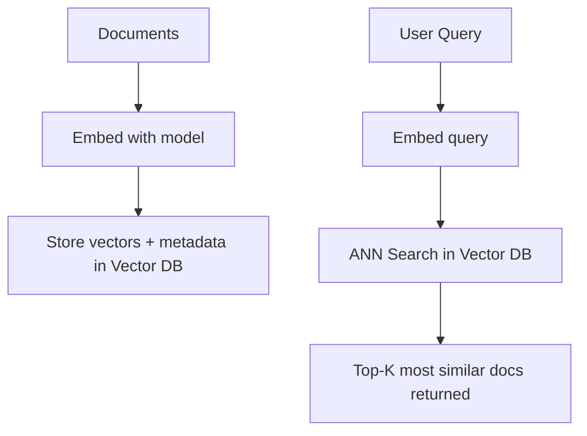

# Vector Databases — Theory

Picture a library where books aren't organized alphabetically or by Dewey Decimal code. Instead, they're arranged by vibe and theme. You walk in and tell the librarian: "I want something like The Alchemist — a journey of self-discovery with philosophical undertones." The librarian doesn't search a title catalog. They instantly point to 10 books with similar energy, from completely different authors, genres, and decades.

That's a vector database. Instead of storing books, it stores embeddings (the numeric "vibe signatures" of your documents). Instead of looking up by ID, you search by meaning.

👉 This is why we need **Vector Databases** — regular databases can't do semantic search, but vector databases can find "things with similar meaning" at scale, in milliseconds.

---

## Why Regular Databases Can't Do This

A regular SQL database stores rows and columns. You query with exact matches and ranges:
```sql
SELECT * FROM docs WHERE topic = 'machine learning'
```

This only works if someone already labeled the document as "machine learning." It can't find a document about "gradient descent and neural networks" when you search for "AI learning systems."

For semantic search, you need to compare thousands of floating-point vectors — a completely different type of query.

---

## How Vector Databases Work



1. At indexing time: convert each document to a vector, store it alongside metadata.
2. At query time: convert the user's question to a vector, find the stored vectors most similar to it.

---

## Approximate Nearest Neighbor (ANN) Search

Finding the exact closest vector in a collection of 10 million would require comparing your query to all 10 million. Too slow.

ANN algorithms trade a small amount of accuracy for massive speed gains. The key one: **HNSW** (Hierarchical Navigable Small World).

HNSW builds a multi-layer graph where each vector is connected to its nearest neighbors. At search time, you start at the top layer and navigate toward the query, moving down layers as you get closer. It's like a GPS system — you first navigate at the highway level, then streets, then the exact address.

**Result:** ANN finds the top-K matches in milliseconds even across 100 million vectors. Exact nearest neighbor would take minutes.

---

## What Makes a Vector Database

Beyond just storing vectors, a vector database provides:

- **Indexing** (HNSW, IVF): fast ANN search
- **Metadata storage**: store extra fields alongside each vector (title, date, source, etc.)
- **Metadata filtering**: "find the 10 most similar documents, but only from source=legal"
- **CRUD operations**: add, update, delete individual vectors
- **Namespaces/collections**: logical separation of different document sets
- **Persistence**: data survives restarts

---

## The Main Options

| Database | Type | Best For |
|----------|------|---------|
| **Pinecone** | Cloud-managed | Production, no infrastructure headache |
| **ChromaDB** | Local + cloud | Prototyping, local development, open-source |
| **Weaviate** | Self-hosted + cloud | Advanced features, multi-modal, hybrid search |
| **pgvector** | PostgreSQL extension | You already use PostgreSQL and want to avoid a new system |
| **Qdrant** | Self-hosted + cloud | High performance, Rust-based, good free tier |

---

## Metadata Filtering

One of the most important features. You can combine vector similarity search with exact metadata filters:

```python
# Find the 5 most similar docs, but only from the "legal" department,
# and only from 2024
collection.query(
    query_embeddings=[query_vector],
    n_results=5,
    where={"department": "legal", "year": 2024}
)
```

This is how enterprise RAG systems scope results to the right data source, user, or time range.

---

✅ **What you just learned:** Vector databases store and search embeddings at scale using ANN algorithms like HNSW — enabling semantic search with metadata filtering that regular SQL databases can't provide.

🔨 **Build this now:** Install ChromaDB. Create a collection. Add 5 documents with different topics. Query it with a question and see which documents it returns.

➡️ **Next step:** Semantic Search → `08_LLM_Applications/06_Semantic_Search/Theory.md`

---

## 📂 Navigation

**In this folder:**
| File | |
|---|---|
| 📄 **Theory.md** | ← you are here |
| [📄 Cheatsheet.md](./Cheatsheet.md) | Quick reference |
| [📄 Interview_QA.md](./Interview_QA.md) | Interview prep |
| [📄 Code_Example.md](./Code_Example.md) | Python code examples |
| [📄 Comparison.md](./Comparison.md) | Vector database comparison |

⬅️ **Prev:** [04 Embeddings](../04_Embeddings/Theory.md) &nbsp;&nbsp;&nbsp; ➡️ **Next:** [06 Semantic Search](../06_Semantic_Search/Theory.md)
