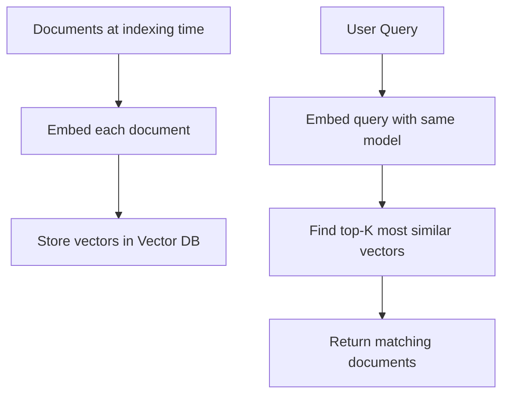
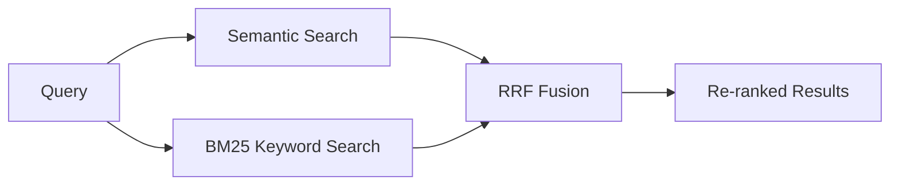

# Semantic Search — Theory

Google search before 2013 was all keyword matching. You typed "fix runny nose" and it found pages containing those exact words. If a page said "remedies for nasal congestion" — not found, even though it's exactly what you want.

Then Google introduced semantic search. Now you search "fix a runny nose" and it returns "remedies for nasal congestion," "tips for stuffy sinuses," and "how to recover from a cold" — because it understands what you mean, not just what you typed.

Zero keyword overlap. Perfect result.

👉 This is why we need **Semantic Search** — to find content based on meaning, not just matching words.

---

## Keyword Search vs Semantic Search

| | Keyword Search | Semantic Search |
|--|----------------|-----------------|
| Method | Match exact words | Compare meaning (embedding vectors) |
| "dog" query finds | Pages with "dog" | Pages about "canine," "puppy," "pets" |
| Handles synonyms | No | Yes |
| Handles paraphrasing | No | Yes |
| Handles misspelling | Partially | Better (via fuzzy match) |
| Works on short queries | Great | Good |
| Very specific terms / codes | Better | Worse |

---

## How Semantic Search Works



The key: both documents and queries go through the same embedding model. This puts them in the same "meaning space," so you can compare query vectors to document vectors.

---

## The Semantic Search Pipeline

**Step 1: Indexing (done once, or when documents change)**
```
Raw documents
  → clean text
  → embed with model
  → store in vector DB
```

**Step 2: Query (done on every user search)**
```
User's question
  → embed with same model
  → find top-K similar vectors
  → return source documents
```

---

## Hybrid Search: The Best of Both Worlds

Pure semantic search misses exact keyword matches. Pure keyword search misses synonyms and paraphrasing. Combine them.

**Hybrid search** = semantic score + keyword score, then fuse the rankings.

Common fusion approach: **RRF (Reciprocal Rank Fusion)**

```
final_score = 1/(k + semantic_rank) + 1/(k + keyword_rank)
```

Where `k` is typically 60. Documents that rank high in both methods float to the top.



**When to use hybrid:** Most real-world search applications. Especially when users sometimes search by exact product codes, IDs, or proper nouns (keyword wins) AND sometimes search by concept (semantic wins).

---

## Re-ranking

The top-K results from vector search are ordered by cosine similarity. But cosine similarity isn't a perfect measure of relevance. Re-ranking adds a second, more powerful pass.

A **cross-encoder** re-ranker takes the query and each candidate document together, processes them jointly, and produces a relevance score. Much more accurate than cosine similarity alone.

```
Vector search: top-20 candidates (fast but approximate)
  → Cross-encoder re-ranker: scores all 20 against the query
  → Return top-5 by re-ranker score (accurate but can't scale to millions)
```

This two-stage pipeline gives you speed (vector search) AND accuracy (re-ranking). Used in all serious production search systems.

---

## Performance Characteristics

| Approach | Documents It Can Handle | Query Latency | Accuracy |
|----------|------------------------|---------------|---------|
| Brute force cosine | < 50K | Slow | Exact |
| HNSW vector DB | Millions | Milliseconds | ~99% |
| Hybrid search (HNSW + BM25) | Millions | Milliseconds | Better |
| Hybrid + re-ranking | Millions (retrieve) | 50–200ms | Best |

---

✅ **What you just learned:** Semantic search converts both queries and documents to embeddings and finds similar content by vector similarity — enabling meaning-based retrieval that keyword search can't match. Hybrid search combines both for production use.

🔨 **Build this now:** Take 10 diverse sentences and build a mini semantic search. Embed them all, then query with a sentence that shares no keywords with the answer but is semantically related.

➡️ **Next step:** Memory Systems → `08_LLM_Applications/07_Memory_Systems/Theory.md`

---

## 📂 Navigation

**In this folder:**
| File | |
|---|---|
| 📄 **Theory.md** | ← you are here |
| [📄 Cheatsheet.md](./Cheatsheet.md) | Quick reference |
| [📄 Interview_QA.md](./Interview_QA.md) | Interview prep |
| [📄 Code_Example.md](./Code_Example.md) | Python code examples |

⬅️ **Prev:** [05 Vector Databases](../05_Vector_Databases/Theory.md) &nbsp;&nbsp;&nbsp; ➡️ **Next:** [07 Memory Systems](../07_Memory_Systems/Theory.md)
